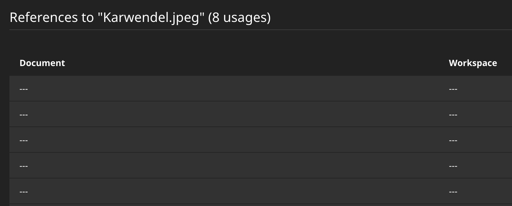
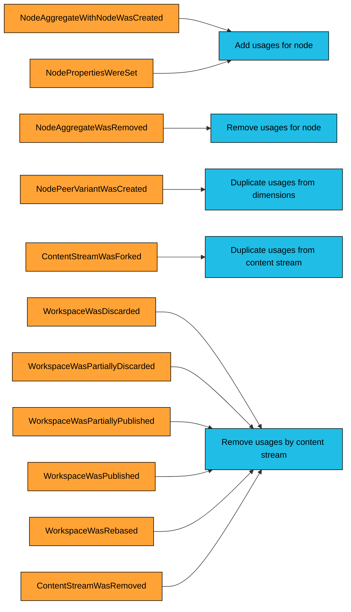

# Neos.AssetUsage

Custom projection to effectively track the usage of assets within the Event Sourced Content Repository

## Usage

1. Install this package

    composer require neos/asset-usage

2. Apply doctrine migrations in order to create the read model table

    ./flow doctrine:migrate

3. And replay the projection

    ./flow projection:replay assetusage

### Neos usage strategy

This package comes with an implementation of the `\Neos\Media\Domain\Strategy\AssetUsageStrategyInterface` that
will protect used assets from being removed via the Neos Media module.

Currently, this needs no further configuration.

For now the visualization within Neos is rather limited though:



### Find usages

The `AssetUsageFinder` is the central authority to find used assets.

E.g. to find asset usages by a `contentStreamId` and group them by asset instance:

```php
$assetFilter = AssetUsageFilter::create()
   ->withContentStream($liveWorkspace->getCurrentContentStreamId())
   ->groupByAsset();
$usages = $assetUsageFinder->findByFilter($assetFilter);

//$usages->count();
foreach ($usages as $usage) {
  // $usage->assetIdentifier;
}
```

## Further information

### Restrictions

In this version, usages are only removed if the corresponding node property is changed or the node itself is removed.
It won't remove usages from child nodes if a parent node is deleted because we don't keep track of the
full node hierarchy.

We plan to implement a CLI command that allows to synchronize the removed nodes using the Content Graph.

### Projection logic


