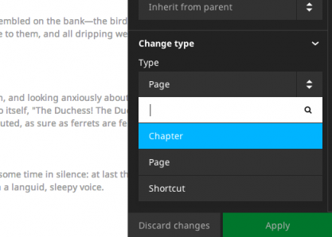
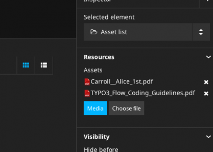
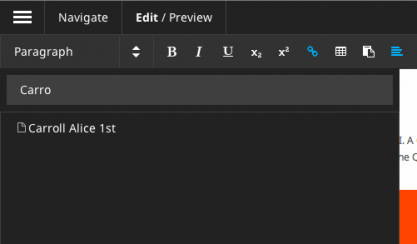
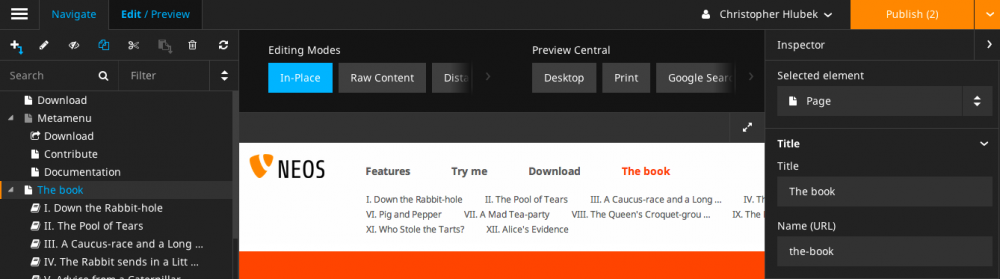
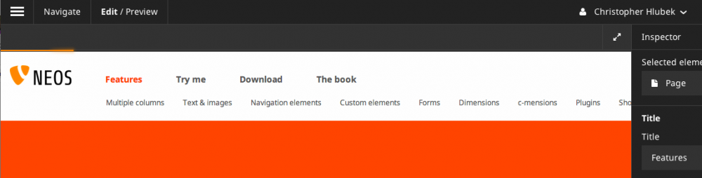

==================
1.1.0 (2014-06-19)
==================

**The goals for the 1.1 version were performance and stability improvements while providing a proper base
for localization support in the next version. The new content cache and other performance improvements will
give Neos sites a huge speed boost, eliminating the need for a separate caching proxy for most installations.
The content dimension concept is the foundation to work with different content variants and have a very flexible
localization solution in Neos. The user interface to work with content dimensions and translations will be part
of the next version.**

Main highlights are
===================

Performance
-----------

**Content Cache**

The Content Cache is a layer inside the view part of Neos that provides a nested cache for rendered content. It is
fully integrated with the Flow caching framework and configurable via TypoScript

Neos comes with the new Content Cache enabled by default. The setting “TYPO3.TypoScript.enableContentCache” can be used to disable the cache explicitly. We encourage developers and integrators to leave it enabled in the Development context to spot caching issues before going into production. An integration with the file monitoring of Flow will clear the cache on code, configuration, TypoScript and template changes automatically during development

The cache is configurable via TypoScript for every path with the new “@cache” meta-property (see full changelog for more information and examples). Neos and the demo site come with a default configuration for caching. Note that caching is also supported while editing, node changes will flush the according cache segments automatically.

Some features of the TypoScript configuration

- Entry identifiers are resolved from TypoScript using any valid value (expression, simple type or object) Content cache entries can be tagged via TS configuration
- Neos will flush all cache entries with specific tags automatically, depending on the node that was changed ("Everything", "Node_[Identifier]", "NodeType_[NodeType]" or "DescendantOf_[Identifier]")
- A more detailed documentation and guides about this feature will follow until the final Neos 1.1 release.

**General Performance Improvements**

General improvements in the Flow package show faster response times and less memory consumption for all requests. On the TYPO3CR side the read access performance with many nodes was greatly increased by implementing additional indexes. The content rendering (besides the content cache) will benefit from a first level cache for many node operations (preventing duplicate queries for the same node information) and cached results during the TypoScript evaluation.

If you have implemented your own TypoScript objects, please note

- $this->tsValue() caches the result, and behaves like a simple accessor
- $this->tsRuntime->evaluate() will not cache the result and be evaluated every time

When moving or creating nodes the operations should be significantly faster by using DQL for batch updates, especially if many nodes are involved.

Additionally the database queries were optimised with indexes making large queries a lot faster, e.g. for rendering the tree.

Editing and User Interface
--------------------------

**Node Tree**

When a new document node is created in the node tree the content module will navigate to the new document automatically. We’ve figured out that this case is more common than creating multiple document nodes in a row. When copying or moving Nodes, they will be pasted “after” a position as the new default, before it was “into”. The new default is more consistent with the default of creating new nodes with position “after”.

The structure tree will show changed nodes (content) like the node tree does for document nodes. This gives a better overview about changes inside a document.

**Node Type Switching**

A feature that should have already been in the 1.0 but was postponed, is the possibility to switch an existing node to another node type. That works for document nodes as well as content nodes. The feature adds a new select box in the Inspector for node types to allow changing the current node type. If a node type is changed, all properties that are the same in the new node type will be kept.

Switch a Node Type in Neos

**Asset Editor**

Using arbitrary files (Assets) from the media browser for a node property was a very demanded feature from many Neos users. The new Asset Editor provides two additional property types for nodes to edit a single or multiple Assets in the inspector. The editor will be used for property types “TYPO3\Media\Domain\Model\Asset” and “array<TYPO3\Media\Domain\Model\Asset>” for single and multiple assignment respectively.

The new AssetList node type in the TYPO3.Neos.NodeTypes package is a simple implementation of a file list to render links to multiple Assets.

Asset editor in Neos

**Asset Linking**

Besides editing Asset properties in the inspector there’s also the need to link to Assets from any inline editable content. An extended link plugin for Aloha allows to search for Assets by tag or title and select them in the results.

A new ConvertUris processor object is used to convert node:// and asset:// links via TypoScript. It’s already configured for the TYPO3.Neos:Content prototype, so no changes should be needed to use this feature.
Linking to assets in Neos

**Publishing and Display of Changes**

Many changes and fixes have been implemented to have a consistent state of unpublished and published changes after any action in the content module. The user interface should show a correct state after publishing or discarding changes as well as editing content or creating document nodes.

**Edit and Preview**

The Edit / Preview panel was improved by adding a responsive slider around the buttons in the Edit and Preview sections. This allows to place more buttons and use custom edit and preview modes extensively.

**Other improvements**

A new loading indicator in the content module replaces the page overlay with a spinner by a more subtle progress bar under the context bar.

Neos Loading indicator
The CodeMirror editor for HTML content was updated to version 3 and some annoying styling issues were fixed

The site JavaScript could break the editing UI if RequireJS was used for the website. By using a custom RequireJS context inside the Neos JavaScript this should no longer be a problem.

Content Rendering
-----------------

**TypoScript**

The exception handling in TypoScript was improved to show the original exception if an error occurred. The ThrowingHandler exception handler implementation will just re-throw exceptions now to get a better hint about the original exception cause. The logging of exceptions in several locations was removed, so all TypoScript exception handlers have to do the actual logging themselves.

TypoScript object implementations have to implement AbstractArrayTypoScriptObject to get sub properties mapped automatically. This could be breaking for custom object implementations, note that this API is not public though.

A new BreadcrumbMenu TypoScript object was introduced in the Neos package that has item states according to Menu. The existing Breadcrumb object is deprecated now.

The Menu implementation was improved to calculate the correct entries depending on the “entryLevel” property.

**Fluid**

The neos:link.node and neos:uri.node view helper arguments were synchronised with the existing link view helpers from the Fluid package. The "arguments", “section”, "addQueryString" and "argumentsToBeExcludedFromQueryString” arguments were added.

A new view helper uri.module for creating links to modules was added as an addition to the existing link.module view helper.

**Eel and FlowQuery**

The FlowQuery find operation added support for recursive node type or identifier queries. This allows many new exciting possibilities to query for content independent from the actual structure:

- Find a node by identifier recursively inside the given site ${q(site).find('#60216562-0ad9-86ff-0b32-7b7072bcb6b2')}
- Find all nodes of a specific type recursively inside the given site ${q(site).find('[instanceof TYPO3.Neos.NodeTypes:Text]')}

The filter operation now supports the != operator to support more situationens. Example::

  titlePropertyIsNotEmpty = ${q(node).is('[title!=""'])}

The filter operation using the "instanceof" operator now works with attributes as well allowing for checking if attributes matches a certain type. Example::

  imagePropertyIsImage = ${q(node).is([image instanceof TYPO3\Media\Domain\Model\ImageVariant])}

A new Math helper brings all JavaScript Math.* functions to Eel expressions. A comprehensive documentation will follow, but the MDN documentation is a good overview of the supported features.

Content Repository
------------------

**Content Dimensions**

The TYPO3CR got a new feature to store different variants of a node with the so called Content Dimensions. A Content Dimension is one aspect of a content variant like Localization, Personalization or Specialization for a Channel. Nodes can have multiple variants, each with one or multiple values for each dimension. The dimensions are configured via Settings (“TYPO3.TYPO3CR.contentDimensions”) and are generic, so the TYPO3CR has no concept of something like a locale. Each dimension has a default value that will be used if no specific dimension is given.

A Node migration is needed after adding a new dimension (the TYPO3CR package provides a migration with version 20140326143834 that will assign the default value of a dimension to all node variants).

The Context in TYPO3CR has a new property for the “dimensions” that will carry an ordered list of values for each dimension that acts as a fallback list when accessing content. This works completely transparent, so the application using the Context does not have to know about the actual content dimensions. All TYPO3CR operations will respect that fallback list and return the best matching variant of a Node.

Neos supports Content Dimensions in the backend by using the context path of nodes consistently. A new route part handler (experimental) can be activated to use prefixed route paths for a “locales” dimension. The Context in Neos will then be initialized to use the resolved locales fallback chain for all Node operations. The route part handler for the Neos frontend can be switched by configuring a different implementation for the TYPO3\Neos\Routing\FrontendNodeRoutePartHandlerInterface interface using Objects.yaml

To restrict the available locale fallback chains and give them a URL path prefix Neos comes with a new configuration for dimension presets (see “TYPO3.Neos.contentDimensions.dimensions”) that will also be used to fill the view selector that will be part of the next release.

**Node Types**

The node type configuration (NodeTypes.yaml) can be split in multiple files now. This is important for larger sites to have a better structure for the node type definitions. All files with the pattern “NodeTypes.*.yaml” will be used as a node type definition. The single “NodeTypes.yaml” file is still supported.

**Independent**

The TYPO3.TYPO3CR package had a dependency on TYPO3.Neos which has now been removed so the package can be used as a standalone package for Flow projects that would like to have the benefit of hierarchical nodes.

**Other changes**

- The TYPO3CR Node implementation got support for the new CacheAwareInterface of Flow, this allows for easier caching of nodesThe Node API will emit signals (Node::NodeAdded, Node::NodeUpdated, Node::NodeRemoved) on changes to a node, this allows to create a search index over the content or react to events for other purposes
- The ContextInterface interface was removed from the TYPO3CR package, the implementation class Context should be used instead for type hints
- The NodeConverter does not support mapping via UUIDs anymore because they do not carry any context information (e.g. for dimensions), use node context paths instead
- Removed the (implicit) dependency to the TYPO3.Neos package from TYPO3CR
- The NodeConverter supports the switching of node types by an additional “_nodeType” source property
- Node Migrations now work directly on NodeData, this could be breaking if custom Transformations or Filters were implemented

Enhancements
------------

**Removal of ExtDirect and ExtJS**

The ExtJS package and usage of ExtDirect for server communication was removed in favor of plain HTTP endpoints. This is the foundation for RESTful content editing that will be a public API for Neos

The handling of the node type schema in the backend was improved to be loaded only once to reduce the number of AJAX calls.

**Commands**

The node type is now optional for the node:createchildnodes command.

**Media**

The tagging of assets via drag and drop was fixed and improved.

Breaking changes
----------------

* **Content cache**

  Due to the content cache you have to specify the cache configuration for content collections and content
  elements rendered directly on the page. This means all secondary content collections besides the primary
  content and individual instantiated content objects, but not content collections inside content elements.

  Read more about the details in `the documentation <http://docs.typo3.org/neos/TYPO3NeosDocumentation/1.1/IntegratorGuide/ContentCache.html>`_.

**Further details can be found in the commit messages of the changes**
