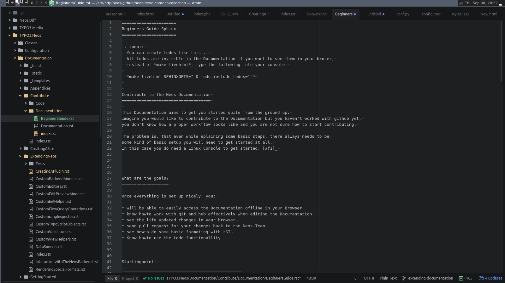
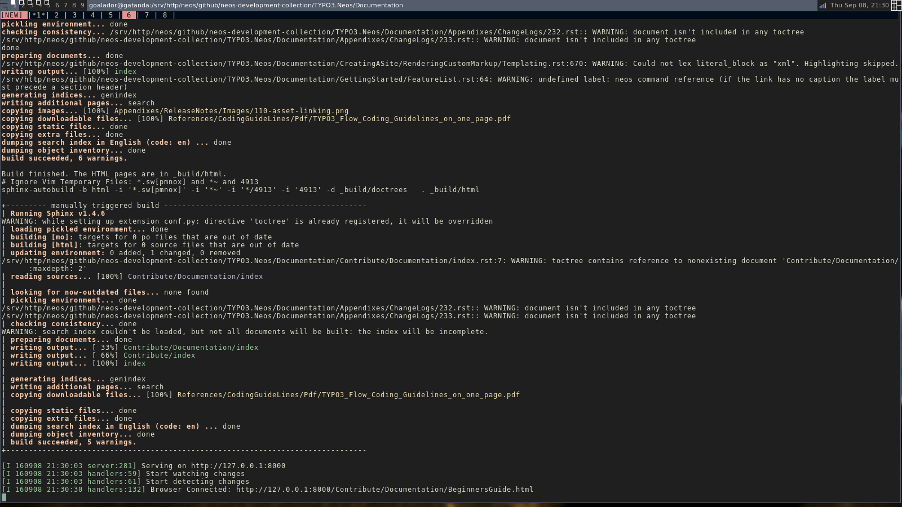
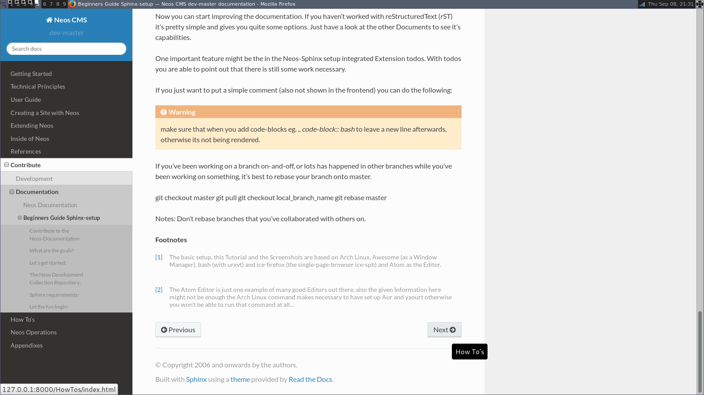
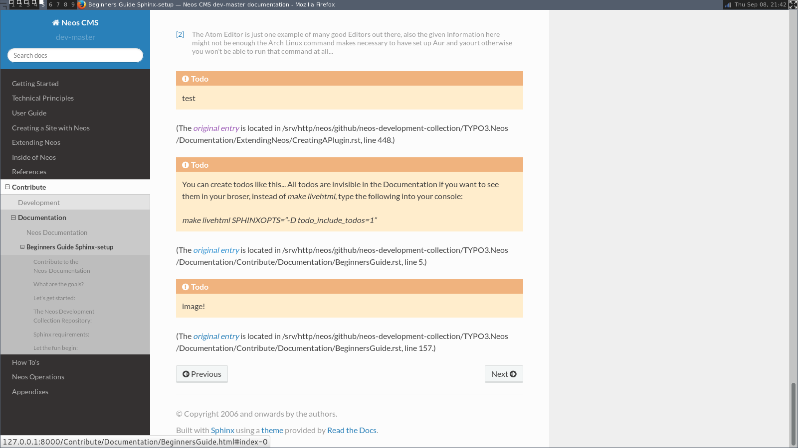

.. meta::
   :description: Beginners Guide Sphinx Documentation with reStructuredText for Neos
   :keywords: rST, Neos, markup language, Documentation,  Linux Console, bash, GitHub

============================
Beginners Guide Sphinx-Setup
============================

Contribute to the Neos-Documentation
====================================

This Documentation aims to get you started quite from the ground up.
A lot of explainations here can of cause be used to work on the whole repository, it just seems
to be a good starting point to explain the workflow concerning the documentation first.

Imagine you would like to contribute to the Documentation but you haven't worked with github yet,
you don't know how a proper workflow looks like and you are not sure how to start contributing.
The problem is, that even while explaining some of the basic steps, there always is the need for
some kind of basic setup you will have to take care of yourself. You can of cause commit by using
GitHub itself. The aim of this document is focusing on working with git locally.
You need for eg. a Linux Console and git to get started. [#f1]_

What are the goals?
===================

Once everything is set up nicely and hopefully without to much trouble, you will:

* know how to commit changes directly on GitHub.
* be able to easily access the Documentation offline in your browser
* know how to work with git and hub effectively when editing the Documentation
* see the life updated changes in your browser
* send pull request for your changes back to the Neos-Team
* see how to do some basic formatting with reStructuredText (rST)
* know how to use the todo functionality

Let's get started
=================

The easiest way to start is using GitHubs website itself to work on the repository.
Just click on the fork-button inside the repository, once you have done this you have
got your own copy (fork) of the repo you can work on. At first create a new branch by
clicking on the branch-button and typing in a new appropriate branch-name into the input field.

Next you can start editing the files relating to the branch you just created. Now you just need
to save your changes by clicking the "Commit changes"-button. (Please read the part below about
meaningful commit messages).

Once you have done all the necessary changes you can click the
"Create pull request"-button. Again make sure to explain what you have done. This last step
opens also a new dialog about your pull request in the original forked repository. Depending
of what you have done this will either be merged right away or you might get some feedback if
some work might still be necessary.

That's basically it. Next we will look into the way of making your commits more precise before
discussing a detailed offline way of working on the repository.

Guideline - commit messages
===========================

.. note::

  The following section was originally posted here (`commit message style`_) by Christian Müller.
  Please make sure to follow these Guidelines.

.. _commit message style: https://discuss.neos.io/t/commit-message-style/507

To have a clear and focused history of code changes is greatly helped by using a
consistent way of writing commit messages. Because of this and to help with (partly)
automated generation of change logs for each release we have defined a fixed syntax for
commit messages that is to be used.

.. warning::
  Tip: Never commit without a commit message explaining the commit

  The syntax is as follows:

Start with one of the following codes:

.. note::

  FEATURE
  A feature change. Most likely it will be an added feature, but it could also be removed. There should
  be a corresponding ticket in the issue tracker. Features usually only get into the current development master.

  BUGFIX
  A fix for a bug. There should be a ticket corresponding to this in the issue tracker and we encourage to add a new test that exposes the bug, which makes the work for everyone easier in the future and prevents the bug from reappearing.

  TASK
  Anything not covered by the above categories, e.g. coding style cleanup or documentation changes. Usually only used if there’s no corresponding ticket.

  SECURITY
  A security related change. Those are only commited by active team members in the security community of practice.

  MERGE
  Used for a branch upmerges by the team (or CI server) not something you usually would need to use.

The code is separated by a colon : from a short summary in the same line, no full stop at the end.

If the change affects the public API or is likely to break things on the user side, prefix the line with !!!. This indicates a breaking change that needs human action when updating. Make sure to explain why a change is breaking and in what circumstances. A change including a migration should always be marked breaking to alert users of the need to migrate.

Then (after a blank line) follows the custom message explaining what was done.
It should be written in a style that serves well for a change log read by users.
If there is more to say about a change add a new paragraph with background information below.
In case of breaking changes give a hint on what needs to be changed by the user.
If corresponding tickets exist, mention the ticket number(s) using footer lines after another blank line and use the following actions:

<issue number> #close Some additional info if needed If the change resolves a ticket by fixing a bug, implemeting a feature or doing a task.
<issue number> #comment Some info why this is related If the change relates to an issue but does not resolve or fix it.
This follows Jiras smart commit footers, see more details in the Jira documentation3

A commit messages following the rules...:

.. note::

  TASK: Short (50 chars or less) summary of changes

  More detailed explanatory text, if necessary.  Wrap it to about 72
  characters or so.  In some contexts, the first line is treated as the
  subject of an email and the rest of the text as the body.  The blank
  line separating the summary from the body is critical (unless you omit
  the body entirely); tools like rebase can get confused if you run the
  two together.

  Write your commit message in the present tense: "Fix bug" and not "Fixed
  bug."  This convention matches up with commit messages generated by
  commands like git merge and git revert.

  Code snippets::

     should be written in
     ReStructuredText compatible
     format for better highlighting

  Further paragraphs come after blank lines.

  * Bullet points are okay, too
  * An asterisk is used for the bullet, it can be preceded by a single
    space. This format is rendered correctly by Forge (redmine)
  * Use a hanging indent

  A first step in solving neos/flow-development-collection#789.

  Fixes #123

  Closes #456

Examples of good and bad subject lines:

.. note::

  Introduce xyz service
  BAD, missing code prefix

  BUGFIX: Fixed bug xyz
  BAD, subject should be written in present tense

  TASK!!!: A breaking change
  BAD, subject has to start with !!! for breaking changes

  BUGFIX: SessionManager removes expired sessions
  GOOD, the line explains what the change does, not what the bug is about (this should be explained in the following lines and in the related bug tracker ticket)

  !!! BUGFIX: SessionManager never expires sessions
  GOOD, the line explains what the change does, not what the bug is about (this should be explained in the following lines and in the related bug tracker ticket)

.. warning::
  Please also have a look at this discussion: (`Creating a pull request`_).

.. _Creating a pull request: https://discuss.neos.io/t/creating-a-pull-request/506

Using git in the console
========================

.. code-block:: bash

  sudo apt-get install git-all hub #(Debian Based)
  sudo pacman -Sy git hub #(Arch Linux)

Quote:
  "Whether you are beginner or an experienced contributor to open-source,
  hub makes it easier to fetch repositories, navigate project pages,
  fork repos and even submit pull requests, all from the command-line."
  -- `hub.github.com`_

.. _hub.github.com: https://hub.github.com/

The Atom Editor including the extension packages *Git Diff* and *language-restructuredtext*
would be nice options for editing the files, etc...:

.. code-block:: bash

  yaourt atom-editor #(Arch Linux)

(See https://github.com/atom/atom for other Distributions) [#f2]_

Here you can see how the Atom Editor looks like. On the left side you can see,
that the new (green) and changed (yellow) folders and files are highlighted,
also in the document itself you can see which lines you changed or added:

  The Atom Editor

To be able to work with GitHub nicely from the console, you could use hub instead
of git, for that you can edit and add: *alias git=hub* to the .bashrc and refresh it:

.. code-block:: bash

  vim ~/.bashrc #(add: alias git=hub)
  source ~/.bashrc #(to reload the .bashrc-file)

The Neos Development Collection Repository
==========================================

Now lets clone the Neos Development Collection Repository into the
folder you are currently in.

.. code-block:: bash

  git clone https://github.com/neos/neos-development-collection.git

Sphinx requirements
===================

Sphinx is based on Python to make Sphinx available in your System
you probably need to install some packages through pip.

.. code-block:: bash

  sudo pacman -S python-pip

There are different ways of dealing with Python-packages.
The following way is to install it in the user-directory and a
dding the bin-path to the $PATH – Environment.

.. code-block:: bash

  pip install --user Sphinx
  pip install --user sphinx-autobuild
  pip install --user sphinx_rtd_theme

Then add the following line to your .bashrc:
*export PATH=$HOME/.local/bin:$PATH*

.. code-block:: bash

  vim ~/.bashrc #(add the above line)
  source ~/.bashrc #(to reload the .bashrc-file)

Let the fun begin
=================

Now you should already be able to make the documentation available in the browser.
Go into the following folder from where you cloned the Neos-Collection:

*cd /neos-development-collection/Neos.Neos/Documentation/*

And then run the following command:

.. code-block:: bash

  make livehtml

If everything works as planed, you should now see a line like this in the console:

*[I 160908 18:55:04 server:281] Serving on http://127.0.0.1:8000*

  Sphinx make livehtml

The Url served here is, as long as you keep the process running, live reloaded when the files are changed.
Just open the Url in your Browser, you should see the whole Documentation served by your local machine.
Now try to open a file in the Neos-Collection eg. the file you are reading right now is located here:
*/neos-development-collection/Neos.Neos/Documentation/Contribute/Documentation/BeginnersGuide.rst*

  Sphinx browser view

Now change a line, save it and have a look in the console and the browser. Afterwards undo the change,
to make sure git doesn't take the change seriously yet...
The console should have recognised by now, that you are connected with a browser to the url,
and now should also tell you which file was changed. If you check the browser again, it should,
without manually refreshing the page, show you the edited line in its new version.

reStructuredText (rST)
======================

Now you can start improving the documentation. If you haven't worked with reStructuredText (rST)
it's pretty simple and gives you quite some options. Just have a look at the Documentation files
available, they give you a good understanding of what is possible. It has a lot of capabilities.
Checkout their documentation for more informations `Sphinx docs`_.

.. _Sphinx docs: http://www.sphinx-doc.org/en/stable/rest.html

One nice feature is the, in the Neos-Sphinx setup integrated, extension *todo*.
With *todo* you are able to point out that there is still some work necessary.
Add a todo, if you feel like there is something missing here, or someone else needs to check
if what you have written is correct like this. Just use it a lot to make sure it's obvious
what still needs to be done...

.. note::
  Every following line which is indented by two spaces now, is part of the note.
  If you would replace it with todo instead of (*.. note::* -> *.. todo::*), it wouldn't be
  visible in the frontend/browser anymore, but just just visible for you and others, when editing these files.

  There is also the possibility to see all the todos with its positions by putting *.. todolist::* into the document.
  Both features (the todo itself and their collection) can be made visible in the browser
  while working on the documentation for eg. by starting Sphinx like this:

.. code-block:: bash

  make livehtml SPHINXOPTS="-D todo_include_todos=1"

  Sphinx todolist

If you just want to put a simple comment (also not shown in the frontend) you can do the following:

.. This is a comment.
  over multiple lines..

  Still in the comment since it is still indented.

.. note::

  Comments are also invisible in the browser, you can create them by just using two dots (..)
  at the beginning of a line. The following indented lines are part of the comment.

.. warning::

  Make sure that when you add code-blocks eg. *.. code-block:: bash* to leave a new line afterwards,
  otherwise its not being rendered.

GitHub checkout-process
=======================

Now we should have a look at the git-workflow. The first step you should checkout a branch from
master to be able to work on that locally for now. Somewhere below the Folder *neos-development-collection/*,
you should run the following command to create and enter a new branch:

.. code-block:: bash

  git checkout -b [local_branch_name]

Now you can start editing the files as you like in your own local feature-branch.

If you've been working on a branch here and there, you should probably make sure first,
that your master-branch is up to date. The there are two strategies for that. Here we will
rebase your only local branch onto master.
The following would be an example where you stash your changes for now, so you don't have to commit
them there and then, switch to your local master, pull the changes to be up to date and then
apply your changes back to your reactivated feature-branch.

.. code-block:: bash

  git stash
  git checkout master
  git pull
  git checkout [local_branch_name]
  git rebase master
  git stash apply

.. warning::
  Make sure not to rebase branches that you've collaborated with others on. Never
  rebase anything you have pushed somewhere already.

To get more information about how to work with git go to this page there are many good sources online.
Two good examples are for eg.: `SSH`_, `Basic Branching and Merging`_ or also `Rebasing`_.

.. _SSH: https://help.github.com/articles/generating-an-ssh-key/
.. _Basic Branching and Merging: https://git-scm.com/book/en/v2/Git-Branching-Basic-Branching-and-Merging
.. _Rebasing: https://git-scm.com/book/ch3-6.html

.. code-block:: bash

  git add [new files]
  git commit -m "FEATURE done with the feature: [local_branch_name] to make this and that more efficient"
  git fork #(forking repo on GitHub...)
  #→ git remote add YOUR_USER git://github.com/YOUR_USER/neos-development-collection.git

.. code-block:: bash

  # push the changes to your new remote
  git push YOUR_USER feature
  # open a pull request for the topic branch you've just pushed
  git pull-request
  #→ (opens a text editor for your pull request message)

.. rubric:: Footnotes

.. [#f1] The basic setup, this Tutorial and the Screenshots are based on Arch Linux,
  Awesome (as a Window Manager), bash (with urxvt) and ice-firefox (the single-page-browser ice-spb) and Atom as the Editor.

.. [#f2] The Atom Editor is just one example of many good Editors out there, also the given Information here
  might not be enough the Arch Linux command makes necessary to have set up AUR and yaourt otherwise you won't be able to run
  that command at all...

.. todolist::
