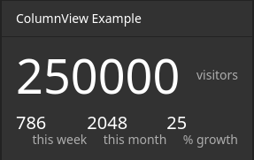

.. _inspector-views-reference:

Inspector Views Reference
=========================

Each ``NodeTypes.yaml`` can be used to configure views that are displayed inside the Neos inspector. Here follows the reference for each built-in view.

``Data/ColumnView``
~~~~~~~~~~~~~~~~~~~

w.

The ``ColumnView`` displays numeric data from a data source as a compact view.

A data source is a PHP class implementing ``Neos\Neos\Service\DataSource\DataSourceInterface`` (which is best achieved by extending ``Neos\Neos\Service\DataSource\AbstractDataSource``). The example displayed above uses the following data source implementation:

.. code-block:: php

  <?php

  /*
   * This script belongs to the package "Vendor.Site".
   */

  declare(strict_types=1);

  namespace Vendor\Site\Application\Neos\DataSource;

  use Neos\Neos\Service\DataSource\AbstractDataSource;
  use Neos\ContentRepository\Domain\Model\NodeInterface;

  final class ColumnViewDataSource extends AbstractDataSource
  {
      /**
      * @var string
      */
      static protected $identifier = 'vendor-site-column-view';

      /**
      * Get data
      *
      * {@inheritdoc}
      */
      public function getData(NodeInterface $node = NULL, array $arguments = [])
      {
          return [
              'data' => [
                  'total' => [
                      'uniqueVisitors' => 250000,
                  ],
                  'thisWeek' => [
                      'uniqueVisitors' => 786,
                      'growthPercent' => 25,
                  ],
                  'thisMonth' => [
                      'uniqueVisitors' => 2048,
                      'growthPercent' => 25,
                  ]
              ]
          ];
      }
  }

.. note:: The data returned from a data source that is used for a ``ColumnView`` need not adhere to a specific shape. The ``viewOptions`` configuration is used to extract data from arbitrary data shapes as you'll see below.

Example ``viewOptions``:

.. code-block:: yaml

  'Vendor.Site:MyCustomNodeType':
    # ...
    ui:
      inspector:
        views:
          columnViewExample:
            label: 'ColumnView Example'
            group: examples
            view: 'Neos.Neos/Inspector/Views/Data/ColumnView'
            viewOptions:
              dataSource: vendor-site-column-view
              hero:
                data: total.uniqueVisitors
                label: 'visitors'
              columns:
                -
                  data: thisWeek.uniqueVisitors
                  label: 'this week'
                -
                  data: thisMonth.uniqueVisitors
                  label: 'this month'
                -
                  data: thisMonth.growthPercent
                  label: '% growth'
    # ...

``viewOptions`` Reference:

``dataSource`` (required string)
  Class name of class implementing ``Neos\Neos\Service\DataSource\DataSourceInterface``

``arguments`` (optional array)
  If provided, the ``arguments`` will be passed as the second parameter to the data source's ``getData`` method.

``hero`` (optional)
  The hero element will be displayed with a larger font above all other data points.

  ``data`` (required string or array)
    A path to access the data from the data source. If given a string, the path will be split by ``.``. The data this path points to should be numeric.

  ``label`` (optional string)
    A brief description of the number provided through ``data``

``columns`` (optional array)
  This is a list of data points that will be displayed below the hero element. Each element in this array has the following options:

  ``data`` (required string or array)
    A path to access the data from the data source. If given a string, the path will be split by ``.``. The data this path points to should be numeric.

  ``label`` (optional string)
    A brief description of the number provided through ``data``
