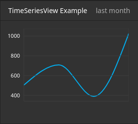

.. _inspector-views-reference:

Inspector Views Reference
=========================

Each ``NodeTypes.yaml`` can be used to configure views that are displayed inside the Neos inspector. Here follows the reference for each built-in view.

``Data/ColumnView``
~~~~~~~~~~~~~~~~~~~

.. figure:: Images/Data.ColumnView.png
  :alt: A screenshot showcasing the ColumnView. It shows "250000 visitors" as the hero element and three additional data points, namely "786 this week", "2048 this month" and "25% growth", all of which are examples of data that can be displayed with the ColumnView.

The ``ColumnView`` displays numeric data from a data source as a compact view.

A data source is a PHP class implementing ``Neos\Neos\Service\DataSource\DataSourceInterface`` (which is best achieved by extending ``Neos\Neos\Service\DataSource\AbstractDataSource``). The example displayed above uses the following data source implementation:

.. code-block:: php

  <?php

  /*
   * This script belongs to the package "Vendor.Site".
   */

  declare(strict_types=1);

  namespace Vendor\Site\Application\Neos\DataSource;

  use Neos\Neos\Service\DataSource\AbstractDataSource;
  use Neos\ContentRepository\Domain\Model\NodeInterface;

  final class ColumnViewDataSource extends AbstractDataSource
  {
      /**
      * @var string
      */
      static protected $identifier = 'vendor-site-column-view';

      /**
      * Get data
      *
      * {@inheritdoc}
      */
      public function getData(NodeInterface $node = NULL, array $arguments = [])
      {
          return [
              'data' => [
                  'total' => [
                      'uniqueVisitors' => 250000,
                  ],
                  'thisWeek' => [
                      'uniqueVisitors' => 786,
                      'growthPercent' => 25,
                  ],
                  'thisMonth' => [
                      'uniqueVisitors' => 2048,
                      'growthPercent' => 25,
                  ]
              ]
          ];
      }
  }

.. note:: The data returned from a data source that is used for a ``ColumnView`` need not adhere to a specific shape. The ``viewOptions`` configuration is used to extract data from arbitrary data shapes as you'll see below.

Example ``viewOptions``:

.. code-block:: yaml

  'Vendor.Site:MyCustomNodeType':
    # ...
    ui:
      inspector:
        views:
          columnViewExample:
            label: 'ColumnView Example'
            group: examples
            view: 'Neos.Neos/Inspector/Views/Data/ColumnView'
            viewOptions:
              dataSource: vendor-site-column-view
              hero:
                data: total.uniqueVisitors
                label: 'visitors'
              columns:
                -
                  data: thisWeek.uniqueVisitors
                  label: 'this week'
                -
                  data: thisMonth.uniqueVisitors
                  label: 'this month'
                -
                  data: thisMonth.growthPercent
                  label: '% growth'
    # ...

``viewOptions`` Reference:

``dataSource`` (required string)
  Class name of class implementing ``Neos\Neos\Service\DataSource\DataSourceInterface``

``arguments`` (optional array)
  If provided, the ``arguments`` will be passed as the second parameter to the data source's ``getData`` method.

``hero`` (optional)
  The hero element will be displayed with a larger font above all other data points.

  ``data`` (required string or array)
    A path to access the data from the data source. If given a string, the path will be split by ``.``. The data this path points to should be numeric.

  ``label`` (optional string)
    A brief description of the number provided through ``data``

``columns`` (optional array)
  This is a list of data points that will be displayed below the hero element. Each element in this array has the following options:

  ``data`` (required string or array)
    A path to access the data from the data source. If given a string, the path will be split by ``.``. The data this path points to should be numeric.

  ``label`` (optional string)
    A brief description of the number provided through ``data``

``Data/TableView``
~~~~~~~~~~~~~~~~~~~

.. figure:: Images/Data.TableView.png
  :alt: A screenshot showcasing the TableView. It shows a table with 3 rows, each split into 3 columns. The first row reads "desktop, 503 visitors, 50%", the second row reads "tablet, 87 visitors, 8.6%", and the third row reads "smartphone, 416 visitors, 41.3%". These are examples of data that can be displayed with the TableView.

The ``TableView`` displays data from a data source as a table.

A data source is a PHP class implementing ``Neos\Neos\Service\DataSource\DataSourceInterface`` (which is best achieved by extending ``Neos\Neos\Service\DataSource\AbstractDataSource``). The example displayed above uses the following data source implementation:

.. code-block:: php

  <?php

  /*
   * This script belongs to the package "Vendor.Site".
   */

  declare(strict_types=1);

  namespace Vendor\Site\Application\Neos\DataSource;

  use Neos\Neos\Service\DataSource\AbstractDataSource;
  use Neos\ContentRepository\Domain\Model\NodeInterface;

  final class TableViewDataSource extends AbstractDataSource
  {
      /**
      * @var string
      */
      static protected $identifier = 'vendor-site-table-view';

      /**
      * Get data
      *
      * {@inheritdoc}
      */
      public function getData(NodeInterface $node = NULL, array $arguments = [])
      {
          return [
              'data' => [
                  'rows' => [
                      [
                          'deviceCategory' => 'desktop',
                          'uniqueVisitors' => 503,
                          'percentage' => 50
                      ],
                      [
                          'deviceCategory' => 'tablet',
                          'uniqueVisitors' => 87,
                          'percentage' => 8.6
                      ],
                      [
                          'deviceCategory' => 'smartphone',
                          'uniqueVisitors' => 416,
                          'percentage' => 41.3
                      ],
                  ],
              ]
          ];
      }
  }

.. note:: The data returned from a data source that is used for a ``TableView`` need not adhere to a specific shape (as long as it represents some sort of list). The ``viewOptions`` configuration is used to extract data from arbitrary data shapes as you'll see below.

Example ``viewOptions``:

.. code-block:: yaml

  'Vendor.Site:MyCustomNodeType':
    # ...
    ui:
      inspector:
        views:
          tableViewExample:
            label: 'TableView Example'
            group: examples
            view: 'Neos.Neos/Inspector/Views/Data/TableView'
            viewOptions:
              dataSource: vendor-site-table-view
              collection: rows
              columns:
                -
                  data: deviceCategory
                  iconMap:
                    desktop: icon-desktop
                    tablet: icon-tablet
                    smartphone: icon-mobile-phone
                -
                  data: uniqueVisitors
                  suffix: ' visitors'
                -
                  data: percentage
                  suffix: '%'
    # ...

``viewOptions`` Reference:

``dataSource`` (required string)
  Class name of class implementing ``Neos\Neos\Service\DataSource\DataSourceInterface``

``arguments`` (optional array)
  If provided, the ``arguments`` will be passed as the second parameter to the data source's ``getData`` method.

``collection`` (required string or array)
  A path to access the collection of interest from the data provided by the data source. If given a string, the path will be split by ``.``. The data this path points to should be a numerically indexed array.

``columns`` (optional array)
  This key is used to configure the columns of the table. Each element in this array has the following options:

  ``data`` (required string or array)
    A path to access the data of an item of the list described by ``collection``. If given a string, the path will be split by ``.``.

  ``iconMap`` (optional hashmap)
    Maps the value provided through ``data`` to an icon that will be displayed in addition to the value.

  ``suffix`` (optional string)
    A brief description of the value provided through ``data``

``Data/TimeSeriesView``
~~~~~~~~~~~~~~~~~~~~~~~

ds "last month" to signify that the displayed data shows the figures over the last month.

The ``TimeSeriesView`` displays data accumulated over time from a data source as a line chart.

A data source is a PHP class implementing ``Neos\Neos\Service\DataSource\DataSourceInterface`` (which is best achieved by extending ``Neos\Neos\Service\DataSource\AbstractDataSource``). The example displayed above uses the following data source implementation:

.. code-block:: php

  <?php

  /*
   * This script belongs to the package "Vendor.Site".
   */

  declare(strict_types=1);

  namespace Vendor\Site\Application\Neos\DataSource;

  use Neos\Neos\Service\DataSource\AbstractDataSource;
  use Neos\ContentRepository\Domain\Model\NodeInterface;

  final class TimeSeriesViewDataSource extends AbstractDataSource
  {
      /**
      * @var string
      */
      static protected $identifier = 'vendor-site-time-series-view';

      /**
      * Get data
      *
      * {@inheritdoc}
      */
      public function getData(NodeInterface $node = NULL, array $arguments = [])
      {
          return [
              'data' => [
                  'rows' => [
                      [
                          'date' => new \DateTimeImmutable('2022-09-01'),
                          'uniqueVisitors' => 503
                      ],
                      [
                          'date' => new \DateTimeImmutable('2022-10-01'),
                          'uniqueVisitors' => 708
                      ],
                      [
                          'date' => new \DateTimeImmutable('2022-11-01'),
                          'uniqueVisitors' => 389
                      ],
                      [
                          'date' => new \DateTimeImmutable('2022-12-01'),
                          'uniqueVisitors' => 1027
                      ],
                  ],
              ]
          ];
      }
  }

.. note:: The data returned from a data source that is used for a ``TimeSeriesView`` need not adhere to a specific shape (as long as it includes a list of data associated with a time and date). The ``viewOptions`` configuration is used to extract data from arbitrary data shapes as you'll see below.

Example ``viewOptions``:

.. code-block:: yaml

  'Vendor.Site:MyCustomNodeType':
    # ...
    ui:
      inspector:
        views:
          timeSeriesViewExample:
            label: 'TimeSeriesView Example'
            group: examples
            view: 'Neos.Neos/Inspector/Views/Data/TimeSeriesView'
            viewOptions:
              subtitle: 'last month'
              dataSource: vendor-site-time-series-view
              collection: rows
              series:
                timeData: date
                valueData: uniqueVisitors
              chart:
                selectedInterval: weeks
                yAxisFromZero: false
    # ...

``viewOptions`` Reference:

``dataSource`` (required string)
  Class name of class implementing ``Neos\Neos\Service\DataSource\DataSourceInterface``

``arguments`` (optional array)
  If provided, the ``arguments`` will be passed as the second parameter to the data source's ``getData`` method.

``subtitle`` (optional string)
  A brief description for the time series chart that will be displayed in the top right corner

``collection`` (optional array or string)
  A path to access the collection of interest from the data provided by the data source. If given a string, the path will be split by ``.``. The data this path points to should be a numerically indexed array.

``series`` (required object)
  This object configures each data point that will be used to draw the chart.

  ``timeData`` (required array or string)
    A path to access the data of an item of the list described by ``collection``. If given a string, the path will be split by ``.``. The data this path points to should represent a time and date (e.g. an ``integer``-typed unix timestamp or a ``\DateTimeInterface``).

  ``valueData`` (required array or string)
    A path to access the data of an item of the list described by ``collection``. If given a string, the path will be split by ``.``. The data this path points to should be numeric.

``chart`` (optional object)
  This object configures the chart itself.

  ``selectedInterval`` (optional, default="years")
    This field configures the scale of the x-axis.
    Possible values are:

    - ``years`` (or ``Y``)
    - ``quarters`` (or ``Q``)
    - ``months`` (or ``M``)
    - ``weeks`` (or ``W``)
    - ``days`` (or ``D``)
    - ``seconds`` (or ``S``)

  ``yAxisFromZero`` (optional boolean, default=false)
    If set to ``true`` the y-axis will start from ``0``. Otherwise the y-axis will start from the lowest available value.
