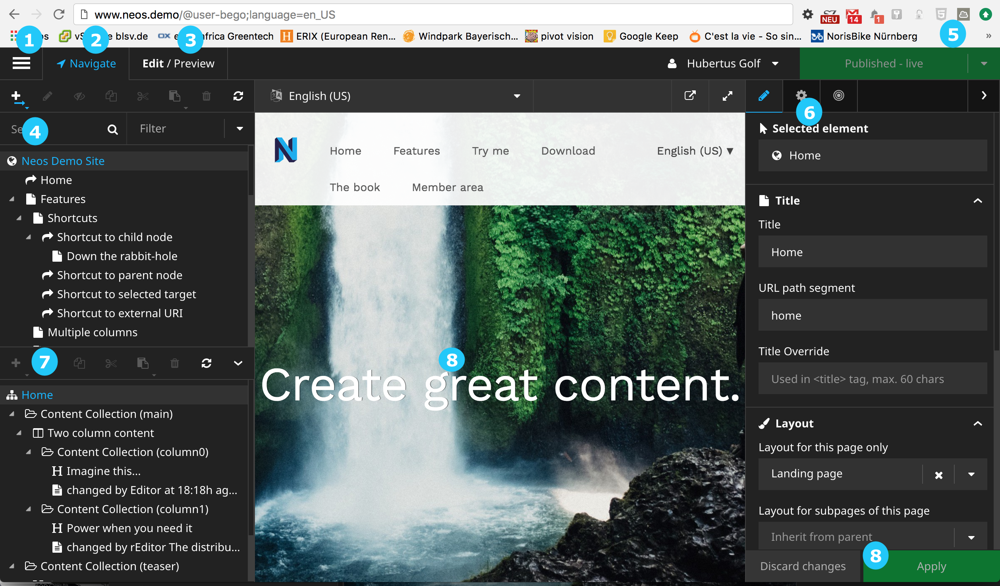
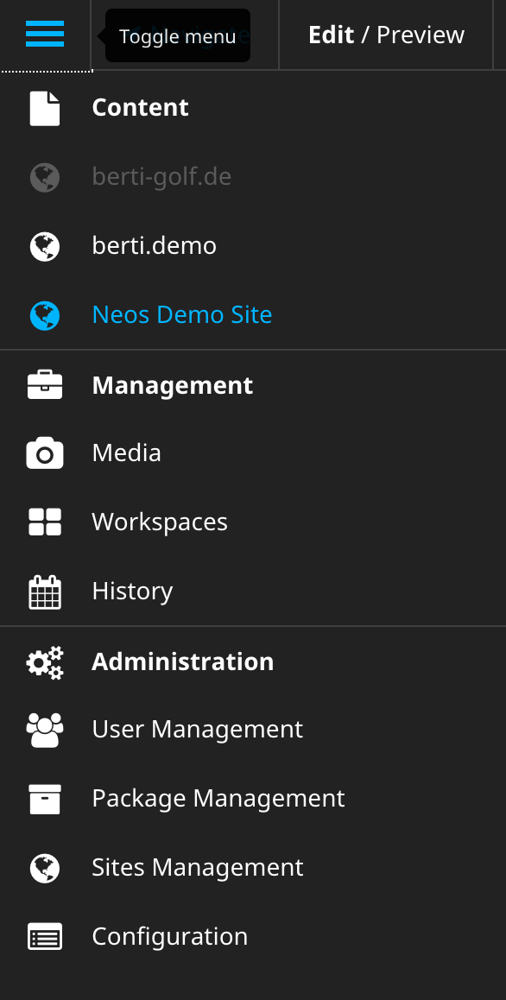
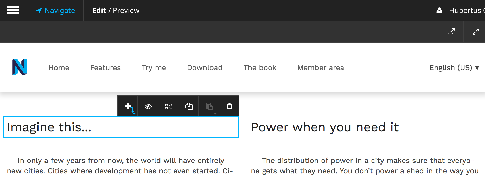
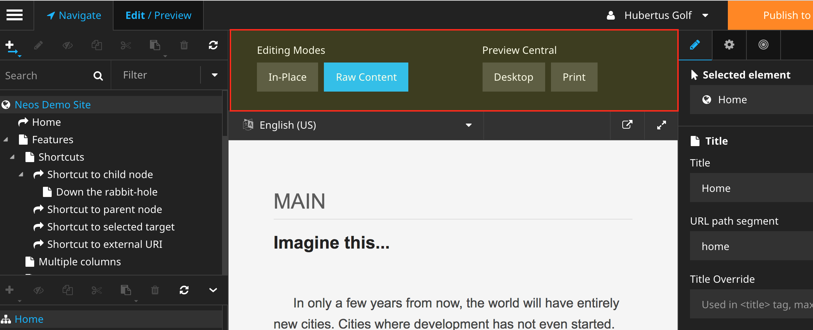
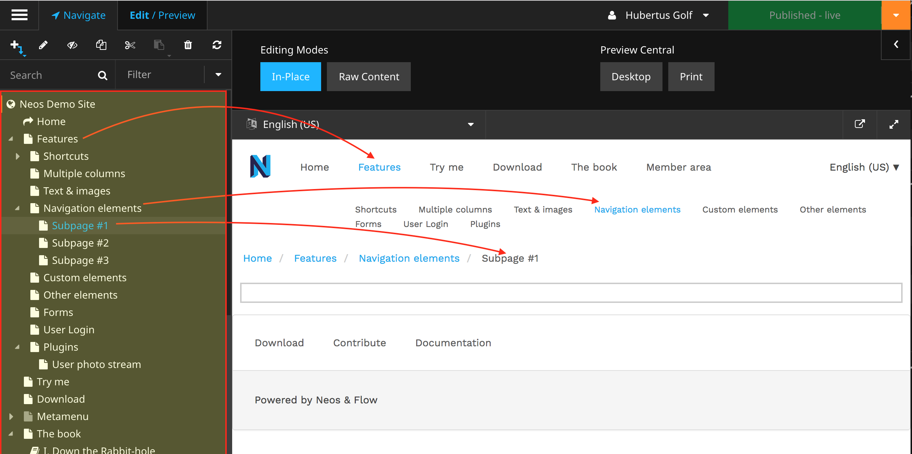
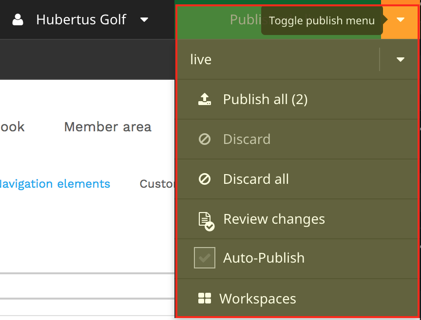
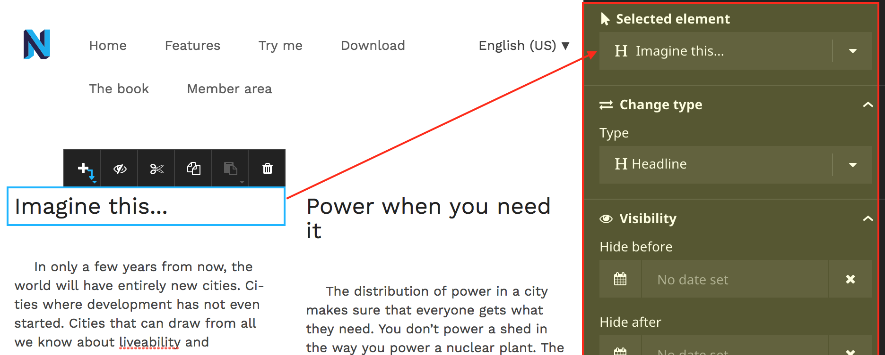
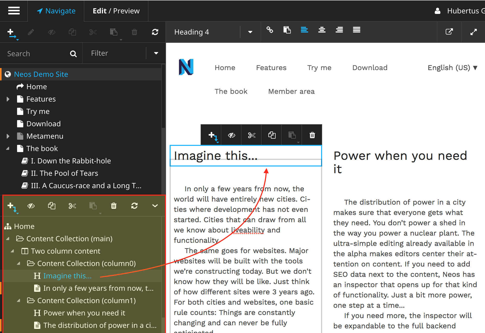
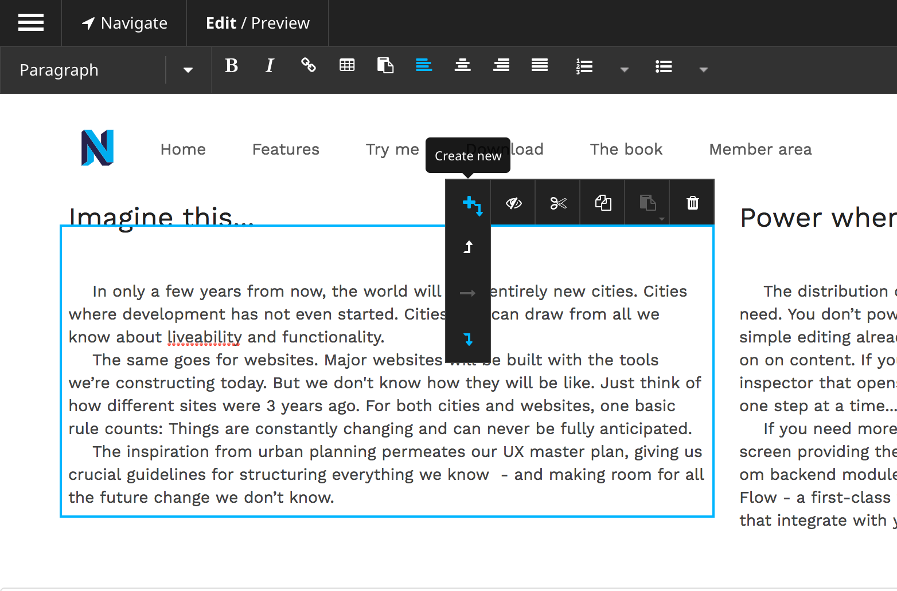
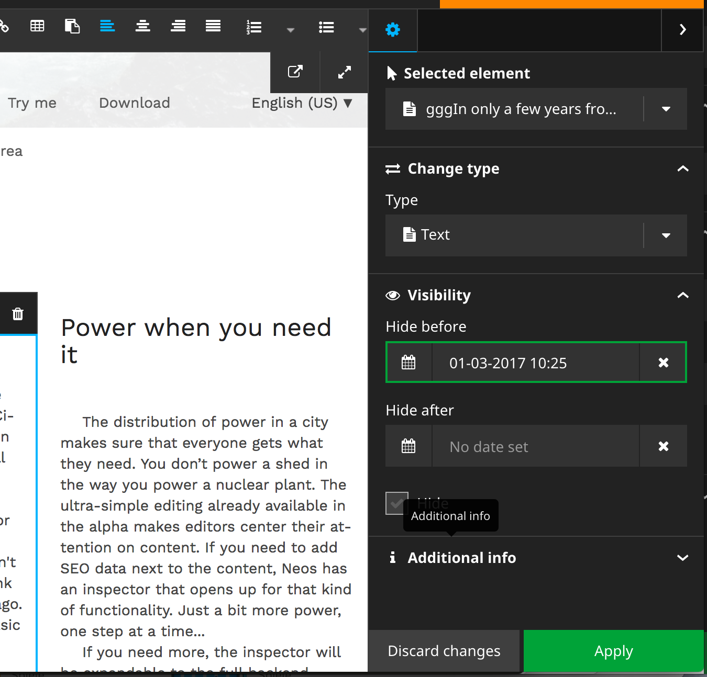

.. _user-interface-basics:

=====================
User Interface Basics
=====================

#. Toggle button for the Menu
#. The Navigate component
#. The Edit/Preview Panel
#. The Page tree
#. Publish button(s)
#. The Property Inspector
#. The Structure tree
#. The content canvas
#. Discard / Apply changes

   
1. Toggle button for the Menu
-----------------------------

   
Show or hide the Module Menu using this button.

.. container:: custom

2. The Navigate component
----------------------

Using the Navigate component you can conveniently find your way through your content. See '4. The Page tree'.
Pressing the ``navigate``-button opens and closes the left panel with `page tree` and `structure tree`.

3. The Edit/Preview Panel
-------------------------

The Edit/Preview Panel gives you the possibility to switch between the (default) 'In Place' editing mode to
and from the 'Raw Content' editing mode.

It also contains the Preview section where you can choose between customizable presentation modes, i.e.
a print style and a default Desktop style.

4. The Page tree
----------------

The Page tree is filterable and searchable and can be edited inline.

5. Publish button(s)
--------------------

These publication buttons aggregate your changes which you can publish at your chosen time. See
:ref:`user-guide-workspaces` for more information on the use of workspaces.

6. The Property Inspector
--------------------------

The Property Inspector gives you detailed property editing options for the chosen nodetype, whether this be
a page or a content element.

7. The Structure tree
---------------------

The Structure tree is a nodetype tree which gives you detailed information of how your content is structured.
It gives you information about which type, its position and its nesting level. This can also be used to navigate
the content of a page.

In the example the headline `Imagine this…` is a child of `Content colection (column0)`, a grandchild of
`Two column content` and  a grandgrandchild of `Content collection (main)`.

8. The content canvas
---------------------

The content canvas is where you can add/edit your content.

9. Discard / Apply changes
--------------------------

Neos saves your changes on the fly as much as possible. When editing properties you must apply or discard
the changes you made.
