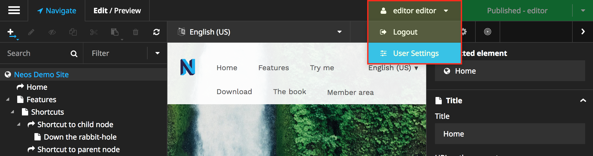
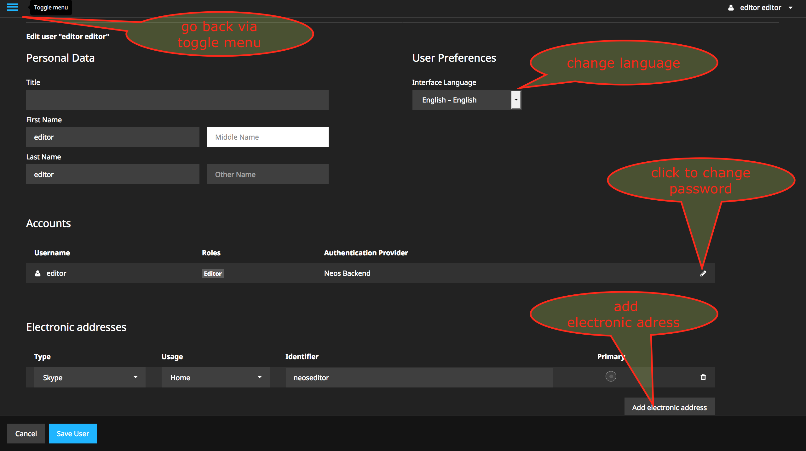
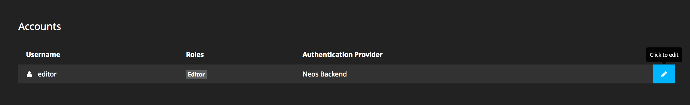
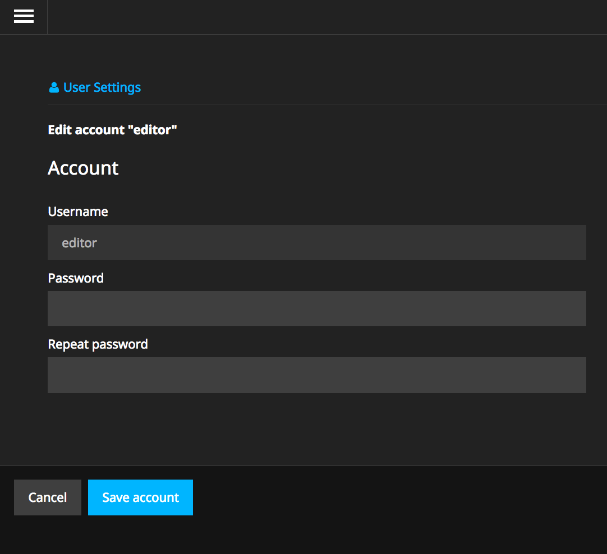
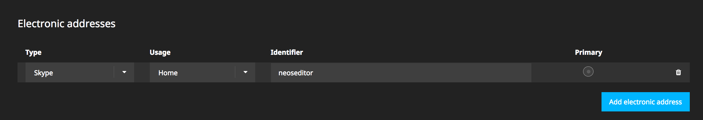
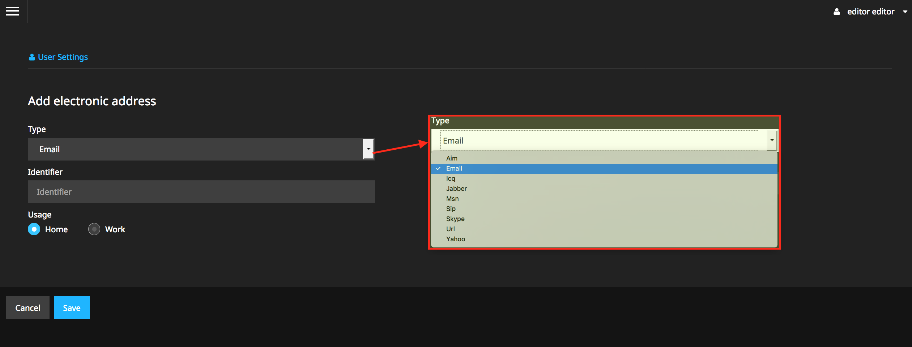
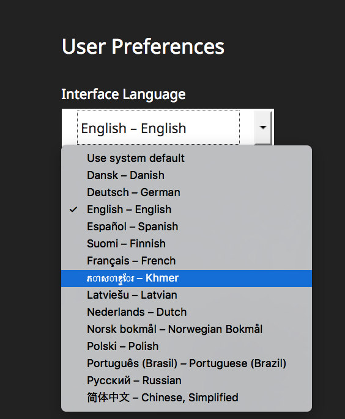

.. _user-settings:

=====================
User Settings
=====================

In this section your personal data, like names, password, electronic address and interface language is stored.

Navigate to User Settings
-------------------------

Select in the user menu `User Settings`

Edit User Settings
-------------

Edit your User Settings. 

Change password
---------------

To change your password you have to click to the edit button in the account section.

   
Change your password 
   

Add electronic adress
---------------------

Press `add electronic adress` button to add a electronic adress

   
Add your electronic adress.

Change Interface Language
-------------------------

Select your preferred language.
 

