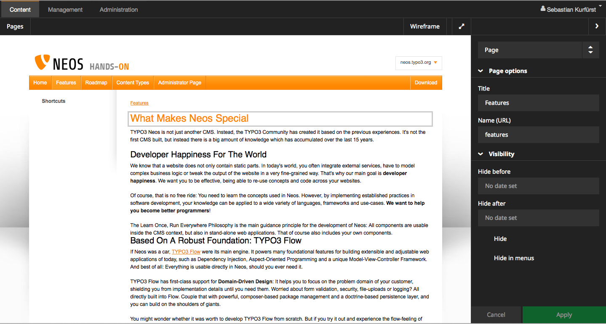
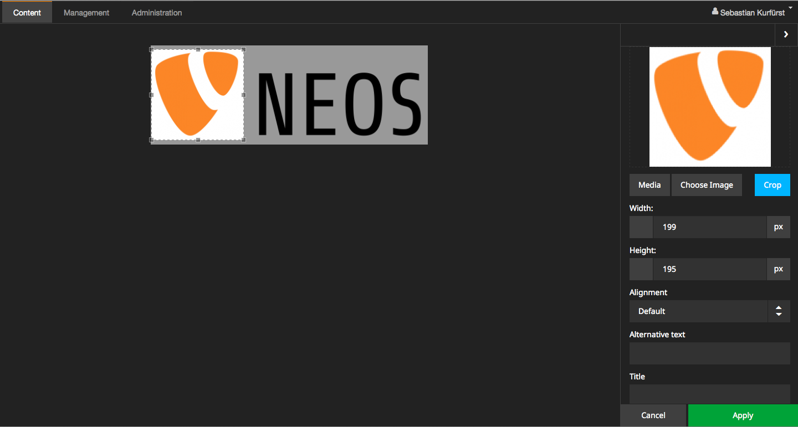
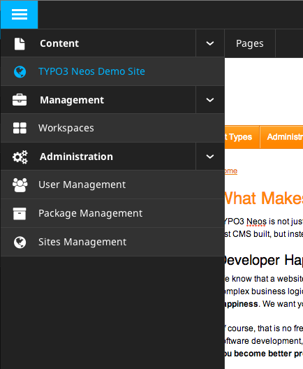
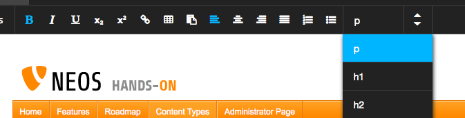
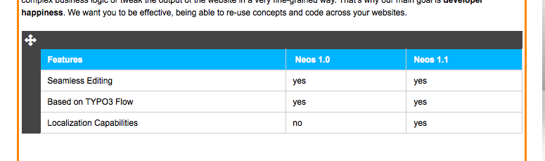

.. _1.0.0-alpha4:

=========================
1.0.0-alpha4 (2013-07-07)
=========================

We are extremely delighted to announce the immediate availability of TYPO3 Neos Alpha 4.

Loads of great improvements have gone into Neos since the last alpha, and we're
nearing feature completion for TYPO3 Neos 1.0 -- needless to say we're extremely
happy on that one.

Read on for a list of the most prominent changes!

Implemented Visual Design for Neos
==================================

During the last spring, Rasmus worked heavily on the visual design that we will
ship in Neos version 1.0. Then, Aske, Mattias and Berit did a great job implementing
the major parts of the Neos design. The implementation is already well developed,
but we'll continue to polish it in the next few weeks.

Nicely Integrated Aloha Content Editor
======================================

Needless to say, the content editing of Neos needs to work flawlessly, as it's the
area editors spend most time in. That's why we had the long-term plan of replacing
Hallo editor with Aloha, which provides us with the content editing stability we need.
Sebastian has been working on this integration for the last few months, and we are
happy to ship it in this alpha. All the formatting you'd expect is working nicely,
and table editing is a breeze thanks to Aloha.

Furthermore, lots of bugfixes have been done in that area, leading to a greatly
revamped experience.

First Integration of Media Browser
==================================

While you have been able to upload images to Neos for quite some time, there was
no way to select an already-uploaded image. Christian and Karsten worked on the
first version of the Media Browser, which was integrated in the last sprint as
well. It also allows tagging, uploading, and organizing images.

We plan numerous improvements in this area in the future, but we are happy to ship
the first version.

Improved Robustness for Site Integration
========================================

As Neos is loaded on top of your website, we have to make sure that it does not
interfere with your website -- which is a pretty hard problem, as you can choose
just about any JavaScript or CSS library on the planet.

Finally, we were able to make sure our versions of JavaScript libraries are properly
namespaced. This is especially important for jQuery so that the Neos-provided version
cannot interfere with the website's version anymore. While this sounds trivial at
first, it greatly improves interoperability.

The same applies to CSS, where the Neos CSS is now properly namespaced.

Node Types and TypoScript Ready For Prime Time
==============================================

In order to finalize the API of Neos, a lot more than PHP code had to be updated.
We have cleaned up the namings and internal configuration of the default node types
and TypoScript objects. Christian and Robert did a lot of work in helping us make
sure that we have a solid foundation to ship in 1.0.

In the next few weeks, we will continue to work on additional API improvements.

Consistency and Stability Improvements all over the place
=========================================================

The whole team -- including Rens, Tim, Christopher, Bastian and Markus -- worked
on loads of consistency and stability improvements in both the PHP code and the
frontend editing.

One of the bigger changes we did as in preparation for this release was that we
renamed the packages to their final name, and we `updated the Git repositories to
reflect these naming changes <http://typo3.org/news/article/git-repositories-for-typo3-flow-packages-have-been-renamed/>`_.

Furthermore, we improved Internet Explorer compatibility.

Content Repository
==================

Robert and Christian improved the stability and scalability of the Content Repository,
so that it can handle bigger data loads, and they fixed some annoying bugs.

Behat Testing
=============

While we had unit and functional tests for big parts of our codebase, we did not
have any end-to-end tests which interacted with Neos through the UI. Now that the
dust is settling, Christopher and Markus did a great job in writing Behat tests
for the Neos backend.

Documentation
=============

Karsten and Sebastian have worked on the `TYPO3 Neos Integrator Guide <http://docs.typo3.org/neos/TYPO3NeosDocumentation/IntegratorGuide/Index.html>`_,
which already contains lots of valuable information. We greatly appreciate everyone’s
help on this area. We want to have a well-written guide for 1.0.

Next Steps
==========

We plan to release the next alpha versions rapidly, and the first beta version
will be released soon.

There are still some breaking changes we plan to merge before the beta, but most
of the breaking changes are already merged.

Giving Feedback
===============

We're eager to hear your feedback on the release. You can reach us most easily
using Twitter (#TYPO3Neos), IRC at irc://freenode.net/typo3-neos or just reach
out to any team member of your choosing.

Enjoy the TYPO3 Developer Days 2013,
The TYPO3 Neos Team.

List of important breaking changes with upgrade instructions
============================================================

* TYPO3CR: Context Cleanup https://review.typo3.org/#/c/21249/
  *run the provided migrations for upgrading your database*
* TYPO3 Neos: Paths given to <ts:render> ViewHelper now uses "." instead of "/" https://review.typo3.org/#/c/20951/
  *to adjust your template, run the provided code migration*
* TYPO3 Neos: <ts:renderTypoScript> has been renamed to <ts:render> https://review.typo3.org/#/c/20950/
  *to adjust your template, run the provided code migration*
* TYPO3 Neos/TYPO3CR: Refactored node type definitions https://review.typo3.org/#/c/18148/
  *NodeTypes.yaml of your custom packages must be manually adjusted*
* TypoScript: Rename page.headerData to page.head
  *Manually rename page.headerData to page.head in your page TypoScript*
* Rename TYPO3.Neos.ContentTypes to TYPO3.Neos.NodeTypes https://review.typo3.org/#/c/19292/
  *included is a migration script to update your database content*
* Neos: Make node types and TypoScript more consistent https://review.typo3.org/#/c/20960/
  *included is a migration script with detailed instructions to update your database content*
* Neos: removed TYPO3.TYPO3CR:Folder node type
  *if you extended Folder directly, you should now extend Document*
* TypoScript: Implement real prototype inheritance https://review.typo3.org/#/c/17573/
  *there should be no visible changes to the outside behavior in most cases*

Full list of breaking changes
=============================

*TYPO3.Neos*

* [!!!][FEATURE] Refactored node type definitions https://review.typo3.org/#/c/18148/
* [!!!][TASK] Rename page.headerData to page.head
* [!!!][FEATURE] Inspector interface and restructuring
* [!!!][TASK] Make node types and TypoScript more consistent
* [!!!][TASK] use consistent naming of JavaScript files
* [!!!][TASK] Move the Breadcrumb into Inspector
* [!!!][TASK] Remove unnecessary notEditable ViewHelper
* [!!!][TASK] Remove context assignment from TS Template (deprecated since sprint 10)

*TYPO3.Neos.NodeTypes*

* [!!!][TASK] Rename package to TYPO3.Neos.NodeTypes https://review.typo3.org/#/c/19292/
* [!!!][FEATURE] Refactored node type definitions http://forge.typo3.org/issues/45317
* [!!!][TASK] Make node types and TypoScript more consistent https://review.typo3.org/#/c/20960/
* [!!!][TASK] use consistent naming of JavaScript files
* [!!!][TASK] Update aloha to a recently built version

*TYPO3.TYPO3CR*

* [!!!][TASK] Context Cleanup https://review.typo3.org/#/c/21249/
* [!!!][FEATURE] Refactored node type definitions https://review.typo3.org/#/c/18147/
* [!!!][TASK] Remove TYPO3.TYPO3CR:Folder node type
* [!!!][FEATURE] Enhance node:migrationstatus command
* [!!!][FEATURE] Support for transient nodes

*TYPO3.TypoScript*

* [!!!][TASK] Change the TS exception handling to allow more options https://review.typo3.org/#/c/20866/
* [!!!][FEATURE] Implement real prototype inheritance" https://review.typo3.org/#/c/17573/
* [!!!][TASK] Paths given to TS render now use . instead of / https://review.typo3.org/#/c/20951/
* [!!!][TASK] Rename renderTypoScript VH to render https://review.typo3.org/#/c/20950/
* [!!!][TASK] Move TypoScript definitions to correct place https://review.typo3.org/#/c/20949/
* [!!!][TASK] Remove deprecated "matchers" in CaseImplementation
* [!!!][TASK] TemplateImplementation shouldn't modify the request