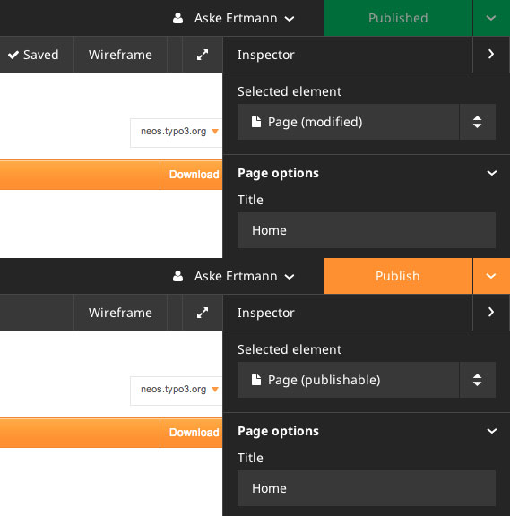

.. _1.0.0-alpha5:

=========================
1.0.0-alpha5 (2013-08-05)
=========================

In accordance with our plan to release more often we are happy to announce the release of TYPO3 Neos Alpha 5.

This release contains lots of small improvements as well as fixing some of the issues experienced with the last release.
However, this release only contains a few breaking changes, making it easier to migrate without having to adjust your own packages too much.

Read on for a list of the most prominent changes!

Validation of inspector fields
==============================

We have introduced live validation of the inspector fields, allowing validation of the user input for the
node properties to prevent errors. The validation follows the same concept as the validators from Flow and
most of these validators have been implemented in JavaScript using Ember.js. This allows for configuring validators
like you already do with action arguments and model properties, keeping one syntax for both client-side and
server-side validation. Currently the validation only takes place client-side, but it will be easy to implement
the server-side validation as well. Something to come later.

Publishing state
================

We have improved the visual state of the publishing menu to make it easier for the editor to see when there are
unpublished changes and not. This is done by changing the background color of the menu from green to orange when
there are unpublished changes.

Access restriction for specific modules
=======================================

We have improved the access restriction for modules to allow restricting access to specific modules
by security resource policies instead of restricting root modules and sub modules by security roles.

Improved Visual Design
======================

Lots of smaller things have gotten improved styling continuing paving the path for the new design.

Fixed some of the issues experienced with last release
======================================================

Since releasing the last alpha we've gotten feedback from some of the people who tried it out. These
issues included problems with being redirected to a non-existing page as well as getting an exception
when having multiple sites in the same installation. Both of these issues have now been fixed which improve the experience when
trying out Neos for the first time. Additionally lots of smaller issues that weren't show stoppers have
been fixed and we'd like to thank the community for providing feedback in order for us to fix these issues.

Protected context for TypoScript
================================

We have implemented restricted access to methods in the Eel context to public getters
and the FlowQuery operations on the "q" variable. This should prevent usage of non-getters
on objects to prevent side effects and prevent possible security issues.

Next Steps
==========

We plan to continue releasing additional alpha versions rapidly, and the first beta version
will be released soon.

There are still some breaking changes we plan to merge before the beta, but most
of the breaking changes are already merged.

Giving Feedback
===============

We're eager to hear your feedback on the release. You can reach us most easily
using Twitter (#TYPO3Neos), IRC at irc://freenode.net/typo3-neos or just reach
out to any team member of your choosing.

The TYPO3 Neos Team.

List of important breaking changes with upgrade instructions
============================================================

* TYPO3.Neos: Restrict access to specific modules https://review.typo3.org/22131
  *if you have created your own modules, you'll need to add security policy as well as configuring your module configuration with this resource*
  *additionally the standard controller has been removed in favor of a abstract module controller, which should be used instead*
* TYPO3.Neos.NodeTypes: Remove image caption alignment https://review.typo3.org/22737
  *if you rely on this property you'll either have to change the content of the property manually or introduce it in your own package*
* TYPO3.TypoScript: Use protected Eel context in Runtime https://review.typo3.org/22256
  *if you have used direct methods in TypoScript you'll have to change these occurrences to use the supported methods or provide custom Flow Query operations or create your own TypoScript context with a custom white listing*

Full list of breaking changes
=============================

*TYPO3.Neos*

* [!!!][FEATURE] Restrict access to specific modules https://review.typo3.org/22131

*TYPO3.Neos.NodeTypes*

* [!!!][TASK] Remove image caption alignment https://review.typo3.org/22737

*TYPO3.TypoScript*

* [!!!][TASK] Use protected Eel context in Runtime https://review.typo3.org/22256