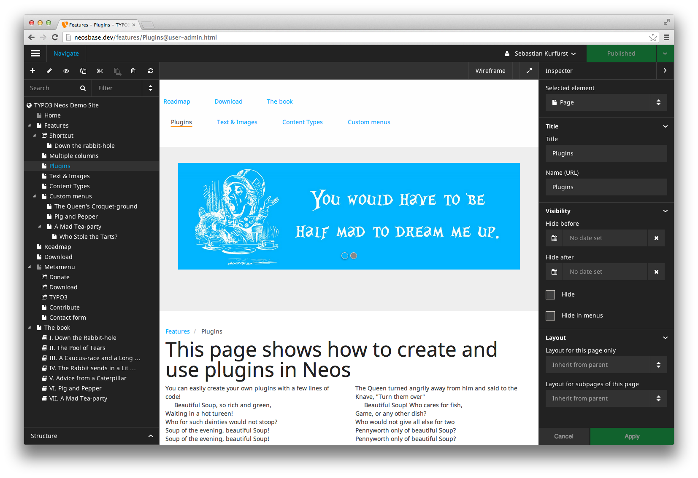
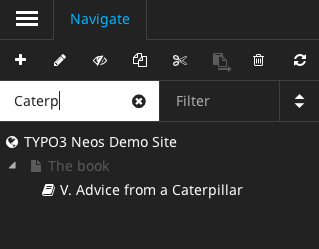
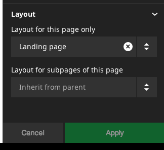
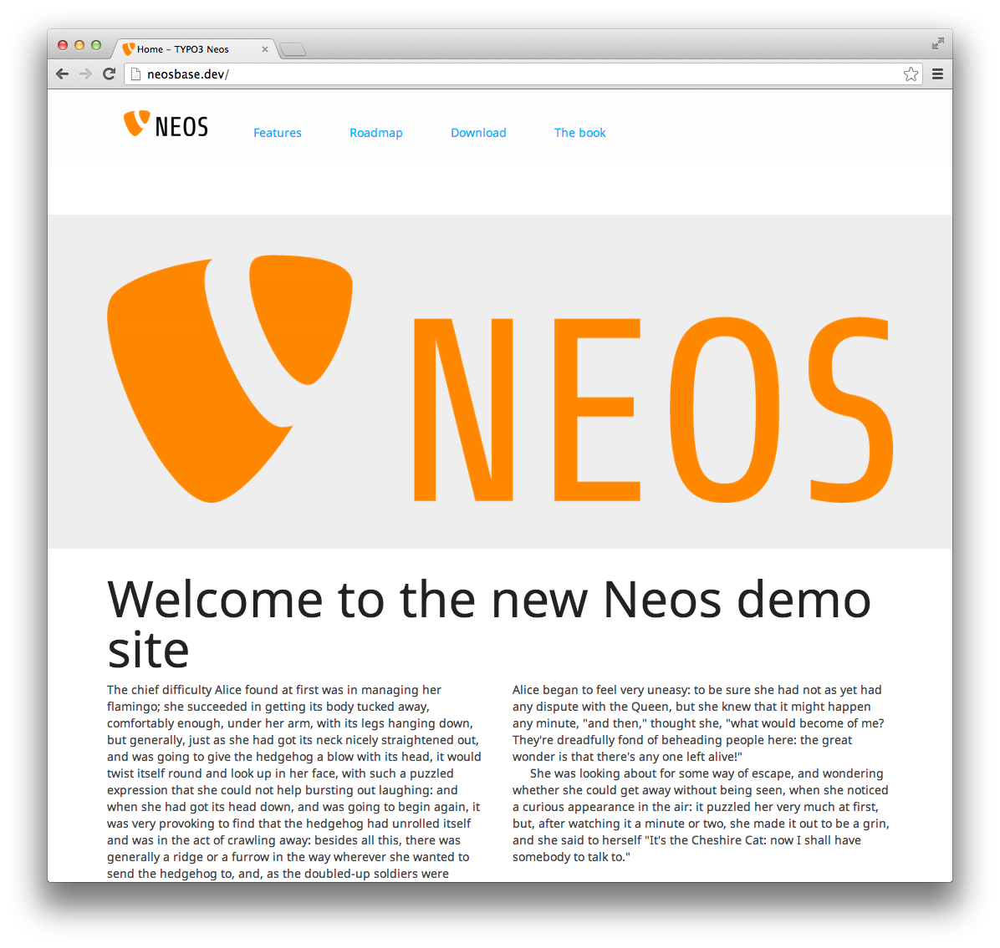

.. _1.0.0-alpha6:

=========================
1.0.0-alpha6 (2013-10-15)
=========================

TYPO3 Neos Alpha 6 contains lots of improvements, where most of them were incorporated at the code sprint at  `de-cix
<http://de-cix.net>`_.
in Frankfurt. Main highlights are improved content editing, Plugin Views, features in TypoScript, a new demo site, improved
security and lots of bugfixes and stability improvements.

Some changes are breaking, but there is a code migration for many of them.

We're aiming for another Alpha version before `T3CON13DE <http://t3con13de.typo3.org>`_, where we will announce the release
date of the beta version, being planned for a few weeks after T3CON.

Read on for the most prominent changes!

Improved Content Editing
========================

The page tree is now called "Navigate", and it has been completely re-vamped. It allows to create, filter and search pages,
and shows a structural view of the page as well.

We now include a Page Layout Selection mechanism in Neos, so the user can switch between different "templates" of a page.
Furthermore, we now ship with a *form* content element based on `TYPO3.Form <http://flow.typo3.org/documentation/guides/forms.html>`_,
which can be used e.g. for contact or signup pages.

Additionally, Aloha is now configurable, being able to change the editing options a user has on a per-content-element basis.

Basic keyboard navigation support was added as well, so navigation and creating of content can now be triggered with
keyboard shortcuts.

Stability was also improved: Especially, a long-standing bug related to moving nodes was fixed, the HTML editor can now work
with inline JavaScript.

TypoScript Improvements
=======================

There were a few bigger changes to the way we handle TypoScript, because we learned from the first real-world implementations.
While this includes some breaking changes, many sites will be easy to adjust to them:

Now, TypoScript Objects, Eel Expressions and simple values can be used interoperably: This means that e.g. every time you
were using an Eel expression beforehand, you could also use a TypoScript object for the same task, and vice versa. This makes
TypoScript more extensible and consistent.

Furthermore, we `re-implemented processors <https://review.typo3.org/#/c/24423/>`_ with Eel and TypoScript, being able to reduce
the number of concepts a user needs to learn. However, if you used processors in your site before, you need to rewrite them
to Eel expressions or TypoScript objects.

For consistency reasons, we removed the ability to attach TypoScript to a particular page, so if you relied on this feature,
you should rather use conditions now.

FlowQuery now has a ``find()`` operation which helps to search in a whole sub-tree, and ``this.*`` now references other
properties at the same level in TypoScript, increasing the re-use of Eel expressions.

Finally, two TypoScript objects were modified: ``ContentCollection.Default`` was moved back to ``ContentCollection``, and
``PrimaryContentCollection`` has been renamed to ``PrimaryContent``. A code migration has been supplied to ease upgrading.

Plugin Views
============

Often, plugins have to be split up across multiple pages, e.g. showing the "list" view on the overview page, and then having
a separate page (with a different layout) for the "detail" views. In order to make this as seamless as possible, we introduced
*plugin views*: A plugin can define into which parts it can be split apart; and the user can then easily add different parts
to different pages.

Furthermore there was one breaking change: Node properties are not passed as plugin arguments anymore, because this behavior
was hard to understand and had some broken fallback logic attached to it. Instead, the node should be accessed directly from
within the plugin.

New Demo Site
=============

The demo site has been completely re-done from scratch, being fully responsive, serving as best-practice of how Neos is used,
and showing many Neos features in detail.

We will continue to work on this in the next weeks.

Security
========

During the code sprint, a bigger Neos security audit took place: This resulted in creating many policies and implementing
security measures, which are all merged into Neos now.

New Login Screen
================

The login screen has been adjusted to match the look and feel of Neos.

Increased Compatibility With Websites
=====================================

As always, we're striving to increase compatibility with arbitrary CSS and JavaScripts the site integrator might add
to the website template. That's why we prepended all Neos CSS with ``neos-``, making it harder for websites to break
the Neos user interface.

Additionally, we are now using ``data``-attributes instead of custom ``script`` tags for storing editing information
in the website, as this makes it a lot easier to customize the desired HTML output, and it reduces difficulties in
working with JavaScript components such as sliders or carousels.

Furthermore, we were able to get rid of the ``.neos-reloadable-content`` marker class, making content reloading a lot
more robust without any help needed by the site integrator.

Code Cleanups
=============

Internally, we streamlined lots of PHP and JavaScript code, most notably we also updated to Ember 1.0.0 final.

Next Steps
==========

One more alpha version will be released before T3CON13DE. A few weeks after T3CONDE, we will release the first Beta
version.

Giving Feedback
===============

We're eager to hear your feedback on the release. You can reach us most easily using Twitter (#TYPO3Neos),
IRC at irc://freenode.net/typo3-neos or just reach out to any team member of your choosing.

Full list of breaking changes
=============================

*TYPO3.Neos*

* Security: Every controller action is now protected by default, this also includes actions and controllers of third party
  packages installed within a Neos distribution. To make them accessible again, you have to add a policy to the corresponding
  package or your site package and grant those actions to at least one role (e.g. "Everybody" or "TYPO3.Neos:Editor")

* Restructure page rendering for more flexibility: https://review.typo3.org/#/c/24563/
  *only breaking if you have overridden prototype(TYPO3.Neos:Page).templatePath*

* Remove automagic creation of ContentCollections on pages: https://review.typo3.org/#/c/24338/
  *This is breaking if you use more than the "main" section in your site. In this case you have to
  define those additional sections in the NodeTypes.yaml of your site package.*

* remove ContentCollection.Default and rename PrimaryContentCollection to PrimaryContent: https://review.typo3.org/#/c/24263/
  *please run the provided code migration*

* improve reloading of content without neos-reloadable-content: https://review.typo3.org/#/c/24300/
  *<neos:contentElement> does not have a reloadable-attribute anymore. Just remove it completely.*

* Introduce sanitation of content in Aloha editor: https://review.typo3.org/#/c/23545/

* Node with object property breaks PluginImplementation: https://review.typo3.org/#/c/23279/

* Remove usage of node based TypoScript: https://review.typo3.org/#/c/20861/
  *Use TypoScript conditions instead.*

* Upgrade Ember to 1.0.0: https://review.typo3.org/#/c/23700/
  *clear your browser cache and cookies.*

*TYPO3.TypoScript*

* re-implement Processors based on TypoScript Objects and Eel: https://review.typo3.org/#/c/24423/
  *if you used processors, see the above commit message for detailed upgrade instructions.*

Detailed change log
===================

~~~~~~~~~~~~~~~~~~~~~~~~~~~~~~~~~~~~~~~~
Base Distribution
~~~~~~~~~~~~~~~~~~~~~~~~~~~~~~~~~~~~~~~~

[TASK] Add installer scripts for package installs
-----------------------------------------------------------------------------------------

Add configuration to manifest that calls scripts on every package
install.

See also I06a2c5e35004f400291e7697c215bea8e685266b.

* Commit: `4b9bec9 <http://git.typo3.org/Neos/Distributions/Base.git?a=commit;h=4b9bec92ce6c84e38d781b2ac5ec223a8cec2270>`_

[TASK] Update vfsstream requirement to 1.2.*
-----------------------------------------------------------------------------------------

This updates the requirement for mikey179/vfsstream from 1.1.* to 1.2.*.

* Commit: `9c7642a <http://git.typo3.org/Neos/Distributions/Base.git?a=commit;h=9c7642a06eb046b9312fc1a971e341270b485752>`_

~~~~~~~~~~~~~~~~~~~~~~~~~~~~~~~~~~~~~~~~
TYPO3.Neos
~~~~~~~~~~~~~~~~~~~~~~~~~~~~~~~~~~~~~~~~

[!!!][TASK] Make TYPO3.Neos.nodeTypes.groups extensible and sortable
-----------------------------------------------------------------------------------------

This changes allows package authors to define their own nodeTypeGroups
without having to overwrite the default settings. It also gets rid of the need
for the integrator to redeclare every nodeTypeGroup in the Distributions
Settings.yaml if he wants to add new ones.

The configuration of TYPO3.Neos.nodeTypes.groups changes to the following format::

  TYPO3:
    Neos:
      nodeTypes:
        groups:
          general:
            position: 'start'
            label: 'General'
          structure:
            position: 100
            label: 'Structure'

This change is breaking because the "group" settings in the NodeTypes.yaml
now has to use the key instead of the label and the Settings.yaml
structure has changed.

* Resolves: `#52524 <http://forge.typo3.org/issues/52524>`_
* Commit: `76a93ab <http://git.typo3.org/Packages/TYPO3.Neos.git?a=commit;h=76a93ab440976190cf025c35db50e432546c7753>`_

[TASK] Remove evaluateProcessor from PluginImplementation
-----------------------------------------------------------------------------------------

* Commit: `cd6befc <http://git.typo3.org/Packages/TYPO3.Neos.git?a=commit;h=cd6befc6a84f1362418c1828816952dff39dcf7d>`_

[!!!][TASK] Restructure page rendering for more flexibility
-----------------------------------------------------------------------------------------

The page rendering now relies more on TypoScript to allow better
possibilities to override parts of the page rendering without
having to adapt a full template.

The rendering is structured like this now to have flexibility
and at the same time not too deeply nested TypoScript paths

prototype(TYPO3.Neos:Page) now extends TYPO3.TypoScript:Array

The following properties can be adapted by integrators:

* prototype(TYPO3.Neos:Page).doctype.value - full doctype string
* prototype(TYPO3.Neos:Page).htmlTag - TYPO3.TypoScript:Tag
* prototype(TYPO3.Neos:Page).headTag - TYPO3.TypoScript:Tag
* prototype(TYPO3.Neos:Page).bodyTag - TYPO3.TypoScript:Tag

All three have the property "attributes" which is an array
of attributes for the tag.

* prototype(TYPO3.Neos:Page).head stays TYPO3.TypoScript:Array
* prototype(TYPO3.Neos:Page).body stays TYPO3.Neos:Template

This change is only breaking if you rely on overwriting
the PageTemplate (prototype(TYPO3.Neos:Page).templatePath).
prototype(TYPO3.Neos:Page).body and
prototype(TYPO3.Neos:Page).head still work as before.
Additionally the variables "title" and "nodePath"
for body are no longer predefined. You can of course define
them in your TypoScript if needed.

* Resolves: `#50384 <http://forge.typo3.org/issues/50384>`_
* Commit: `1ce77a1 <http://git.typo3.org/Packages/TYPO3.Neos.git?a=commit;h=1ce77a1fcb13eee52629e3775536ab11d7b844bb>`_

[!!!][TASK] Add navigate component
-----------------------------------------------------------------------------------------

This adds navigation functionality which includes the
Node tree and Context structure tree.

* Resolves: `#48071 <http://forge.typo3.org/issues/48071>`_
* Resolves: `#49946 <http://forge.typo3.org/issues/49946>`_

* Commit: `304143a <http://git.typo3.org/Packages/TYPO3.Neos.git?a=commit;h=304143a2aa0bc8cf475628f74022d02aa5e98b8f>`_

[TASK] Remove enableAloha feature switch
-----------------------------------------------------------------------------------------

Disabling Aloha will leave the user without content editing, to
prevent that from happening we remove the feature switch for now.

* Commit: `ecb6f37 <http://git.typo3.org/Packages/TYPO3.Neos.git?a=commit;h=ecb6f378d461cd8b6b81069183106fbf18f65c09>`_

[TASK] Remove PHP closing tag
-----------------------------------------------------------------------------------------

* Commit: `959b4c2 <http://git.typo3.org/Packages/TYPO3.Neos.git?a=commit;h=959b4c2cd7343d1cc4c4a62042a492947b744b5f>`_

[FEATURE] Sticky Menu button
-----------------------------------------------------------------------------------------

This change introduces the sticky menu button into the
Neos menu allowing for keeping the menu open with just
the icons being visible.

* Commit: `48fe28b <http://git.typo3.org/Packages/TYPO3.Neos.git?a=commit;h=48fe28b7074c5feff02f8be2a23ea8395429a87a>`_

[TASK] Add "use" for NodeInterface in MenuImplementation
-----------------------------------------------------------------------------------------

Also add one missing typehint for NodeInterface

* Commit: `72e8848 <http://git.typo3.org/Packages/TYPO3.Neos.git?a=commit;h=72e884862904d90afb51b85c89aed33688996683>`_

[TASK] Streamline FlowQueryOperation classes
-----------------------------------------------------------------------------------------

* Commit: `fd74eac <http://git.typo3.org/Packages/TYPO3.Neos.git?a=commit;h=fd74eacfde09b61fe3bea8892bda9c620c2c073c>`_

[TASK] Add missing title attributes
-----------------------------------------------------------------------------------------

This change adds some missing title attributes to UI components.

* Commit: `f615636 <http://git.typo3.org/Packages/TYPO3.Neos.git?a=commit;h=f6156363db769dc0580b37a10055e07fd6a44cf3>`_

[TASK] Add missing @param annotation in PluginUriAspect
-----------------------------------------------------------------------------------------

* Commit: `9b7df98 <http://git.typo3.org/Packages/TYPO3.Neos.git?a=commit;h=9b7df9853ce868c19a3717b81530125a0aa54fc7>`_

[FEATURE] Add removeCommand to UserCommandController
-----------------------------------------------------------------------------------------

* Commit: `46b8d4e <http://git.typo3.org/Packages/TYPO3.Neos.git?a=commit;h=46b8d4eea1ace9662fb215f6d35a1813004c5248>`_

[TASK] Introduce "use" in NodeView and NodeController
-----------------------------------------------------------------------------------------

* Commit: `39e66f8 <http://git.typo3.org/Packages/TYPO3.Neos.git?a=commit;h=39e66f8275e3c32be23bbb7b179b3fd3ec8d2105>`_

[BUGFIX] Publish all always marks all nodes published
-----------------------------------------------------------------------------------------

This change changes the publish all button to only mark
all nodes published if the request returned a success status.
If the publishing goes wrong a error notification is shown.

Also introduces a missing dependency.

* Commit: `a9b618e <http://git.typo3.org/Packages/TYPO3.Neos.git?a=commit;h=a9b618e5e75b2887702472fe236d876baf703677>`_

[BUGFIX] Select boxes in collapsed inspector sections
-----------------------------------------------------------------------------------------

If a inspector section is collapsed the custom selector boxes
width is set to 0px, to prevent this we add width to 100%
with !important to overwrite inline style.

* Related: `#47023 <http://forge.typo3.org/issues/47023>`_
* Commit: `576ae57 <http://git.typo3.org/Packages/TYPO3.Neos.git?a=commit;h=576ae57f18f9f5d155cd23ae20832013c791b3f1>`_

[TASK] Add default files for install process
-----------------------------------------------------------------------------------------

This adds a default Routes.yaml and .gitignore file to be installed
during install / update of the package.

* Commit: `6a46a10 <http://git.typo3.org/Packages/TYPO3.Neos.git?a=commit;h=6a46a10c287c3a4da13e9fd5c835346554c32016>`_

[TASK] Cookbook Example for Wrapping a List of Content Elements
-----------------------------------------------------------------------------------------

Starting with a simple example for just wrap with a div to using a
checkbox for adopting output via fluid.

* Commit: `d2a6d76 <http://git.typo3.org/Packages/TYPO3.Neos.git?a=commit;h=d2a6d76618f715f6de991ac7ce1485965a13cf99>`_

[TASK] Add MenuRendering to IntegratorCookbook
-----------------------------------------------------------------------------------------

This adds a MenuRendering documentatution part to
the IntegratorCookbook which is written in english.

* Commit: `4190d12 <http://git.typo3.org/Packages/TYPO3.Neos.git?a=commit;h=4190d12d92e77b216404d41c24b5b2e37f60a8d5>`_

[TASK] adjustments to new processor syntax
-----------------------------------------------------------------------------------------

* Related: `#48361 <http://forge.typo3.org/issues/48361>`_
* Commit: `cdbadaf <http://git.typo3.org/Packages/TYPO3.Neos.git?a=commit;h=cdbadaf667b68553ac322a1e33552bf7d9ab2c44>`_

[TASK] Add missing throws annotation in FrontendNodeRoutePartHandler
-----------------------------------------------------------------------------------------

* Commit: `eadeb70 <http://git.typo3.org/Packages/TYPO3.Neos.git?a=commit;h=eadeb706b35907a22cc2272d6b7edbd0696ac51b>`_

[BUGFIX] InlineEditableOverlay is not added to new HTML elements
-----------------------------------------------------------------------------------------

The InlineEditableOverlay tries to read the NodeConfiguration for
new nodes which currently fails. This configuration is only used
for adding an icon to the overlay based on the content type.

As this feature isn't used anymore, and not planned to enable again,
we remove it in this change.

* Fixes: `#52404 <http://forge.typo3.org/issues/52404>`_
* Commit: `18a051c <http://git.typo3.org/Packages/TYPO3.Neos.git?a=commit;h=18a051cd84ba393f813302239845fad7efd22eb8>`_

[BUGFIX] Retrigger javascript in submodule flash messages
-----------------------------------------------------------------------------------------

When trying to close a flashmessage in a submodule by
clicking on the X it redirects the user to domain/#.
This is related to the renaming of Twitter Boostrap classes
to be prepended by neos-.

By adding the alert class to flash messages the Twitter Boostrap
javascript is triggered.

* Commit: `82da726 <http://git.typo3.org/Packages/TYPO3.Neos.git?a=commit;h=82da726b9a49e251e53a8abf2fae909d2395752a>`_

[FEATURE] Add possibility to change roles for users
-----------------------------------------------------------------------------------------

* Commit: `d8039e0 <http://git.typo3.org/Packages/TYPO3.Neos.git?a=commit;h=d8039e00143d5ea4836bc70f769efc7b467f3a62>`_

[TASK] Remove wrong validate on EmailAddress in UserCommandController
-----------------------------------------------------------------------------------------

* Commit: `89e0fa7 <http://git.typo3.org/Packages/TYPO3.Neos.git?a=commit;h=89e0fa79838d69c624387b4ca30f2053d1f72343>`_

[TASK] Disallow nodes in workspaces of other users
-----------------------------------------------------------------------------------------

For this to achieve we restrict the node type converter
to only allow create for nodes in the current user's
workspace or the live workspace.

* Resolves: `#52500 <http://forge.typo3.org/issues/52500>`_
* Commit: `2d82fbd <http://git.typo3.org/Packages/TYPO3.Neos.git?a=commit;h=2d82fbdd82ebacdde81d81fe5ad4df54fa11c151>`_

[TASK] Disallow access to foreign workspaces
-----------------------------------------------------------------------------------------

The workspace module currently allows
to show, publish and discard workspaces
of other users.
Since we currently only have per user workspaces,
this change disables the selection of other
workspaces in the workspaces module controller
so that only access to the workspace of
the currently logged in user is possible.

* Resolves: `#52506 <http://forge.typo3.org/issues/52506>`_
* Resolves: `#52504 <http://forge.typo3.org/issues/52504>`_

* Commit: `9321a00 <http://git.typo3.org/Packages/TYPO3.Neos.git?a=commit;h=9321a008fc82e77c3da70d360067be337e9b726c>`_

[TASK] Use hasAccessToResource from access decision manager
-----------------------------------------------------------------------------------------

* Commit: `73a6f1b <http://git.typo3.org/Packages/TYPO3.Neos.git?a=commit;h=73a6f1b35c330f315d7069e62176bfc0d7ce60e4>`_

[TASK] Backend users are only allowed to update their own user settings
-----------------------------------------------------------------------------------------

* Resolves: `#52505 <http://forge.typo3.org/issues/52505>`_
* Commit: `9161050 <http://git.typo3.org/Packages/TYPO3.Neos.git?a=commit;h=9161050fbaaafb0ff6849a99e1476f6a463f39ec>`_

[BUGFIX] Add missing policy rule for publishAll action
-----------------------------------------------------------------------------------------

The change was merged after the policy introducion,
but didn't contain a matching policy since the change
was created prior to merging of the policy change.

* Commit: `20a1105 <http://git.typo3.org/Packages/TYPO3.Neos.git?a=commit;h=20a110518ac850a998fa088939b07fc6c63614da>`_

[TASK] Rename publishAllWorkspace method to publishAll
-----------------------------------------------------------------------------------------

Also includes some minor CGL clean ups.

* Commit: `27a7a91 <http://git.typo3.org/Packages/TYPO3.Neos.git?a=commit;h=27a7a912cc16f640e23860cad3ac5370f73dcddd>`_

[TASK] Remove not used injects in SiteImportService
-----------------------------------------------------------------------------------------

There are 3 injects which are not used. Remove them.

DomainRepository
WorkspaceRepository
PersistenceManagerInterface

* Commit: `60acac5 <http://git.typo3.org/Packages/TYPO3.Neos.git?a=commit;h=60acac5e619c50dcebf4abe54c9fbf2458e985e5>`_

[TASK] Change example in Link\\ModuleViewHelper
-----------------------------------------------------------------------------------------

* Commit: `c440e92 <http://git.typo3.org/Packages/TYPO3.Neos.git?a=commit;h=c440e92c80fe05ea3723579be964a34a77d1c2b0>`_

[TASK] Remove not used "use" in NodeConverter
-----------------------------------------------------------------------------------------

* Commit: `082e032 <http://git.typo3.org/Packages/TYPO3.Neos.git?a=commit;h=082e03273a4979803cb1ed9d45d696b39ef39ee5>`_

[TASK] Remove not used "use" in all Step classes
-----------------------------------------------------------------------------------------

* Commit: `fba9df2 <http://git.typo3.org/Packages/TYPO3.Neos.git?a=commit;h=fba9df2c3937e7732b480df5454e267275725e17>`_

[TASK] Make use of the "use" for NodeInterface in PluginViewImplementation
-----------------------------------------------------------------------------------------

* Commit: `ec012a9 <http://git.typo3.org/Packages/TYPO3.Neos.git?a=commit;h=ec012a90796a82aefddc11867449d9bf68065c2f>`_

[TASK] Update custom content element example code
-----------------------------------------------------------------------------------------

The example code uses the 'TYPO3.TypoScript:Template' node type
for prototyping instead of the 'TYPO3.Neos:Template' node type.
This results in an exception as the ContentElementViewHelper
expects a node as passed argument.

For consistency the change is done in all examples.

* Commit: `a85e507 <http://git.typo3.org/Packages/TYPO3.Neos.git?a=commit;h=a85e50709c77641e8250513a7ee8de73963ba6b2>`_

[TASK] Replace inject method to inject annotation in EditableViewHelper
-----------------------------------------------------------------------------------------

* Commit: `3d0b256 <http://git.typo3.org/Packages/TYPO3.Neos.git?a=commit;h=3d0b2566499a44b02fb2b9b5d9ed427449fa3405>`_

[BUGFIX] Neos Icons should have a reseted margin
-----------------------------------------------------------------------------------------

In the frontend you could define different css settings for your
FontAwesome classes. Using a margin should not break the Neos Icons.
Therefore a margin should be set for top, left, right and bottom.

* Commit: `7450c10 <http://git.typo3.org/Packages/TYPO3.Neos.git?a=commit;h=7450c10213cff20af4f5c89868427933e2b5a76c>`_

[TASK] Adjust to refactoring of DatabaseConnectionException
-----------------------------------------------------------------------------------------

* Commit: `9e080d6 <http://git.typo3.org/Packages/TYPO3.Neos.git?a=commit;h=9e080d67095e11c092c99617366d53447ef1d0b8>`_

[BUGFIX] add a save check for disabled selectbox options
-----------------------------------------------------------------------------------------

Only if the disabled value is set to true it will actually be
disabled. If a value is missing or it has any other value it will
be active.

* Commit: `88d8e0f <http://git.typo3.org/Packages/TYPO3.Neos.git?a=commit;h=88d8e0f9510e116f440620115ed1c29b7f4db054>`_

[TASK] Revert login screen footer text changes
-----------------------------------------------------------------------------------------

* Related: `#52203 <http://forge.typo3.org/issues/52203>`_
* Commit: `9cae131 <http://git.typo3.org/Packages/TYPO3.Neos.git?a=commit;h=9cae131ac2c6a5bf977cf94ef8688f89e83ba629>`_

[BUGFIX] Clean up after direct push of new login design
-----------------------------------------------------------------------------------------

* Related: `#52203 <http://forge.typo3.org/issues/52203>`_
* Commit: `151c17d <http://git.typo3.org/Packages/TYPO3.Neos.git?a=commit;h=151c17dc215486fb4aa9f9f4ba7db41f66e17edc>`_

[FEATURE] Implement new login screen design
-----------------------------------------------------------------------------------------

New login screen design implementation.

* Related: `#52203 <http://forge.typo3.org/issues/52203>`_
* Commit: `d154e7f <http://git.typo3.org/Packages/TYPO3.Neos.git?a=commit;h=d154e7fa8a37d9ff401331c0c22f881cefe68e90>`_

[!!!][TASK] rename "class" to "className" in TYPO3.Neos:ContentCollection
-----------------------------------------------------------------------------------------

… this is done to be consistent with the naming of
the Template TypoScript objects.

While this is a breaking change, this feature has only been introduced
a week ago at the code sprint, so except the new demosite nobody will
use it yet.

* Commit: `dfaf6ca <http://git.typo3.org/Packages/TYPO3.Neos.git?a=commit;h=dfaf6ca4f079cb608616565d1fa06ec86a12369d>`_

[TASK] Remove unused "use" for TYPO3\\TypoScript\\Core\\Runtime
-----------------------------------------------------------------------------------------

* Commit: `510e4b5 <http://git.typo3.org/Packages/TYPO3.Neos.git?a=commit;h=510e4b5a1db96435625117ddb8abcd0ae6a42114>`_

[BUGFIX] Image upload fails with CSRF error
-----------------------------------------------------------------------------------------

Fixes an issue with the image upload which failed uploading images after
applying the new, more restrictive security policies. This change adds
a CSRF token to the form sent by the image uploader and generally makes
the current CSRF token available in the JavaScript Configuration object.

* Commit: `94847e8 <http://git.typo3.org/Packages/TYPO3.Neos.git?a=commit;h=94847e827553da657a3b7d26daaf6103622964ee>`_

[TASK] Move Aloha to TYPO3.Neos
-----------------------------------------------------------------------------------------

This change moves the Aloha files to the TYPO3.Neos package and updates
the update scripts of the external dependencies accordingly.

* Commit: `78218b3 <http://git.typo3.org/Packages/TYPO3.Neos.git?a=commit;h=78218b35f9b6ebdba888454d21f6a70a800870f5>`_

[TASK] Remove unused injects in ContentCollectionImplementation
-----------------------------------------------------------------------------------------

* Commit: `fad5c8c <http://git.typo3.org/Packages/TYPO3.Neos.git?a=commit;h=fad5c8c57d6d4a6c588292432da6717ed0e700ff>`_

[TASK] remove empty newline after closing PHP tag in PublishingService
-----------------------------------------------------------------------------------------

* Commit: `d970976 <http://git.typo3.org/Packages/TYPO3.Neos.git?a=commit;h=d970976488dba6c205c15829467b5edd72535d85>`_

[BUGFIX] Small fix for Flexible Plugin
-----------------------------------------------------------------------------------------

The Flexible Plugin Intergration doesn't work correctly
with only one plugin instance. And fix the Content-Type
in ContentController.

* Commit: `58f3aab <http://git.typo3.org/Packages/TYPO3.Neos.git?a=commit;h=58f3aab3735f09c8a81ee990b656f60c56e196d0>`_

[TASK] Integrator Cookbook Extending the page node type
-----------------------------------------------------------------------------------------

* Commit: `518b63b <http://git.typo3.org/Packages/TYPO3.Neos.git?a=commit;h=518b63bbf419703584dfa69ece16802716ed2629>`_

[TASK] Integrator Cookbook Create a New Node Type
-----------------------------------------------------------------------------------------

* Commit: `8bb88e7 <http://git.typo3.org/Packages/TYPO3.Neos.git?a=commit;h=8bb88e7db50601775720befcd142dfcc03283441>`_

[TASK] Added some examples to the eel query cookbook.
-----------------------------------------------------------------------------------------

* Commit: `92dbe3b <http://git.typo3.org/Packages/TYPO3.Neos.git?a=commit;h=92dbe3b83e24671074f4354da091d7bd510c5ee9>`_

[TASK] Missing jQuery in ContentCommands.js
-----------------------------------------------------------------------------------------

* Commit: `0dc9ea7 <http://git.typo3.org/Packages/TYPO3.Neos.git?a=commit;h=0dc9ea7c2a4046780f1d5b241a499e96ad5fbe94>`_

[BUGFIX] Incorrect return type for publishing service getUnpublishedNodes
-----------------------------------------------------------------------------------------

* Commit: `f691a97 <http://git.typo3.org/Packages/TYPO3.Neos.git?a=commit;h=f691a978dd1c02de709c26077a883eb2d935425f>`_

[BUGFIX] Publish content collections for all document types
-----------------------------------------------------------------------------------------

Currently only Page document types have their content collections
published automatically. This should be done for all document
types instead.

* Commit: `765b5a2 <http://git.typo3.org/Packages/TYPO3.Neos.git?a=commit;h=765b5a27609923ff2cdcd7c3ee6b522cfbf34f83>`_

[TASK] Fix debugmode settings in functional TS RenderingTest
-----------------------------------------------------------------------------------------

* Commit: `d16ae25 <http://git.typo3.org/Packages/TYPO3.Neos.git?a=commit;h=d16ae2590ee1732b3dd22fb0f5d5ce1d2e67854f>`_

[TASK] Remove not used "use" for NodeCreationException
-----------------------------------------------------------------------------------------

Inside ContentController NodeCreationException is not used, so
we can remove it.

* Commit: `b5641b5 <http://git.typo3.org/Packages/TYPO3.Neos.git?a=commit;h=b5641b5e75742eb6db731b31d5a1cef22acfe01f>`_

[TASK] Remove not used AccountFactory in UserCommandController
-----------------------------------------------------------------------------------------

* Commit: `c749478 <http://git.typo3.org/Packages/TYPO3.Neos.git?a=commit;h=c74947826893eee42c5db64e92f8de74e35db43f>`_

[TASK] Remove not used NodeDataRepository in SitesController
-----------------------------------------------------------------------------------------

* Commit: `bde31c5 <http://git.typo3.org/Packages/TYPO3.Neos.git?a=commit;h=bde31c5f6ffeffa1d772e1f7e28b112ab835d418>`_

[TASK] Remove not used NodeDataRepository in NodeController
-----------------------------------------------------------------------------------------

* Commit: `ef340f3 <http://git.typo3.org/Packages/TYPO3.Neos.git?a=commit;h=ef340f3287966034b37f9cfd96244fef90eab5dc>`_

[TASK] Add typehints to createRuntime in TypoScriptService
-----------------------------------------------------------------------------------------

* Commit: `62c3a49 <http://git.typo3.org/Packages/TYPO3.Neos.git?a=commit;h=62c3a491dad2e8d831519453cb7e7f3bd2f72589>`_

[TASK] Remove full class-path for NodeInterface in FindOperation
-----------------------------------------------------------------------------------------

* Commit: `715b3f6 <http://git.typo3.org/Packages/TYPO3.Neos.git?a=commit;h=715b3f6241ce620da93831cb8f5c463a2b38f08b>`_

[!!!][TASK] Remove automagic creation of ContentCollections on pages
-----------------------------------------------------------------------------------------

ContentCollections are no longer auto created on rendering of a
page. Instead they need to be defined as childNodes of the Page
Node. Neos predefines a "main" section by default which can be
overriden or added to in the site package. Additionally you can
of course create your own Document Type with a specific child
node structure.

This is breaking if you use more than the "main" section in your
site. In this case you have to define those additional sections
in the NodeTypes.yaml of your site package.

* Related: `#49951 <http://forge.typo3.org/issues/49951>`_
* Commit: `3448a26 <http://git.typo3.org/Packages/TYPO3.Neos.git?a=commit;h=3448a2606196f0047ffa9e545d61267c21ac63f1>`_

[FEATURE] Add PluginService to Neos
-----------------------------------------------------------------------------------------

The PluginService bundles various functions needed by
Neos Plugins and PluginViews.

* Resolves: `#46857 <http://forge.typo3.org/issues/46857>`_
* Commit: `767b7e5 <http://git.typo3.org/Packages/TYPO3.Neos.git?a=commit;h=767b7e5f1a54bec883a7dd2b438a6fc6585c9600>`_

[BUGFIX] make sure that an empty content collection is not selfclosing
-----------------------------------------------------------------------------------------

This fixes the regression that inside the backend, the content
rendering is destroyed because a self-closing 
 is invalid HTML.

* Commit: `fb74f88 <http://git.typo3.org/Packages/TYPO3.Neos.git?a=commit;h=fb74f88d6f15d61f533fd8d686d92fe2ff078b8b>`_

[TASK] Integrator Cookbook Adding a Simple Contact Form
-----------------------------------------------------------------------------------------

Simple Step by Step How to create a Contact Form and insert it in the page.

* Commit: `1df5071 <http://git.typo3.org/Packages/TYPO3.Neos.git?a=commit;h=1df5071f8abdf40c6e2f4aeda4cda6ad38b1d79c>`_

[BUGFIX] fix functional tests
-----------------------------------------------------------------------------------------

* Commit: `c4be695 <http://git.typo3.org/Packages/TYPO3.Neos.git?a=commit;h=c4be6959a2b1a6da0d70d1f3212514c756063ec6>`_

[!!!][BUGFIX] fix regression introduced with content collection CSS class additions
-----------------------------------------------------------------------------------------

We need to make sure that the wrapping container for the content collection
is outputted also if the user is not logged into the backend, in order to
be sure that the markup structure is the same in Frontend and Backend.

This change is potentially breaking because it modifies the frontend DOM structure
when not being logged in.

* Commit: `85e1ef2 <http://git.typo3.org/Packages/TYPO3.Neos.git?a=commit;h=85e1ef2eab44fa5d54cdfb7a6defbd73fcf11a86>`_

[BUGFIX] Add editAction to sites module policy resource
-----------------------------------------------------------------------------------------

* Commit: `3b0dbf5 <http://git.typo3.org/Packages/TYPO3.Neos.git?a=commit;h=3b0dbf5259ad646f87b816e40a230f497b44c540>`_

[FEATURE] make it possible to add custom classes to content collections
-----------------------------------------------------------------------------------------

* Commit: `9b212a8 <http://git.typo3.org/Packages/TYPO3.Neos.git?a=commit;h=9b212a85549da8931d5d137ec888e65537dda1a0>`_

[BUGFIX] ContentElementHandles are rendered over modal dialogs
-----------------------------------------------------------------------------------------

A regression has been introduced causing the ContentElementHandles
to be rendered over the new content element dialog.
This change sets the z-index higher of the handles higher then
the modals.

* Commit: `0547e40 <http://git.typo3.org/Packages/TYPO3.Neos.git?a=commit;h=0547e40b6f95ed892a1f9b6069701ffc6aa259b3>`_

[BUGFIX] Exclude fixtures from global Neos policy during tests
-----------------------------------------------------------------------------------------

* Commit: `8fe3e0e <http://git.typo3.org/Packages/TYPO3.Neos.git?a=commit;h=8fe3e0ed7d5299f7e3b754c77bb30931d936e1c9>`_

[TASK] Add Shared Footer to IntegratorCookBook
-----------------------------------------------------------------------------------------

* Commit: `5f91fa1 <http://git.typo3.org/Packages/TYPO3.Neos.git?a=commit;h=5f91fa1bfbae8d19cfec7c42538a21b1e7de530d>`_

[!!!][BUGFIX] remove ContentCollection.Default and rename PrimaryContentCollection to PrimaryContent
----------------------------------------------------------------------------------------------------

Please run the code migration using ./flow core:migrate for adjusting that.

* Commit: `2962e8f <http://git.typo3.org/Packages/TYPO3.Neos.git?a=commit;h=2962e8fd62bba7ef6c9a9cc0837fa3bd92121f2e>`_

[FEATURE] allow a CSS class attribute in <neos:contentElement>
-----------------------------------------------------------------------------------------

This is really helpful to create custom content elements for carousels
and the like, being able to fine-tune the created markup in detail.

* Commit: `6775262 <http://git.typo3.org/Packages/TYPO3.Neos.git?a=commit;h=67752621795582bc0e6dbfe907bd4f79f8f61beb>`_

[TASK] Allow access to media management in content view
-----------------------------------------------------------------------------------------

Make the Typo3BackendProvider responsible for the Media package and
allow access to the TYPO3_Media_ManageAssets resource.

* Commit: `ad4cc83 <http://git.typo3.org/Packages/TYPO3.Neos.git?a=commit;h=ad4cc83f2a3fcecdda1234a3282242adb496ddea>`_

[TASK] Use generateSitePackage() to create site packages
-----------------------------------------------------------------------------------------

* Commit: `66ec930 <http://git.typo3.org/Packages/TYPO3.Neos.git?a=commit;h=66ec930a9e6cbd18ab7b958c425a742e8dc5362b>`_

[TASK] Grant widget controllers to "Everybody"
-----------------------------------------------------------------------------------------

* Resolves: `#49943 <http://forge.typo3.org/issues/49943>`_
* Commit: `9289442 <http://git.typo3.org/Packages/TYPO3.Neos.git?a=commit;h=928944201b34ecc0fdae48fff85078f3bc2d19d8>`_

[BUGFIX] remove z-index on content elements, but rather place it on the content handles
-----------------------------------------------------------------------------------------

* Commit: `5933a35 <http://git.typo3.org/Packages/TYPO3.Neos.git?a=commit;h=5933a355b60607d4a7858a6298d9e2a69a51e39a>`_

[TASK] Remove unused Node Abstract from NodeView
-----------------------------------------------------------------------------------------

See also change I8a5753bde3c2cf0ede003cae5279b8e2712cf2f1.

* Commit: `3bb0b18 <http://git.typo3.org/Packages/TYPO3.Neos.git?a=commit;h=3bb0b18d321a9bb105d3624aa6185a75ea79f85e>`_

[TASK] Re-arrange order of content element handle actions
-----------------------------------------------------------------------------------------

* Related: `#49852 <http://forge.typo3.org/issues/49852>`_
* Commit: `ea828df <http://git.typo3.org/Packages/TYPO3.Neos.git?a=commit;h=ea828df5a62496f7b88e6179354ea98010c0c824>`_

[TASK] Implement security policy
-----------------------------------------------------------------------------------------

* Resolves: `#52508 <http://forge.typo3.org/issues/52508>`_
* Commit: `921dc13 <http://git.typo3.org/Packages/TYPO3.Neos.git?a=commit;h=921dc134f796d5d3692b110e62759342c85c8cd8>`_

[TASK] Minor styling improvements for select boxes
-----------------------------------------------------------------------------------------

* Related: `#48091 <http://forge.typo3.org/issues/48091>`_
* Commit: `7faf9af <http://git.typo3.org/Packages/TYPO3.Neos.git?a=commit;h=7faf9afc422b95e7b3012987fa7a2a3a04f75cd1>`_

[TASK] Apply migration TYPO3.Flow-201212051340
-----------------------------------------------------------------------------------------

No change, but make sure to skip this migration in the future.

* Commit: `e8a68f3 <http://git.typo3.org/Packages/TYPO3.Neos.git?a=commit;h=e8a68f3e6db01fb6215aa7f6db08f265ecb095bd>`_

[TASK] Update the database connection error screen
-----------------------------------------------------------------------------------------

The database connection error now warns for a connection error
while the DatabaseConnectionException is also thrown if the
database structure is not up to date.
This change updates the error message and points to the logfile
for further information.

* Commit: `fdaa2bd <http://git.typo3.org/Packages/TYPO3.Neos.git?a=commit;h=fdaa2bd367ebe80f632235f5139de142df3c7361>`_

[FEATURE] Cookbook: Creating a Plugin
-----------------------------------------------------------------------------------------

Added content to the cookbook-chapter 'Creating a Plugin'

The described command 'flow kickstart:plugin ...' can be found in I94378aa2c900e0ba5cb9b47d2980d9315ea858e8 (#24272)

* Commit: `714e3f1 <http://git.typo3.org/Packages/TYPO3.Neos.git?a=commit;h=714e3f1b0c5a43cbe106dda66a08bfb1b05fcda1>`_

[FEATURE] Add layout selection to pages
-----------------------------------------------------------------------------------------

This adds a layout & subpages layout selector in the Inspector
for TYPO3.Neos:Page node type. This can be used to alter the
rendering of the page using TypoScript.

* Resolves: `#52196 <http://forge.typo3.org/issues/52196>`_
* Commit: `c8a4cd3 <http://git.typo3.org/Packages/TYPO3.Neos.git?a=commit;h=c8a4cd3a709c4b3f0762b45147a6a402619e8ce5>`_

[TASK] add functional tests to FlowQuery
-----------------------------------------------------------------------------------------

* Related: `#52196 <http://forge.typo3.org/issues/52196>`_
* Commit: `02c5ce0 <http://git.typo3.org/Packages/TYPO3.Neos.git?a=commit;h=02c5ce0b88b3bdc0859fb514166be5652522b88c>`_

[!!!][FEATURE] improve reloading of content without neos-reloadable-content
-----------------------------------------------------------------------------------------

This change removes the neos-reloadable-content CSS class, which was
used to determine the sections which shall be reloaded. Now,
we reload everything between #t3-page-metainformation (which is
rendered directly after the body tag by the Neos PageTemplate.html)
and #neos-application, which is rendered at the very end of the body
by the same template.

This greatly improves the reloading experience, taking also changes
to menu states, breadcrumb, and complete layout modifications into account.

Applying new CSS classes on <html> and <body> is not yet supported,
though (but that did not work before this change, either).

This change is breaking because <neos:contentElement> does not have
a reloadable-attribute anymore. Just remove these classes from your
usages of <neos:contentElement>.

Make sure to check the corresponding changes as well.

* Resolves: `#49945 <http://forge.typo3.org/issues/49945>`_
* Commit: `39e9f64 <http://git.typo3.org/Packages/TYPO3.Neos.git?a=commit;h=39e9f64e31607c8ce737fefc1d0a69c76f9afb39>`_

[FEATURE] Add siblings operation for Nodes
-----------------------------------------------------------------------------------------

The siblings operation fetches all nodes that are siblings
of the given context node(s). The returned FlowQuery object will
not contain the original nodes from the context but just the
siblings. Filtering is possible as well.

The functionality is modelled after the jQuery siblings
operation.

* Commit: `137dc07 <http://git.typo3.org/Packages/TYPO3.Neos.git?a=commit;h=137dc07ecf1ce69151d07029c916aeff5281d88d>`_

[TASK] Adjust to refactored route caching in Flow
-----------------------------------------------------------------------------------------

* Related: `#52452 <http://forge.typo3.org/issues/52452>`_
* Commit: `6cbdf52 <http://git.typo3.org/Packages/TYPO3.Neos.git?a=commit;h=6cbdf52b28ce94495fb4a08cd55d6a00b6484a8e>`_

[TASK] Clarify pasting of nodes
-----------------------------------------------------------------------------------------

Previously the paste button always said "Paste after" even though
it actually pastes into a content collection. This change
introduces a new title property, so we actually have the correct
one depending on the context and also removes the "after" from all
methods and parameters as this is handled in the ContentCommands.

* Relates: `#40677 <http://forge.typo3.org/issues/40677>`_
* Commit: `bde25ab <http://git.typo3.org/Packages/TYPO3.Neos.git?a=commit;h=bde25abbdc7fa7b2c01337fb872014a649f6b0cd>`_

[BUGFIX] Remove unnecessary included template file
-----------------------------------------------------------------------------------------

In the MenuPanelController a unnecessary template was
included and not used.

* Commit: `4eaf3bb <http://git.typo3.org/Packages/TYPO3.Neos.git?a=commit;h=4eaf3bbeafe02d0ee138f867f92cdd12a165605f>`_

[BUGFIX] Reintroduce modal backdrop for submodules modal
-----------------------------------------------------------------------------------------

This reintroduces modal backdrop for submodule modal
windows.

* Commit: `ccf98bf <http://git.typo3.org/Packages/TYPO3.Neos.git?a=commit;h=ccf98bfdd3ebed9df3f75ce18d48c1df337a7d18>`_

[BUGFIX] inline editables should preserve their content after applying changes in the inspector
-----------------------------------------------------------------------------------------------

Before this change, the following bug appeared:

* you modified e.g. the text of the "Text" content element
* then, for the same content element, you directly changed a property
  in the inspector (f.e. toggling "hidden")
* then, press apply.
* This has reset the contents of the "Text" content element back to
  the initial value; losing all content changes.

The bug was that the inspector stored *all* properties of the node,
and on apply, restored all of them. The bugfix is that the inspector
only updates properties that were changed and not all of them on
apply.

* Resolves: `#48261 <http://forge.typo3.org/issues/48261>`_
* Commit: `35c1407 <http://git.typo3.org/Packages/TYPO3.Neos.git?a=commit;h=35c1407a2fbc750a4eb9381bb6469b09c6430e27>`_

[BUGFIX] Auto publish stops working upon reload
-----------------------------------------------------------------------------------------

This saves the state of the autoPublish checkbox in localStorage,
so it is still there even if a reload happens.

* Fixes: `#52477 <http://forge.typo3.org/issues/52477>`_
* Commit: `b651b16 <http://git.typo3.org/Packages/TYPO3.Neos.git?a=commit;h=b651b163d8eb81af6123f9da79450295f092ca3b>`_

[BUGFIX] Reintroduce mouse leave for menu button
-----------------------------------------------------------------------------------------

When hovering on the menu button and then leaving it
the menu panel is closed.

This behaviour was already in place before the Ember 1.0
update.

* Commit: `7af7277 <http://git.typo3.org/Packages/TYPO3.Neos.git?a=commit;h=7af727719f5684d497e5fe3ea2a87f14c18ae396>`_

[TASK] Add workspace link to publish menu
-----------------------------------------------------------------------------------------

Moves the publish menu away from the user actions container into a new
top bar right container and takes care styling the whole publish dropdown.

* Commit: `c905e62 <http://git.typo3.org/Packages/TYPO3.Neos.git?a=commit;h=c905e62e0f5df4b3a3f3184d5af6112c27cd1709>`_

[FEATURE] use data-attributes for content elements
-----------------------------------------------------------------------------------------

this greatly allows compatibility with e.g. sliders
or more advanced JavaScript elements in the backend.

* Commit: `09a9e2c <http://git.typo3.org/Packages/TYPO3.Neos.git?a=commit;h=09a9e2cf5162b9527595562e6bf0937780fb65d9>`_

[TASK] Remove use of aloha:baseUri VH in PageHead.html
-----------------------------------------------------------------------------------------

This replaces the aloha:baseUri VH with a uri.resource VH use.

* Commit: `042f213 <http://git.typo3.org/Packages/TYPO3.Neos.git?a=commit;h=042f213653a4b5f03ffe3b5a3b66b3a69cd60866>`_

[TASK] Neos uses the Flow package type filter
-----------------------------------------------------------------------------------------

The logic to search for packages of a particular type or in a particular
directory is now in TYPO3.Flow, so we can take advantage of the
PackageManager's convenience method getFilteredPackages().

This also tells the PackageManager where to put packages that are of
type:

- typo3-flow-site
- typo3-flow-plugin

This depends on Ic87ebaece612e25898318795c748941e5a96b8cb

* Commit: `3f39bb4 <http://git.typo3.org/Packages/TYPO3.Neos.git?a=commit;h=3f39bb4b4f7631177f19af473274663a105d1514>`_

[BUGFIX] adjust "Plugin" TypoScript object to "this" changes
-----------------------------------------------------------------------------------------

* Related: `#52433 <http://forge.typo3.org/issues/52433>`_
* Commit: `d984ef8 <http://git.typo3.org/Packages/TYPO3.Neos.git?a=commit;h=d984ef8d7b391a603567b6f726c47692e1fcef64>`_

[!!!][TASK] Introduce sanitation of content in Aloha editor
-----------------------------------------------------------------------------------------

This commit introduces a sanitation for inline edited content.
The level is currently set to be relaxed but there is possibility
for relaxed, basic and restricted.

In the commit there is also sanitation for pasted content
from word, generic and oembed which is default configuration for Aloha.

* Commit: `5e634a4 <http://git.typo3.org/Packages/TYPO3.Neos.git?a=commit;h=5e634a4874a3dba888488386a0567698cb660d5f>`_

[TASK] add basic structure for cookbooks
-----------------------------------------------------------------------------------------

* Commit: `30cac37 <http://git.typo3.org/Packages/TYPO3.Neos.git?a=commit;h=30cac37d75b717e35c4a1014bae6df907e404adc>`_

[FEATURE] Add basic keyboard navigation
-----------------------------------------------------------------------------------------

* Related: `#48243 <http://forge.typo3.org/issues/48243>`_
* Commit: `335c7f1 <http://git.typo3.org/Packages/TYPO3.Neos.git?a=commit;h=335c7f1d49b37c6130c5f40ab91f64d0073cb8e8>`_

[FEATURE] Allow Aloha Buttons to be configured via yaml settings
-----------------------------------------------------------------------------------------

For each contentelement you can define properties.ui.aloha.* with
an array. Supported are table, link, list, alignment, format.

* Resolves: `#52330 <http://forge.typo3.org/issues/52330>`_
* Commit: `fa0f854 <http://git.typo3.org/Packages/TYPO3.Neos.git?a=commit;h=fa0f854ade865813ec2f164c59f0b64a7721f4f6>`_

[TASK] Add publish all button to publish menu
-----------------------------------------------------------------------------------------

Introduces a publish all button to the publish menu
dropdown. This is doing exactly what is says, publishing
all in the current workspace.

* Resolves: `#49933 <http://forge.typo3.org/issues/49933>`_
* Commit: `569e083 <http://git.typo3.org/Packages/TYPO3.Neos.git?a=commit;h=569e083e4d9d6f6f57d22c6d4f56c50c7327cbe6>`_

[BUGFIX] Collection overlays are not added after node create / paste
-----------------------------------------------------------------------------------------

The collection overlays that should make empty collections visible
were not added when the collection was created or pasted. This happened
because the CSS selector for detecting / removing was incorrect causing
the removal of the overlay on the parent collection to remove the new
overlay on the child collection.

* Commit: `fdfc194 <http://git.typo3.org/Packages/TYPO3.Neos.git?a=commit;h=fdfc1940b6006be6fe9a37df51538d5c345aafbe>`_

[TASK] Remove unnecessary newlines from MenuPanel
-----------------------------------------------------------------------------------------

* Commit: `0da522a <http://git.typo3.org/Packages/TYPO3.Neos.git?a=commit;h=0da522ad32f14195b3588c0a568fce2e55634594>`_

[BUGFIX] Get the behat tests running green again
-----------------------------------------------------------------------------------------

* Commit: `ec74bad <http://git.typo3.org/Packages/TYPO3.Neos.git?a=commit;h=ec74bada066eec2e56f55e27fa551ab6b764df91>`_

[TASK] Remove unused requirejs loading debug mechanism
-----------------------------------------------------------------------------------------

We used this debugging mechanism when we still searched for the
right inclusion order in requirejs. This is in the meantime handled
correctly, and the debugging isn't used anymore.

Also fixes some minor CGL issues in storage.js

* Commit: `bfa89dd <http://git.typo3.org/Packages/TYPO3.Neos.git?a=commit;h=bfa89dd15fe757fa35cc7c1fc3effddd654ad4fc>`_

[FEATURE] Trigger externally observable events on important actions
-----------------------------------------------------------------------------------------

Trigger custom events that external site-specific JavaScript can listen on
whenever important events happen in Neos.
Currently event are triggered on the following actions

* PageReload
* EnablePreview
* DisablePreview
* NodeSelected
* NodeUnselected
* ContentModuleLoaded

* Resolves: `#51367 <http://forge.typo3.org/issues/51367>`_
* Commit: `8c16d4f <http://git.typo3.org/Packages/TYPO3.Neos.git?a=commit;h=8c16d4fb3ecad0a46f1488b0eb3dad5f9098d5ae>`_

[!!!][BUGFIX] Node with object property breaks PluginImplementation
-----------------------------------------------------------------------------------------

Currently Neos PluginImplementation use the Request argument to pass the
node properties. This work fine for simple type, but break with object.
By using internal arguments, object can be passed with success.

This is a breaking change.

* Resolves: `#51302 <http://forge.typo3.org/issues/51302>`_
* Commit: `78055b9 <http://git.typo3.org/Packages/TYPO3.Neos.git?a=commit;h=78055b9feb6e97ce9f36c7751d0dfb2483abf85b>`_

[BUGFIX] HTML editor should be able to edit inline JavaScript
-----------------------------------------------------------------------------------------

* shows inline java script correctly in html editor
* inline java script is executed exactly once on apply
* html added in inline editing is escaped

Think about:
* if inline java script is broken, it breaks the backend
* Resolves: `#33010 <http://forge.typo3.org/issues/33010>`_, #52387

* Commit: `0ad3281 <http://git.typo3.org/Packages/TYPO3.Neos.git?a=commit;h=0ad328185f2c6c02278fddb257315e5758925703>`_

[TASK] Update Chosen to 1.0
-----------------------------------------------------------------------------------------

* Related: `#52406 <http://forge.typo3.org/issues/52406>`_
* Commit: `87193ab <http://git.typo3.org/Packages/TYPO3.Neos.git?a=commit;h=87193ab31f1aa614bcbc2104c894c2024e2e9757>`_

[BUGFIX] Inspector apply button is not visible
-----------------------------------------------------------------------------------------

* Related: `#52175 <http://forge.typo3.org/issues/52175>`_
* Commit: `ed69337 <http://git.typo3.org/Packages/TYPO3.Neos.git?a=commit;h=ed69337595d0a54d5fe85f1339b1197963791dc9>`_

[!!!][TASK] Remove usage of node based TypoScript
-----------------------------------------------------------------------------------------

TypoScript files are no longer searched in the subpath "Nodes".
The concept of TypoScript specific to a Node was abandoned in
favor of a centralized TypoScript configuration. Any changes
to the rendering based on nodes and node structure should be
realized by using Matchers and EEL expressions in the central
TypoScript.

* Resolves: `#48321 <http://forge.typo3.org/issues/48321>`_
* Commit: `aea0442 <http://git.typo3.org/Packages/TYPO3.Neos.git?a=commit;h=aea044242fe0aafe81a3464a321daf29f43406de>`_

[BUGFIX] Clear session storage if quota limit is reached
-----------------------------------------------------------------------------------------

The session storage can reach it's quota limit (5 MB) when
the configuration has been cleared a lot during the same session,
so to prevent a JavaScript error we clear the session storage.

* Commit: `ac626f7 <http://git.typo3.org/Packages/TYPO3.Neos.git?a=commit;h=ac626f715f96cfb0cc1fd53defc78416d01f60ba>`_

[TASK] Remove duplicate license line in composer.json
-----------------------------------------------------------------------------------------

* Commit: `4883001 <http://git.typo3.org/Packages/TYPO3.Neos.git?a=commit;h=48830019327a1545217705359db1308d6e470031>`_

[TASK] Linking to Nodes with given ContextNodePath
-----------------------------------------------------------------------------------------

Giving a ContextNodePath that is an absolute path appended
with the context, like "/sites/flowtypo3org/homepage@live",
correctly creates a link for this node, even without being
inside a Neos environment and, therefore, without having
access to the TypoScript environment which contains
Node objects.

This makes interoperability between Flow applications and Neos
easier as it allows you to render links from Flow applications
without the needing to create a Node object.

* Commit: `1ff8dbf <http://git.typo3.org/Packages/TYPO3.Neos.git?a=commit;h=1ff8dbf50fa9bbc346722a2ba5d2b22db9eb2116>`_

[BUGFIX] Prevent error when menu data isn't cached
-----------------------------------------------------------------------------------------

* Commit: `4e8f012 <http://git.typo3.org/Packages/TYPO3.Neos.git?a=commit;h=4e8f0120534382d3a1cbf3f55b48ba0caf06b4e5>`_

[TASK] Add number of changes to publish menu button
-----------------------------------------------------------------------------------------

Introduces the number of unpublished nodes to the
publish menu button. This is to make it more visible
for the user how many numbers of changes there is to
be published

* Related: `#48235 <http://forge.typo3.org/issues/48235>`_
* Commit: `8013def <http://git.typo3.org/Packages/TYPO3.Neos.git?a=commit;h=8013defe4ad759ed1a420981812abd6d3e981d03>`_

[TASK] Correct Fizzle docs about property paths
-----------------------------------------------------------------------------------------

We don't currently support property names with periods, though a period
could be added to the Eel grammar at some point if someone needs it.
The period is the only thing missing to support property paths, as
FlowQuery already asks the ObjectManager to resolve the property paths
that are matched.

Since no one is currently using this feature, we just correct the docs
instead of fixing and testing the feature in TYPO3.Eel.

* Commit: `4f904ca <http://git.typo3.org/Packages/TYPO3.Neos.git?a=commit;h=4f904ca4ebf87396534e5acbd4455d33e50b9671>`_

[TASK] Use get method on configuration
-----------------------------------------------------------------------------------------

* Related: `#48328 <http://forge.typo3.org/issues/48328>`_
* Commit: `4f2355d <http://git.typo3.org/Packages/TYPO3.Neos.git?a=commit;h=4f2355d4d561539e556e110e3b96133346331c8e>`_

[TASK] Restructure JavaScript model objects
-----------------------------------------------------------------------------------------

* Related: `#48328 <http://forge.typo3.org/issues/48328>`_
* Commit: `7e803e2 <http://git.typo3.org/Packages/TYPO3.Neos.git?a=commit;h=7e803e25788b91e240a436943355ce4fd5ac82c1>`_

[!!!][TASK] Upgrade Ember to 1.0.0
-----------------------------------------------------------------------------------------

Breaking due to requiring clearing of session storage.

* Related: `#48328 <http://forge.typo3.org/issues/48328>`_
* Commit: `bd18312 <http://git.typo3.org/Packages/TYPO3.Neos.git?a=commit;h=bd18312b69d9ba1f6ab26fafbf0678cc005d6d25>`_

[FEATURE] Implement date time editor
-----------------------------------------------------------------------------------------

The current jQuery UI datepicker is replaced by a more
lightweight version with time picking support.
The datetimepicker uses a 'shadow field' so internal
storage of the date is done in an internal format
(US for now), and displaying is done in a format
which could be user specific.

* Resolves: `#49859 <http://forge.typo3.org/issues/49859>`_
* Fixes: `#46251 <http://forge.typo3.org/issues/46251>`_

* Commit: `663572c <http://git.typo3.org/Packages/TYPO3.Neos.git?a=commit;h=663572c4ae799b50c36055411098e7eecce679ba>`_

[BUGFIX] Prevent reselecting page node when already selected
-----------------------------------------------------------------------------------------

This bug occurs when the page node is selected and a non-content
element is clicked resulting in the inspector to be reinitialized.

* Commit: `2b6d914 <http://git.typo3.org/Packages/TYPO3.Neos.git?a=commit;h=2b6d914c4c97083b2861ef8c866e2013344fc042>`_

[TASK] test cases for prototype inheritance
-----------------------------------------------------------------------------------------

… depends on https://review.typo3.org/17573 to be merged

* Related: `#39865 <http://forge.typo3.org/issues/39865>`_
* Commit: `d22f395 <http://git.typo3.org/Packages/TYPO3.Neos.git?a=commit;h=d22f39544b6fadea5f348810f6bfe37b90565658>`_

[BUGFIX] Make styled checkboxes work in Firefox
-----------------------------------------------------------------------------------------

Since Firefox doesn't render pseudo elements for self closing
tags like input, we need to add a span after the input in order
to style the checkbox.

* Commit: `c6507b1 <http://git.typo3.org/Packages/TYPO3.Neos.git?a=commit;h=c6507b1bfa34560440567cb91485be0c992d2c5e>`_

[BUGFIX] Fix arrow alignment on inspector validation errors
-----------------------------------------------------------------------------------------

* Related: `#52175 <http://forge.typo3.org/issues/52175>`_
* Commit: `e582a39 <http://git.typo3.org/Packages/TYPO3.Neos.git?a=commit;h=e582a3948b0f7e7e09d14f07f6972b2dbf07dc86>`_

[FEATURE] Support removing of images for image properties
-----------------------------------------------------------------------------------------

This patch adds a remove button in the ImageEditor.

* Resolves: `#48072 <http://forge.typo3.org/issues/48072>`_
* Commit: `001baa6 <http://git.typo3.org/Packages/TYPO3.Neos.git?a=commit;h=001baa6df49b45ec3e0dccb64065f24b981c155e>`_

[TASK] Restructure user input event initialization
-----------------------------------------------------------------------------------------

This change restructures the registration of keyboard
and mouse events as a preparation on keyboard navigation
and the extension of available keyboard shortcuts.

* Related: `#48243 <http://forge.typo3.org/issues/48243>`_
* Commit: `05d80c7 <http://git.typo3.org/Packages/TYPO3.Neos.git?a=commit;h=05d80c76f721b3572d9881e212161340cb813348>`_

[TASK] Add hover state for menu button
-----------------------------------------------------------------------------------------

This adds an open/close state to the menu button causing
the menu panel to open on hovering over the menu button.
The functionality is inspired from the Google Plus home
menu.

* Commit: `65dc6d1 <http://git.typo3.org/Packages/TYPO3.Neos.git?a=commit;h=65dc6d14dec24ec382e7cca38ef6389115d36a65>`_

[TASK] Change resource cache into an Ember object
-----------------------------------------------------------------------------------------

* Related: `#48328 <http://forge.typo3.org/issues/48328>`_
* Commit: `4a681c3 <http://git.typo3.org/Packages/TYPO3.Neos.git?a=commit;h=4a681c3d18ec76d8e23b00e7dc9bf54c5f87ea59>`_

[BUGFIX] Backend module overview is broken
-----------------------------------------------------------------------------------------

Since the CSS classname prefix the backend module
overview page styling is broken. This change fixes
the styling.

* Related: `#52175 <http://forge.typo3.org/issues/52175>`_
* Commit: `210f4aa <http://git.typo3.org/Packages/TYPO3.Neos.git?a=commit;h=210f4aa9911748fddfac310c151f78c0479d1175>`_

[BUGFIX] Add missing neos- prefix to menu section collapse
-----------------------------------------------------------------------------------------

* Related: `#52175 <http://forge.typo3.org/issues/52175>`_
* Commit: `863628e <http://git.typo3.org/Packages/TYPO3.Neos.git?a=commit;h=863628e8efa50c51dac9cb3dfad13f12cfd2c386>`_

[BUGFIX] Re-add default styling of icons
-----------------------------------------------------------------------------------------

* Related: `#52175 <http://forge.typo3.org/issues/52175>`_
* Commit: `fa22837 <http://git.typo3.org/Packages/TYPO3.Neos.git?a=commit;h=fa22837a46d3e91bd74c1dc237f972b99f4afaff>`_

[TASK] Support importing of "huge" Sites.xml files
-----------------------------------------------------------------------------------------

Adds the LIBXML_PARSEHUGE flag to SimpleXMLElement creation.

* Commit: `884ab81 <http://git.typo3.org/Packages/TYPO3.Neos.git?a=commit;h=884ab819d10318989670307c186343f500971fa6>`_

[BUGFIX] Create new document node modal is broken
-----------------------------------------------------------------------------------------

Since the CSS classname prepend the modal for creating a new
document node was broken as this template file still contains
unprepended classes. This change prepends the missed classnames.

* Related: `#52175 <http://forge.typo3.org/issues/52175>`_
* Commit: `b9830e3 <http://git.typo3.org/Packages/TYPO3.Neos.git?a=commit;h=b9830e3b9270456fddbe2f6b0eaa43bb801117ce>`_

[BUGFIX] Thumbnails styling is missing from Neos
-----------------------------------------------------------------------------------------

The thumbnails styling for Neos is removed as it wasn't used in
the TYPO3.Neos package, but it is used in TYPO3.Media.

This change adds the classes and prepends them with neos-.

* Related: `#52175 <http://forge.typo3.org/issues/52175>`_
* Commit: `6b26a6c <http://git.typo3.org/Packages/TYPO3.Neos.git?a=commit;h=6b26a6c82369789ea7997acbd40d06afb275a6bf>`_

[BUGFIX] Correct styling issues after CSS classname prepend
-----------------------------------------------------------------------------------------

I5689792e0bbb68d798d3e22a5fa6edf292c74e58 introduced a few regressions.

This change fixes:
* missing styling in the wireframe mode
* breadcrumb in inspector does not open
* broken module styling
* Related: `#52175 <http://forge.typo3.org/issues/52175>`_

* Commit: `f92daa9 <http://git.typo3.org/Packages/TYPO3.Neos.git?a=commit;h=f92daa9aaf62eeac4f1a89058b2219570441961a>`_

[BUGFIX] Fit upload image button into Inspector
-----------------------------------------------------------------------------------------

* Commit: `9677d0e <http://git.typo3.org/Packages/TYPO3.Neos.git?a=commit;h=9677d0e18ff7edd218ac5a27d8635045a770e368>`_

[BUGFIX] _StyleWorkInProgress.scss contains invalid classnames
-----------------------------------------------------------------------------------------

* Related: `#52175 <http://forge.typo3.org/issues/52175>`_
* Commit: `38c79ef <http://git.typo3.org/Packages/TYPO3.Neos.git?a=commit;h=38c79ef7e08e2530f7fead8616baace5c6fd84eb>`_

[FEATURE] Add shared sessionStorage component (like localStorage)
-----------------------------------------------------------------------------------------

Also adds a internal property for caching the result of the functionality
check to prevent unnecessary read/write to disk.

Clear session storage for it to work properly

* Related: `#48348 <http://forge.typo3.org/issues/48348>`_
* Commit: `9560e59 <http://git.typo3.org/Packages/TYPO3.Neos.git?a=commit;h=9560e59072322433f2a5be4c67328bae95588f93>`_

[BUGFIX] Nodes containing datetime properties cannot be ex-/imported
-----------------------------------------------------------------------------------------

This change adds the handling of \\DateTime instances to the site export
and import services.

* Fixes: `#49268 <http://forge.typo3.org/issues/49268>`_
* Commit: `bcabd0b <http://git.typo3.org/Packages/TYPO3.Neos.git?a=commit;h=bcabd0ba9f627c23d276df1b430c57d89f0ec62f>`_

[FEATURE] FlowQuery find() operation
-----------------------------------------------------------------------------------------

This change introduces a new operation "find()" which allows for
retrieving nodes by relative or absolute paths.

${q(site).find('home/about-us/luebeck').property('title')}

* Commit: `03076fd <http://git.typo3.org/Packages/TYPO3.Neos.git?a=commit;h=03076fde1daef3e7b53ca117be6450f9204fe000>`_

[BUGFIX] Notification styling is broken since CSS classname prepend
-----------------------------------------------------------------------------------------

The grunt replace file did a double replace on the notification
template, first on the literal HTML, later on class=".

* Related: `#52175 <http://forge.typo3.org/issues/52175>`_
* Commit: `96e8d73 <http://git.typo3.org/Packages/TYPO3.Neos.git?a=commit;h=96e8d73f6b1a211122505f6dd5fe88adaa2df692>`_

[TASK] Adjustments because of Simple Value / Eel Expression / TypoScript Object Interoperability
------------------------------------------------------------------------------------------------

* Related: `#48359 <http://forge.typo3.org/issues/48359>`_
* Commit: `ebcde2c <http://git.typo3.org/Packages/TYPO3.Neos.git?a=commit;h=ebcde2c5a54fc4a9c621c6d64fad7275ba10f40e>`_

[TASK] Use createFromNodeData() instead of createFromNode
-----------------------------------------------------------------------------------------

* Related: `#52130 <http://forge.typo3.org/issues/52130>`_
* Commit: `a461bbe <http://git.typo3.org/Packages/TYPO3.Neos.git?a=commit;h=a461bbe61a55b601ba2a025188423b2daabf251e>`_

[TASK] Use renderValidNodeName() from TYPO3CR\\Utility
-----------------------------------------------------------------------------------------

* Related: `#44644 <http://forge.typo3.org/issues/44644>`_
* Commit: `4965a62 <http://git.typo3.org/Packages/TYPO3.Neos.git?a=commit;h=4965a6241cad976ec351b015b2eb6c3dc665cba2>`_

[TASK] Prepend base CSS with neos-
-----------------------------------------------------------------------------------------

To prevent issues with Bootstrap 3 and future releases of Bootstrap
and other CSS frameworks we prepend all classnames we took over
from the original Bootstrap implementation with neos-.

* Fixes: `#52175 <http://forge.typo3.org/issues/52175>`_
* Commit: `2fd131a <http://git.typo3.org/Packages/TYPO3.Neos.git?a=commit;h=2fd131adefcfc3840e48d450fc0304bafb6a82a9>`_

[TASK] Fix wrong indentation in integrator guide
-----------------------------------------------------------------------------------------

* Commit: `26ce87b <http://git.typo3.org/Packages/TYPO3.Neos.git?a=commit;h=26ce87b6736388c23b744d3d6ea97d592a8db7b2>`_

[BUGFIX] Broken node type configuration example
-----------------------------------------------------------------------------------------

Fixes indentation in an example on custom node types.

* Commit: `483142d <http://git.typo3.org/Packages/TYPO3.Neos.git?a=commit;h=483142d0ce23efca345f583c18f47fbe2e93f5ed>`_

[FEATURE] Support for creating other document-like nodes
-----------------------------------------------------------------------------------------

This change introduces support for creating other than just Page nodes
in the content tree. When clicking on the tree's "+" button, the user
may choose from available node types which inherit TYPO3.Neos:Document.

* Resolves: `#52136 <http://forge.typo3.org/issues/52136>`_
* Commit: `d894fee <http://git.typo3.org/Packages/TYPO3.Neos.git?a=commit;h=d894feebf782ea1aeae5053f3a8db53c0f23c4d3>`_

[TASK] Use correct root node in SiteImportService
-----------------------------------------------------------------------------------------

Uses getRootNode() on Context instead of Workspace.

* Commit: `e4b4714 <http://git.typo3.org/Packages/TYPO3.Neos.git?a=commit;h=e4b4714f51d317ac7fd0b7a146193f016c2e5d81>`_

[BUGFIX] Pin Twitter Bootstrap version to "2" for Wireframe Mode
-----------------------------------------------------------------------------------------

Fixes an issue with the wireframe mode which would use Bootstrap 3.0
since the latest TYPO3.Twitter.Bootstrap upgrade but is not yet ready
for using other versions than 2.x.

* Commit: `4a72695 <http://git.typo3.org/Packages/TYPO3.Neos.git?a=commit;h=4a7269589804318efbbf04a63727b2ecbd1ec18f>`_

[FEATURE] New nodes: set node name according to page title
-----------------------------------------------------------------------------------------

This patch adds a feature which will automatically set a human
friendly node name derived from the node's title when creating
a new node via the (page) tree. Some very basic transliteration
is included, proper implementation of that is scope of a separate
change though.

If a node with the same name already exists, a counter is added
to the node name.

This implementation only takes care of new Document-like nodes
which are created via the tree (currently implemented with an
ExtDirect controller).

* Resolves: `#44644 <http://forge.typo3.org/issues/44644>`_
* Commit: `75a5836 <http://git.typo3.org/Packages/TYPO3.Neos.git?a=commit;h=75a58365d2f1e8f6bb274cdcae1436928da7aa8d>`_

[TASK] Mark document node type abstract
-----------------------------------------------------------------------------------------

* Related: `#45317 <http://forge.typo3.org/issues/45317>`_
* Commit: `3c0656b <http://git.typo3.org/Packages/TYPO3.Neos.git?a=commit;h=3c0656b483841f1cb34dc16ac84be7772c49068d>`_

[TASK] Pass TypoScript settings to PluginImplementation
-----------------------------------------------------------------------------------------

With this change a plugin implementation will receive
the evaluated value for a TypoScript setting so it's
possible to configure the plugin by using TypoScript.

Example usage::

  prototype(My.Package:BlogPlugin) < prototype(TYPO3.Neos:Plugin) {
    storageNode = ${node}
  }

* Commit: `b545870 <http://git.typo3.org/Packages/TYPO3.Neos.git?a=commit;h=b5458701bc88befac7abea9cb0260fdc7903bd54>`_

[BUGFIX] Fix typo in comment for ExtDirect\\V1\\NodeView
-----------------------------------------------------------------------------------------

* Commit: `93484fd <http://git.typo3.org/Packages/TYPO3.Neos.git?a=commit;h=93484fd12b65b6802a2a190df4b81140aca22f80>`_

[TASK] Add T3.Common.Util as a shared resource
-----------------------------------------------------------------------------------------

This adds T3.Common.Util as a shared resource and
replaces old ocurrances.

The name Util is also changed to the more descriptive
name Utility.

* Related: `#48328 <http://forge.typo3.org/issues/48328>`_
* Commit: `f88e9be <http://git.typo3.org/Packages/TYPO3.Neos.git?a=commit;h=f88e9becc94d24a10f36ae366956f1a1428880d0>`_

[TASK] Replace occurrences of T3.Common.LocalStorage
-----------------------------------------------------------------------------------------

This replaces occurrences of T3.Common.LocalStorage to
use the Shared/LocalStorage instead.

* Commit: `5584dea <http://git.typo3.org/Packages/TYPO3.Neos.git?a=commit;h=5584dea24804eb6f964e681dec0a4a5c73900ad6>`_

[TASK] Add T3.Common.Notification as a shared resource
-----------------------------------------------------------------------------------------

This adds the T3.Common.Notification as a shared resource.
Also replaces the ocurrances of the old usage in the new
JavaScript structure.

But it do not change the PageTree because of the refactoring
in the Navigate component (I393fd01266f95ece643999b4e8e59e3710dc76f5)
commit.

* Related: `#48328 <http://forge.typo3.org/issues/48328>`_
* Commit: `70eb689 <http://git.typo3.org/Packages/TYPO3.Neos.git?a=commit;h=70eb6898ef9f741c17022a1f06e42c6b1088cf44>`_

[BUGFIX] Fix minor comment typos in Application.js
-----------------------------------------------------------------------------------------

* Commit: `91e7f5a <http://git.typo3.org/Packages/TYPO3.Neos.git?a=commit;h=91e7f5a3443e372e7e5e79df1579fe6e386b8b01>`_

[TASK] Fix TODO abour removal of workaround for cut and paste
-----------------------------------------------------------------------------------------

In the Application.js there is a comment referring
to the issue http://forge.typo3.org/issues/42014

* Related: `#42014 <http://forge.typo3.org/issues/42014>`_
* Commit: `c386817 <http://git.typo3.org/Packages/TYPO3.Neos.git?a=commit;h=c3868172f25f5154a95eff5ab7f96268030f1109>`_

[TASK] Move menu button into top bar dom
-----------------------------------------------------------------------------------------

* Related: `#48068 <http://forge.typo3.org/issues/48068>`_
* Commit: `52897ff <http://git.typo3.org/Packages/TYPO3.Neos.git?a=commit;h=52897ff601b09eda073c35fafafa8ec8ec7d6bdc>`_

[BUGFIX] Fix conflict for dropdown menus
-----------------------------------------------------------------------------------------

This initializes all dropdown menus via JavaScript instead
of relying on the document binding since it breaks if a
page includes a separate version of the
Twitter Bootstrap dropdown JavaScript.

* Commit: `c06aef3 <http://git.typo3.org/Packages/TYPO3.Neos.git?a=commit;h=c06aef3a7bb94b6fc3267b3f8a20a11042dd6442>`_

[TASK] Adjust styling of modals in modules
-----------------------------------------------------------------------------------------

* Related: `#45444 <http://forge.typo3.org/issues/45444>`_
* Commit: `154461e <http://git.typo3.org/Packages/TYPO3.Neos.git?a=commit;h=154461e41ab2d2d0bae06355a01ad87cac360ef9>`_

[TASK] JavaScript code cleanup
-----------------------------------------------------------------------------------------

* Removes the InspectButton file which is not used
  in Neos now and contains invalid dependencies.
* Changes the UUID validator message to be present time
* Removes unnecessary require() nesting in HTMLEditor
* Removes invalid comma from SecondaryInspectorView
* Commit: `7be2e69 <http://git.typo3.org/Packages/TYPO3.Neos.git?a=commit;h=7be2e69197f89e6faa14d8a7ad2c19e43d1194be>`_

[TASK] Add license information to composer manifest
-----------------------------------------------------------------------------------------

Fixes file level docblocks accordingly.

* Resolves: `#50835 <http://forge.typo3.org/issues/50835>`_
* Commit: `d715ab6 <http://git.typo3.org/Packages/TYPO3.Neos.git?a=commit;h=d715ab62dff1a308f7107936a80523b621ed0b88>`_

[TASK] Code clean up in vie/entity.js
-----------------------------------------------------------------------------------------

* Commit: `9be2ed0 <http://git.typo3.org/Packages/TYPO3.Neos.git?a=commit;h=9be2ed05269c71a81769a23a9245a9ee9c70eedb>`_

[TASK] Add license information to composer manifest
-----------------------------------------------------------------------------------------

* Resolves: `#50835 <http://forge.typo3.org/issues/50835>`_
* Commit: `19dbd3a <http://git.typo3.org/Packages/TYPO3.Neos.git?a=commit;h=19dbd3a7bf6f232250e51d4e2001dbdb8d49e91d>`_

~~~~~~~~~~~~~~~~~~~~~~~~~~~~~~~~~~~~~~~~
TYPO3.Neos.NodeTypes
~~~~~~~~~~~~~~~~~~~~~~~~~~~~~~~~~~~~~~~~

[TASK] Adjusts to new nodeTypeGroups configuration format
-----------------------------------------------------------------------------------------

* Commit: `07f99e3 <http://git.typo3.org/Packages/TYPO3.Neos.NodeTypes.git?a=commit;h=07f99e310500f030434893e43bd1077f49763658>`_

[TASK] Remove PHP closing tag
-----------------------------------------------------------------------------------------

* Commit: `abbc5ee <http://git.typo3.org/Packages/TYPO3.Neos.NodeTypes.git?a=commit;h=abbc5ee90f8a60eab34f6f3ad9ec649d09dacc40>`_

[TASK] make change of MultiColumn element less breaking, re-introducing the layout property
-------------------------------------------------------------------------------------------

* Commit: `689c623 <http://git.typo3.org/Packages/TYPO3.Neos.NodeTypes.git?a=commit;h=689c623cefdef96ab706fd469718990f6a8980c5>`_

[TASK] adjustments to new processor syntax
-----------------------------------------------------------------------------------------

* Related: `#48361 <http://forge.typo3.org/issues/48361>`_
* Commit: `353a783 <http://git.typo3.org/Packages/TYPO3.Neos.NodeTypes.git?a=commit;h=353a7836bb2858ebe82ad5c5159ce34533bdd667>`_

[BUGFIX] Image placeholder is not rendered
-----------------------------------------------------------------------------------------

When new image elements are added to the page the placeholder image
is not rendered anymore. This happens because of a regression which
was probably introduced because the new resource names where introduced
while I0789ee8d79ae9580c872b9131278db846328519f was already under
review.

* Resolves: `#52663 <http://forge.typo3.org/issues/52663>`_
* Commit: `fca3ba7 <http://git.typo3.org/Packages/TYPO3.Neos.NodeTypes.git?a=commit;h=fca3ba73f051c36710dd1ae002071aa0b963d5de>`_

[FEATURE] make CSS classes on containers and images adjustable through TypoScript
-----------------------------------------------------------------------------------------

* Commit: `6032631 <http://git.typo3.org/Packages/TYPO3.Neos.NodeTypes.git?a=commit;h=6032631a3a39c336954c17502548d937b2b79bf4>`_

[FEATURE] adds a Form Element that uses TYPO3.Form Yaml Files
-----------------------------------------------------------------------------------------

Via selecting a valid form identifier in the inspecter a TYPO3.Form
Yaml Setting File can be rendered.

* Commit: `7b2cd46 <http://git.typo3.org/Packages/TYPO3.Neos.NodeTypes.git?a=commit;h=7b2cd464fcb5967f96c1f53239a917fb702bb52a>`_

[TASK] adjust to the removal of neos-reloadable-content
-----------------------------------------------------------------------------------------

see the corresponding change in TYPO3.Neos for a full explanation.

* Commit: `0f2e44a <http://git.typo3.org/Packages/TYPO3.Neos.NodeTypes.git?a=commit;h=0f2e44a05cb4169c2dd5fd506274e82b3992b533>`_

[BUGFIX] Image placeholder should not be visible in live
-----------------------------------------------------------------------------------------

Currently the placeholder image is shown regardless if you are
logged in to the backend or in which workspace.

With this change it is only shown if you have acccess to the
backend and are not on live workspace.

* Commit: `a2d1595 <http://git.typo3.org/Packages/TYPO3.Neos.NodeTypes.git?a=commit;h=a2d1595c456676d6aa5fd10808a3c419a1e9806b>`_

[FEATURE] Allow Aloha Buttons to be configured via yaml settings
-----------------------------------------------------------------------------------------

* Resolves: `#52330 <http://forge.typo3.org/issues/52330>`_
* Commit: `5a384d8 <http://git.typo3.org/Packages/TYPO3.Neos.NodeTypes.git?a=commit;h=5a384d8ff4cb4e8bac72cd423d41cb9b04e0043c>`_

[BUGFIX] HTML editor displays dynamically inserted content rather than the actual node's
-----------------------------------------------------------------------------------------

* Resolves: `#45456 <http://forge.typo3.org/issues/45456>`_
* Commit: `02d4092 <http://git.typo3.org/Packages/TYPO3.Neos.NodeTypes.git?a=commit;h=02d409212f4487048f7a458b3f9eff2d1a59bd01>`_

[TASK] Add license information to composer manifest
-----------------------------------------------------------------------------------------

* Resolves: `#50835 <http://forge.typo3.org/issues/50835>`_
* Commit: `ea13534 <http://git.typo3.org/Packages/TYPO3.Neos.NodeTypes.git?a=commit;h=ea135341089acdc468c6ad588acaa74468d8138c>`_

~~~~~~~~~~~~~~~~~~~~~~~~~~~~~~~~~~~~~~~~
TYPO3.SiteKickstarter
~~~~~~~~~~~~~~~~~~~~~~~~~~~~~~~~~~~~~~~~

[TASK] Remove PHP closing tag
-----------------------------------------------------------------------------------------

* Commit: `6e3395e <http://git.typo3.org/Packages/TYPO3.SiteKickstarter.git?a=commit;h=6e3395eb0ab9d1c794b418b05b9b6fa490806a65>`_

[TASK] SiteKickstarter should generate NodeTypes.yaml
-----------------------------------------------------------------------------------------

This creates lets the SiteKickstarter generate a NodeTypes.yaml
with explanation and code snippet to add more content areas to
your website.

* Related: `#49951 <http://forge.typo3.org/issues/49951>`_
* Commit: `899b887 <http://git.typo3.org/Packages/TYPO3.SiteKickstarter.git?a=commit;h=899b887d3cd43a85ad76618be91038f8eaec0a00>`_

[TASK] Add generateSitePackage() to GeneratorService
-----------------------------------------------------------------------------------------

The generateSitePackage() method creates a package and fills it with
boilerplate data. It is a shortcut for manually creating a package and
calling generateSitesXml(), generateSitesTypoScript() and
generateSitesTemplate(). These methods are made protected with this
change.

* Commit: `70fa3f7 <http://git.typo3.org/Packages/TYPO3.SiteKickstarter.git?a=commit;h=70fa3f74c5f141644eb5fef0aeaa462eebb2810c>`_

[!!!][TASK] Renamed flow command site:kickstart to kickstart:site
-----------------------------------------------------------------------------------------

The command::

  flow site:kickstart My.Site Title

is replaced by::

  flow kickstart:site My.Site Title

One the one hand it is more consistent with the other kickstart-command,
e.g. kickstart:package, and it allows to add more neos-specific
kickstart command, i.e. kickstart:plugin.

* Commit: `958329c <http://git.typo3.org/Packages/TYPO3.SiteKickstarter.git?a=commit;h=958329c6925db069a888da361f4b334b9113642f>`_

[TASK] Use the default package path for new sites
-----------------------------------------------------------------------------------------

The PackageManager knows about where to store different packages based
on type, so we don't need to generate the path here, and just accept the
default configured in Neos.

Depends on Ic87ebaece612e25898318795c748941e5a96b8cb
Depends on I59f12a0730af8a96d4beb77b723b2bc41c26eb76

* Commit: `16b167f <http://git.typo3.org/Packages/TYPO3.SiteKickstarter.git?a=commit;h=16b167fd8ec8a1541fbf9e6bcfad18a1adc3b821>`_

[TASK] Add description to composer manifest
-----------------------------------------------------------------------------------------

* Commit: `243e745 <http://git.typo3.org/Packages/TYPO3.SiteKickstarter.git?a=commit;h=243e74507786cc5025a87f5c481f7ea966b452dd>`_

[TASK] Add license information to composer manifest
-----------------------------------------------------------------------------------------

* Resolves: `#50835 <http://forge.typo3.org/issues/50835>`_
* Commit: `1a1f9c5 <http://git.typo3.org/Packages/TYPO3.SiteKickstarter.git?a=commit;h=1a1f9c592b3e877fb2f22b9682880285d107dc62>`_

~~~~~~~~~~~~~~~~~~~~~~~~~~~~~~~~~~~~~~~~
TYPO3.TYPO3CR
~~~~~~~~~~~~~~~~~~~~~~~~~~~~~~~~~~~~~~~~

[TASK] Return node label instead of type for fallback label
-----------------------------------------------------------------------------------------

* Related: `#48071 <http://forge.typo3.org/issues/48071>`_
* Commit: `c3f95ce <http://git.typo3.org/Packages/TYPO3.TYPO3CR.git?a=commit;h=c3f95ce590824bb8050a4f6cfbb1bbff7d209386>`_

[FEATURE] Add method to get a node's full length label
-----------------------------------------------------------------------------------------

* Related: `#48071 <http://forge.typo3.org/issues/48071>`_
* Commit: `10f16a5 <http://git.typo3.org/Packages/TYPO3.TYPO3CR.git?a=commit;h=10f16a5d5e4a8e7512bfda2211b3971d1ac47750>`_

[TASK] Remove PHP closing tag
-----------------------------------------------------------------------------------------

* Commit: `d5a236f <http://git.typo3.org/Packages/TYPO3.TYPO3CR.git?a=commit;h=d5a236f0063ff210994c43439f8b27b30507121c>`_

[FEATURE] Prevent duplicate node paths when moving nodes
-----------------------------------------------------------------------------------------

* Commit: `8e0be7e <http://git.typo3.org/Packages/TYPO3.TYPO3CR.git?a=commit;h=8e0be7e7dd62562af424bd11c0856223f67d1370>`_

[BUGFIX] Prevent error if node type label is undefined
-----------------------------------------------------------------------------------------

* Commit: `f809655 <http://git.typo3.org/Packages/TYPO3.TYPO3CR.git?a=commit;h=f809655745ef83b66c183e76e7cc9750eb558332>`_

[BUGFIX] Copying a node into itself causes an endless loop
-----------------------------------------------------------------------------------------

If a node is copied into itself the node gets copied
recursively in an endless loop when trying to copy
child nodes into the copied node

* Fixes: `#52646 <http://forge.typo3.org/issues/52646>`_
* Commit: `239fd96 <http://git.typo3.org/Packages/TYPO3.TYPO3CR.git?a=commit;h=239fd960e3aa0e81c65b2329b99c1a41062abf36>`_

[BUGFIX] Adjust the test to changed NodeTypeSchema
-----------------------------------------------------------------------------------------

* Commit: `dd1946d <http://git.typo3.org/Packages/TYPO3.TYPO3CR.git?a=commit;h=dd1946d1072ac10d03bb4f3cb38788aa1672fe3e>`_

[FEATURE] Add property "options" to NodeType
-----------------------------------------------------------------------------------------

* Commit: `e6dfdd3 <http://git.typo3.org/Packages/TYPO3.TYPO3CR.git?a=commit;h=e6dfdd397f22968dceb6781c22d092322341cb89>`_

[FEATURE] NodeType configuration postprocessing
-----------------------------------------------------------------------------------------

To add dynamic properties and configurations to the
node type configuration this change adds the concept
of NodeType postprocessors that can be added to modify
node type configurations.

* Resolves: `#46680 <http://forge.typo3.org/issues/46680>`_
* Commit: `11bdbc1 <http://git.typo3.org/Packages/TYPO3.TYPO3CR.git?a=commit;h=11bdbc1d5ca1cb4375c5f0cc34ba3d54325be184>`_

[!!!][FEATURE] Add Node->getClosestAncestor($nodeType)
-----------------------------------------------------------------------------------------

Now one can easily get the page a content element is located on by
calling::

    $contentNode->getClosestAncestor('TYPO3.Neos.NodeTypes:Page')

Using just getParent() does not work in most cases to get the page
the content element belongs to, because it is often inside a section
or other group of nodes.

This change is considered breaking as the method "findOnPath"
will now also return something if there are removed nodes
in the path. As this is currently not considered anywhere else
in the NodeRepository it shouldn't make a big difference.

* Commit: `985bb64 <http://git.typo3.org/Packages/TYPO3.TYPO3CR.git?a=commit;h=985bb642d71e64b1251fd8ae75cf99a457f0567e>`_

[FEATURE] Add recursive search to findByParentAndNodeType
-----------------------------------------------------------------------------------------

This modifies the 'findByParentAndNodeType' method so that you can
recursively retrieve all of the matching nodes beneath a path.

* Commit: `98e5378 <http://git.typo3.org/Packages/TYPO3.TYPO3CR.git?a=commit;h=98e5378e92b9f6b25719a0008e3ce0c35917a8cc>`_

[TASK] initializeAction methods have to be protected
-----------------------------------------------------------------------------------------

* Commit: `1e1d902 <http://git.typo3.org/Packages/TYPO3.TYPO3CR.git?a=commit;h=1e1d902484f548f23180cd3e202a77cf200d4a16>`_

[TASK] Adjust to refactored route caching in Flow
-----------------------------------------------------------------------------------------

* Related: `#52452 <http://forge.typo3.org/issues/52452>`_
* Commit: `c477108 <http://git.typo3.org/Packages/TYPO3.TYPO3CR.git?a=commit;h=c4771080fc7a1847c8dd65791215f3b5f5ab2e2a>`_

[TASK] Use objectarray data type for properties
-----------------------------------------------------------------------------------------

* Related: `#42167 <http://forge.typo3.org/issues/42167>`_
* Commit: `51453f4 <http://git.typo3.org/Packages/TYPO3.TYPO3CR.git?a=commit;h=51453f4c44d2524ab11f598544881147aa48ab18>`_

[BUGFIX] fix regression introduced with moving-nodes-fix
-----------------------------------------------------------------------------------------

* Related: `#48214 <http://forge.typo3.org/issues/48214>`_
* Commit: `1a6aa00 <http://git.typo3.org/Packages/TYPO3.TYPO3CR.git?a=commit;h=1a6aa006f9211270ca6874f4ff259839c76080fa>`_

[BUGFIX] Fix moving of nodes across workspace levels
-----------------------------------------------------------------------------------------

Adds a check for moved nodes in your workspace while fetching
child nodes and also introduces dql to make this check faster.

Also implements test cases which show this behavior.

* Fixes: `#48214 <http://forge.typo3.org/issues/48214>`_
* Commit: `4bf537e <http://git.typo3.org/Packages/TYPO3.TYPO3CR.git?a=commit;h=4bf537ef1aa8b7538051abb4d0aa8210a23eaac3>`_

[BUGFIX] (count|find)ByParentAndContentType() are not workspace compliant
-----------------------------------------------------------------------------------------

Fixes workspace problems in NodeDataRepository methods:

- findByParentAndContentType()
- countByParentAndContentType()

This fixes the issue where removed nodes were still counted, unless published.

Also the limit and offset were not always applied correctly if removed nodes
were part of the result, so you could still get more nodes back as expected.

* Commit: `4ac379c <http://git.typo3.org/Packages/TYPO3.TYPO3CR.git?a=commit;h=4ac379c7aee2a7ff4c0051798430ea91715649a7>`_

[TASK] Adjust database structure to allow long paths
-----------------------------------------------------------------------------------------

Raises the length of the path and parentpath columns to 4000 instead
of 255. This is the lowest common denominator, MySQL and PostgreSQL
would support 65535 but we play it safe...

* Commit: `e5ebc30 <http://git.typo3.org/Packages/TYPO3.TYPO3CR.git?a=commit;h=e5ebc3021f245fa508b07878fc81e9c0708b6aff>`_

[FEATURE] Support final flag for node types
-----------------------------------------------------------------------------------------

* Related: `#52020 <http://forge.typo3.org/issues/52020>`_
* Commit: `6b4a5e1 <http://git.typo3.org/Packages/TYPO3.TYPO3CR.git?a=commit;h=6b4a5e1135c3372b3edcb7a3ced706ad161815f8>`_

[FEATURE] Generate node name in createNodeFromTemplate()
-----------------------------------------------------------------------------------------

This change makes it possible to use createNodeFromTemplate() without
specifying a node name and still get the best possible node name.

Generating a name consists of two steps:

* NodeTemplate generates a valid node name if none has been set.
  It does this by using the title property of itself (if present) or
  generating a name using uniqid()
* createNodeFromTemplate() checks if the node name exists already and
  appends a counter until an unused name is found

* Related: `#44644 <http://forge.typo3.org/issues/44644>`_
* Commit: `4b08557 <http://git.typo3.org/Packages/TYPO3.TYPO3CR.git?a=commit;h=4b085573e887e37f608413b7cf0be279bc55cb9a>`_

[BUGFIX] getRootNode() returns NodeData despite the name
-----------------------------------------------------------------------------------------

The name implies that a Node(Interface) instance is used, but in fact
NodeData is returned.

This change renames it to getRootNodeData() to be consistent and avoid
confusion.

* Fixes: `#52130 <http://forge.typo3.org/issues/52130>`_
* Commit: `fb7bb9e <http://git.typo3.org/Packages/TYPO3.TYPO3CR.git?a=commit;h=fb7bb9e41d7ea1f433b84734f1ad471e07882a1a>`_

[TASK] Rename createFromNode() to createFromNodeData()
-----------------------------------------------------------------------------------------

Since this method in NodeFactory creates a Node from NodeData, it should
have a matching name.

* Related: `#52130 <http://forge.typo3.org/issues/52130>`_
* Commit: `3f09dbd <http://git.typo3.org/Packages/TYPO3.TYPO3CR.git?a=commit;h=3f09dbd567e43e7000ae5f64720560eb42d9c641>`_

[BUGFIX] NodeTypeFilter does never match
-----------------------------------------------------------------------------------------

The introduction of NodeData broke node type filtering in TYPO3CR
migrations.

* Fixes: `#51032 <http://forge.typo3.org/issues/51032>`_
* Commit: `b2d8d45 <http://git.typo3.org/Packages/TYPO3.TYPO3CR.git?a=commit;h=b2d8d453165901928c9644a0be7f637a0066db06>`_

[TASK] Add license information to composer manifest
-----------------------------------------------------------------------------------------

Fixes file level docblocks accordingly.

* Resolves: `#50835 <http://forge.typo3.org/issues/50835>`_
* Commit: `478b284 <http://git.typo3.org/Packages/TYPO3.TYPO3CR.git?a=commit;h=478b28405f36ece627a805e1b542ef570e07d70c>`_

~~~~~~~~~~~~~~~~~~~~~~~~~~~~~~~~~~~~~~~~
TYPO3.TypoScript
~~~~~~~~~~~~~~~~~~~~~~~~~~~~~~~~~~~~~~~~

[TASK] Remove PHP closing tag
-----------------------------------------------------------------------------------------

* Commit: `019ce52 <http://git.typo3.org/Packages/TYPO3.TypoScript.git?a=commit;h=019ce523d5a523c47cec65ca12a4c320fb915eda>`_

[TASK] Allow colon in TypoScript paths
-----------------------------------------------------------------------------------------

* Commit: `8bd180d <http://git.typo3.org/Packages/TYPO3.TypoScript.git?a=commit;h=8bd180d756de356c3b3753c6266aca420aed02bc>`_

[FEATURE] add template method in TemplateImplementation
-----------------------------------------------------------------------------------------

Expose needs a way to add new variables to the Fluid view before
it gets rendered, so we add a template method to be used by subclasses.

* Commit: `b80df8d <http://git.typo3.org/Packages/TYPO3.TypoScript.git?a=commit;h=b80df8d21ee5781ad81237f87be69803c22b8ae3>`_

[!!!][FEATURE] re-implement Processors based on TypoScript Objects and Eel
-----------------------------------------------------------------------------------------

This is a major overhaul of the TypoScript processors feature.

Before this change, processors were written such as::

	myProperty = "some text"
	myProperty << 1.wrap(after: '…')

However, then, we introduced Eel objects, and it became more and more clear
that processors, while they are very important from a users standpoint,
lead to very much duplicated code.

That's why we are dropping the above syntax completely, replacing it with
the following:

New Processors
~~~~~~~~~~~~~~

::

	myProperty = "some text"
	myProperty.@process.1 = ${value + '…'}

* We use the @process meta-property to run processors.
* The index afterwards describes the ordering on which processors are applied.
* "value" is a special context variable available in processors which contains
  the to-be-processed content.

Extended Syntax
~~~~~~~~~~~~~~~

Furthermore, there exists an extended syntax as follows::

	myProperty = "some text"
	myProperty.@process.foo {
	  expression = ${value + '…'}
	  @position = 1
	}

* This allows to use *named processors*.
* For @position, every positional argument is valid,
  such as "start", "end", [any number], "before [otherkey]",
  "after [otherkey]". That's extremely powerful!

Using TypoScript Objects or Eel Expressions
~~~~~~~~~~~~~~~~~~~~~~~~~~~~~~~~~~~~~~~~~~~

Instead of using Eel expressions, you can use arbitrary TypoScript
objects for processing stuff, as in the (contrived) example below::

	myProperty.@process.1 = Some.Namespace:SomeTypoScriptObject {
	  value = ${value + '…'}
	}

Unsetting of Processors
~~~~~~~~~~~~~~~~~~~~~~~

Unsetting processors was not possible before; now that's
easily done using the ">" operator::

	myProperty.@process.1 >

That also works correctly when being combined with prototype
inheritance.

Using TypoScript Objects in @override
~~~~~~~~~~~~~~~~~~~~~~~~~~~~~~~~~~~~~

Furthermore, this change also adjusts the @override functionality
such that a context variable's value is the return value of a
TypoScript object::

	// this worked already before this change:
	myObject.@override.myVariable = ${myOtherVariable + '…'}

	// this works now as well:
	myObject.@override.myVariable = Value {
	  value = ${myOtherVariable + '…'}
	}

Code Cleanup
~~~~~~~~~~~~

This feature has been developed in a very test-driven manner, every functionality
is well-covered with tests. Additionally, the tests and the code of the
runtime and parser are cleaned up. The following features were removed
as they are obsolete:

* "old" processor syntax and implementations
* relicts of TypoScript variables (were non-functional before)
* relicts of "<<" operator (was non-functional before)

Additionally, the internal representation of TypoScript objects has been
changed a little, to make sure you can also set processors on e.g. simple
strings.

Furthermore, it is now made sure that if e.g. an Eel expression is defined,
this expression *overrides* a TypoScript object or a simple value which has
existed beforehand on a given TypoScript path. The same has been done as well
for simple values and TypoScript objects. This is to make sure that at any
given TypoScript path, there can only be *either* a TypoScript object,
*or* an Eel expression, *or* a simple type. That improves general stability.

When testing this feature, make sure to check out the related changesets
with the same topic as well.

* Resolves: `#48361 <http://forge.typo3.org/issues/48361>`_
* Resolves: `#43752 <http://forge.typo3.org/issues/43752>`_

* Commit: `db4ae80 <http://git.typo3.org/Packages/TYPO3.TypoScript.git?a=commit;h=db4ae808075218de7eab09cfed178c2f1ace25ad>`_

[BUGFIX] Make sure prototype inheritance is only flattened at the end of all include-parsing
--------------------------------------------------------------------------------------------

Problem Description
~~~~~~~~~~~~~~~~~~~

Imagine a TypoScript file Base.ts2 with the following contents::

  prototype(A) {
    a = 'a'
  }
  prototype(B) < prototype(A)

… and another TypoScript file with::

  include: resource://…/Base.ts2
  prototype(A).a = 'new'

Then you would expect prototype(B).a to be "new" as well.

Without this change, this was not the case, because TypoScript
object prototypes were flattened too early.

Solution
~~~~~~~~

Just make sure the flattening of the TypoScript prototypes
happens only at the very end of the full parsing step.

While I restructured the tests a bit more, they do not exactly
test this case, because it only broke for resource:// URLs
(which I don't know how to emulate in the tests), while it
worked for relative includes.

* Commit: `b908915 <http://git.typo3.org/Packages/TYPO3.TypoScript.git?a=commit;h=b908915322400022037808e485b39c68cc76d640>`_

[FEATURE] Make TypoScriptView configurable via Views.yaml
-----------------------------------------------------------------------------------------

This changes the TypoScriptView to make use of the new
way to set options by the view configuration change.
See I93acc3ed3d9578a5d00d494b367aa7201138255b

Besides this adds support for multiple fallback paths and makes sure
that `canRender()`` is invoked on the ``TypoScriptRuntime`` before
rendering the actual TypoScript.

* Resolves: `#44417 <http://forge.typo3.org/issues/44417>`_
* Related: `#42176 <http://forge.typo3.org/issues/42176>`_

* Commit: `83a1466 <http://git.typo3.org/Packages/TYPO3.TypoScript.git?a=commit;h=83a14669af7af79713029dcd6e3e34a068f102b8>`_

[TASK] Allow Hyphen in TypoScript paths
-----------------------------------------------------------------------------------------

Allows using the hypen "-" character inside TypoScript paths
so you are able to do something like this:

page.header.attributes.data-foo = 'bar'

* Resolves: `#50380 <http://forge.typo3.org/issues/50380>`_
* Commit: `e41c335 <http://git.typo3.org/Packages/TYPO3.TypoScript.git?a=commit;h=e41c335eb786c9fc2e4ba5a65dd29f33f39c83cd>`_

[FEATURE] allow "this" in all TypoScript objects to reference other properties
-----------------------------------------------------------------------------------------

If a user writes complex Eel expressions, it might make sense to use
intermediate variables for that. With this change, the following
syntax is possible::

  myContent = MyTypoScriptObject {
    other = ${5*2}
    myProperty = ${'some complex expression: ' + this.other}
  }

This is implemented for all TypoScript objects.

* Resolves: `#52433 <http://forge.typo3.org/issues/52433>`_
* Commit: `d3648e3 <http://git.typo3.org/Packages/TYPO3.TypoScript.git?a=commit;h=d3648e3876f894860b5969047abfdef53f578425>`_

[FEATURE] Implement a Tag TypoScript object
-----------------------------------------------------------------------------------------

This change implements a versatile Tag TypoScript object to generate
correctly escaped markup that is easily extensible. For extensible
attributes a new RawArray object that extends the Array object is
provided which will not evaluate to a string but to a real array and
which provides the same positioning capabilities.

Example::

    // Base definition
    container = TYPO3.TypoScript:Tag {
        tagName = 'section'
    }

    // Custom site package
    container {
        attributes {
            class = 'landing-page'
            id = 'product-a'
        }
    }

* Resolves: `#50192 <http://forge.typo3.org/issues/50192>`_
* Commit: `cfc64cf <http://git.typo3.org/Packages/TYPO3.TypoScript.git?a=commit;h=cfc64cf0bec9b598cebc9e1e35dcab540caf1762>`_

[TASK] Refactor ArrayImplementation to use the PositionalArraySorter
-----------------------------------------------------------------------------------------

With If7487f8724462a5ff48375eda1085a2831becf5a the sorting
functionality of the ArrayImplementation has been copied to
the TYPO3.Flow package.

This change adjusts the ArrayImplementation to use the new
PositionalArraySorter from Flow in order to reduce code duplication.

Depends: If7487f8724462a5ff48375eda1085a2831becf5a
* Related: `#52074 <http://forge.typo3.org/issues/52074>`_
* Commit: `be75230 <http://git.typo3.org/Packages/TYPO3.TypoScript.git?a=commit;h=be75230465addee79afed3fcb73fbe8f99907759>`_

[TASK] Documentation changes
-----------------------------------------------------------------------------------------

* Commit: `8ad9c13 <http://git.typo3.org/Packages/TYPO3.TypoScript.git?a=commit;h=8ad9c1317b12c3d57d7e49348d3d1db8c34b17f6>`_

[TASK] Runtime class can work without a controller context
-----------------------------------------------------------------------------------------

For some use cases, like rendering TS object in service class, the
requirement of the ControllerContext in TS Runtime cause some design
problems. Currently the Standalone Fluid view can create a
ControllerContext if needed, this patch propose the same thing for the
TS Runtime, but based on a factory

* Resolves: `#49921 <http://forge.typo3.org/issues/49921>`_
* Commit: `eb3340d <http://git.typo3.org/Packages/TYPO3.TypoScript.git?a=commit;h=eb3340de0893f847299897e95b61e9fb201338b6>`_

[BUGFIX] Removes the test for implementationClassName
-----------------------------------------------------------------------------------------

As implementationClassName didn't work in real world it was removed, the
test is a leftover that is now also removed.

* Commit: `2460557 <http://git.typo3.org/Packages/TYPO3.TypoScript.git?a=commit;h=2460557d38ca41010e05e51eef4cb3f375ca0c5f>`_

[FEATURE] Value / Eel Expression / TypoScript-Object interoperability
-----------------------------------------------------------------------------------------

Currently, there is a big distinction between simple values and Eel
expressions, and sub-TypoScript objects; despite them sharing the same
namespace.

However, basically, all of the above mentioned three TS data types produce
a value which they return to their parent.

This functionality must be tested in the following three dimensions:

1.a using Runtime::evaluate()
1.b using $this->tsValue() inside a TypoScript object

2.a without processors
2.b with processors

3.a pass in a simple type
3.b pass in an Eel Expression
3.c pass in a TypoScript object

This change implements the functionality in a test-driven way, testing
all the 12 cases from above.

This change also removes all references to "implementationClassName" which
was deprecated for a long time now as well. Using
"implementationClassName" instead of "@class" was broken anyway so this
is not considered breaking.

* Resolves: `#48359 <http://forge.typo3.org/issues/48359>`_
* Commit: `af27c18 <http://git.typo3.org/Packages/TYPO3.TypoScript.git?a=commit;h=af27c1837f290746ff497656692d089807d0be24>`_

[TASK] Revert "Refactor ArrayImplementation to use ArraySorter from Flow package"
-----------------------------------------------------------------------------------------

This reverts commit 8fbee40e315e2e740b5575442dc9d3a3e98d7492 which was
pushed by accident.

* Commit: `d9cea9f <http://git.typo3.org/Packages/TYPO3.TypoScript.git?a=commit;h=d9cea9f77bd467533ac3d17c424a41b870fee221>`_

[TASK] Refactor ArrayImplementation to use ArraySorter from Flow package
-----------------------------------------------------------------------------------------

With If7487f8724462a5ff48375eda1085a2831becf5a the sorting functionality
of the ArrayImplementation has been copied to the TYPO3.Flow package.

This change adjusts the ArrayImplementation to use the new ArraySorter from
Flow in order to reduce code duplication.

* Related: `#52074 <http://forge.typo3.org/issues/52074>`_
* Commit: `8fbee40 <http://git.typo3.org/Packages/TYPO3.TypoScript.git?a=commit;h=8fbee40e315e2e740b5575442dc9d3a3e98d7492>`_

[TASK] Add license information to composer manifest
-----------------------------------------------------------------------------------------

* Resolves: `#50835 <http://forge.typo3.org/issues/50835>`_
* Commit: `3a3ffc2 <http://git.typo3.org/Packages/TYPO3.TypoScript.git?a=commit;h=3a3ffc2905fc218cc2a9bfdabdd1948e87a592c2>`_
