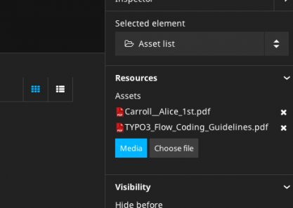

==================
1.1.0 (2014-06-19)
==================

**The goals for the 1.1 version were performance and stability improvements while providing a proper base
for localization support in the next version. The new content cache and other performance improvements will
give Neos sites a huge speed boost, eliminating the need for a separate caching proxy for most installations.
The content dimension concept is the foundation to work with different content variants and have a very flexible
localization solution in Neos. The user interface to work with content dimensions and translations will be part
of the next version.**

Main highlights are
-----------------------------

Performance
-----------------------------

**Content Cache**

The Content Cache is a layer inside the view part of Neos that provides a nested cache for rendered content. It is
fully integrated with the Flow caching framework and configurable via TypoScript

Neos comes with the new Content Cache enabled by default. The setting “TYPO3.TypoScript.enableContentCache” can be used to disable the cache explicitly. We encourage developers and integrators to leave it enabled in the Development context to spot caching issues before going into production. An integration with the file monitoring of Flow will clear the cache on code, configuration, TypoScript and template changes automatically during development

The cache is configurable via TypoScript for every path with the new “@cache” meta-property (see full changelog for more information and examples). Neos and the demo site come with a default configuration for caching. Note that caching is also supported while editing, node changes will flush the according cache segments automatically.

Some features of the TypoScript configuration

- Entry identifiers are resolved from TypoScript using any valid value (expression, simple type or object) Content cache entries can be tagged via TS configuration
- Neos will flush all cache entries with specific tags automatically, depending on the node that was changed ("Everything", "Node_[Identifier]", "NodeType_[NodeType]" or "DescendantOf_[Identifier]")
- A more detailed documentation and guides about this feature will follow until the final Neos 1.1 release.

**General Performance Improvements**

General improvements in the Flow package show faster response times and less memory consumption for all requests. On the TYPO3CR side the read access performance with many nodes was greatly increased by implementing additional indexes. The content rendering (besides the content cache) will benefit from a first level cache for many node operations (preventing duplicate queries for the same node information) and cached results during the TypoScript evaluation.

If you have implemented your own TypoScript objects, please note

- $this->tsValue() caches the result, and behaves like a simple accessor
- $this->tsRuntime->evaluate() will not cache the result and be evaluated every time

When moving or creating nodes the operations should be significantly faster by using DQL for batch updates, especially if many nodes are involved.

Additionally the database queries were optimised with indexes making large queries a lot faster, e.g. for rendering the tree.

Editing and User Interface
-----------------------------

**Node Tree**

When a new document node is created in the node tree the content module will navigate to the new document automatically. We’ve figured out that this case is more common than creating multiple document nodes in a row. When copying or moving Nodes, they will be pasted “after” a position as the new default, before it was “into”. The new default is more consistent with the default of creating new nodes with position “after”.

The structure tree will show changed nodes (content) like the node tree does for document nodes. This gives a better overview about changes inside a document.

**Node Type Switching**

A feature that should have already been in the 1.0 but was postponed, is the possibility to switch an existing node to another node type. That works for document nodes as well as content nodes. The feature adds a new select box in the Inspector for node types to allow changing the current node type. If a node type is changed, all properties that are the same in the new node type will be kept.

Switch a Node Type in TYPO3 Neos

.. figure:: Images/110-change-nodetype.png
	:alt: Node Type Switching

**Asset Editor**

Using arbitrary files (Assets) from the media browser for a node property was a very demanded feature from many Neos users. The new Asset Editor provides two additional property types for nodes to edit a single or multiple Assets in the inspector. The editor will be used for property types “TYPO3\Media\Domain\Model\Asset” and “array<TYPO3\Media\Domain\Model\Asset>” for single and multiple assignment respectively.

The new AssetList node type in the TYPO3.Neos.NodeTypes package is a simple implementation of a file list to render links to multiple Assets.

Asset editor in TYPO3 Neos

**Asset Linking**

Besides editing Asset properties in the inspector there’s also the need to link to Assets from any inline editable content. An extended link plugin for Aloha allows to search for Assets by tag or title and select them in the results.

A new ConvertUris processor object is used to convert node:// and asset:// links via TypoScript. It’s already configured for the TYPO3.Neos:Content prototype, so no changes should be needed to use this feature.
Linking to assets in TYPO3 Neos

.. figure:: Images/110-asset-linking.png
	:alt: Asset Linking

**Publishing and Display of Changes**

Many changes and fixes have been implemented to have a consistent state of unpublished and published changes after any action in the content module. The user interface should show a correct state after publishing or discarding changes as well as editing content or creating document nodes.

**Edit and Preview**

The Edit / Preview panel was improved by adding a responsive slider around the buttons in the Edit and Preview sections. This allows to place more buttons and use custom edit and preview modes extensively.

.. figure:: Images/110-edit-preview.png
	:alt: Edit and Preview

**Other improvements**

A new loading indicator in the content module replaces the page overlay with a spinner by a more subtle progress bar under the context bar.

.. figure:: Images/110-loading-indicator.png
	:alt: Loading indicator

TYPO3 Neos Loading indicator
The CodeMirror editor for HTML content was updated to version 3 and some annoying styling issues were fixed

The site JavaScript could break the editing UI if RequireJS was used for the website. By using a custom RequireJS context inside the Neos JavaScript this should no longer be a problem.

Content Rendering
-----------------------------

**TypoScript**

The exception handling in TypoScript was improved to show the original exception if an error occurred. The ThrowingHandler exception handler implementation will just re-throw exceptions now to get a better hint about the original exception cause. The logging of exceptions in several locations was removed, so all TypoScript exception handlers have to do the actual logging themselves.

TypoScript object implementations have to implement AbstractArrayTypoScriptObject to get sub properties mapped automatically. This could be breaking for custom object implementations, note that this API is not public though.

A new BreadcrumbMenu TypoScript object was introduced in the Neos package that has item states according to Menu. The existing Breadcrumb object is deprecated now.

The Menu implementation was improved to calculate the correct entries depending on the “entryLevel” property.

**Fluid**

The neos:link.node and neos:uri.node view helper arguments were synchronised with the existing link view helpers from the Fluid package. The "arguments", “section”, "addQueryString" and "argumentsToBeExcludedFromQueryString” arguments were added.

A new view helper uri.module for creating links to modules was added as an addition to the existing link.module view helper.

**Eel and FlowQuery**

The FlowQuery find operation added support for recursive node type or identifier queries. This allows many new exciting possibilities to query for content independent from the actual structure:

- Find a node by identifier recursively inside the given site ${q(site).find('#60216562-0ad9-86ff-0b32-7b7072bcb6b2')}
- Find all nodes of a specific type recursively inside the given site ${q(site).find('[instanceof TYPO3.Neos.NodeTypes:Text]')}

The filter operation now supports the != operator to support more situationens. Example::

  titlePropertyIsNotEmpty = ${q(node).is('[title!=""'])}

The filter operation using the "instanceof" operator now works with attributes as well allowing for checking if attributes matches a certain type. Example::

  imagePropertyIsImage = ${q(node).is([image instanceof TYPO3\Media\Domain\Model\ImageVariant])}

A new Math helper brings all JavaScript Math.* functions to Eel expressions. A comprehensive documentation will follow, but the MDN documentation is a good overview of the supported features.

Content Repository
-----------------------------

**Content Dimensions**

The TYPO3CR got a new feature to store different variants of a node with the so called Content Dimensions. A Content Dimension is one aspect of a content variant like Localization, Personalization or Specialization for a Channel. Nodes can have multiple variants, each with one or multiple values for each dimension. The dimensions are configured via Settings (“TYPO3.TYPO3CR.contentDimensions”) and are generic, so the TYPO3CR has no concept of something like a locale. Each dimension has a default value that will be used if no specific dimension is given.

A Node migration is needed after adding a new dimension (the TYPO3CR package provides a migration with version 20140326143834 that will assign the default value of a dimension to all node variants).

The Context in TYPO3CR has a new property for the “dimensions” that will carry an ordered list of values for each dimension that acts as a fallback list when accessing content. This works completely transparent, so the application using the Context does not have to know about the actual content dimensions. All TYPO3CR operations will respect that fallback list and return the best matching variant of a Node.

Neos supports Content Dimensions in the backend by using the context path of nodes consistently. A new route part handler (experimental) can be activated to use prefixed route paths for a “locales” dimension. The Context in Neos will then be initialized to use the resolved locales fallback chain for all Node operations. The route part handler for the Neos frontend can be switched by configuring a different implementation for the TYPO3\Neos\Routing\FrontendNodeRoutePartHandlerInterface interface using Objects.yaml

To restrict the available locale fallback chains and give them a URL path prefix Neos comes with a new configuration for dimension presets (see “TYPO3.Neos.contentDimensions.dimensions”) that will also be used to fill the view selector that will be part of the next release.

**Node Types**

The node type configuration (NodeTypes.yaml) can be split in multiple files now. This is important for larger sites to have a better structure for the node type definitions. All files with the pattern “NodeTypes.*.yaml” will be used as a node type definition. The single “NodeTypes.yaml” file is still supported.

**Independent**

The TYPO3.TYPO3CR package had a dependency on TYPO3.Neos which has now been removed so the package can be used as a standalone package for Flow projects that would like to have the benefit of hierarchical nodes.

**Other changes**

- The TYPO3CR Node implementation got support for the new CacheAwareInterface of Flow, this allows for easier caching of nodesThe Node API will emit signals (Node::NodeAdded, Node::NodeUpdated, Node::NodeRemoved) on changes to a node, this allows to create a search index over the content or react to events for other purposes
- The ContextInterface interface was removed from the TYPO3CR package, the implementation class Context should be used instead for type hints
- The NodeConverter does not support mapping via UUIDs anymore because they do not carry any context information (e.g. for dimensions), use node context paths instead
- Removed the (implicit) dependency to the TYPO3.Neos package from TYPO3CR
- The NodeConverter supports the switching of node types by an additional “_nodeType” source property
- Node Migrations now work directly on NodeData, this could be breaking if custom Transformations or Filters were implemented

Enhancements
-----------------------------

**Removal of ExtDirect and ExtJS**

The ExtJS package and usage of ExtDirect for server communication was removed in favor of plain HTTP endpoints. This is the foundation for RESTful content editing that will be a public API for Neos

The handling of the node type schema in the backend was improved to be loaded only once to reduce the number of AJAX calls.

**Commands**

The node type is now optional for the node:createchildnodes command.

**Media**

The tagging of assets via drag and drop was fixed and improved.

Breaking changes
-----------------------------

* **Content cache**

  Due to the content cache you have to specify the cache configuration for content collections and content
  elements rendered directly on the page. This means all secondary content collections besides the primary
  content and individual instantiated content objects, but not content collections inside content elements.

  Read more about the details in `the documentation <http://docs.typo3.org/neos/TYPO3NeosDocumentation/1.1/IntegratorGuide/ContentCache.html>`_.

Detailed change log
-----------------------------

~~~~~~~~~~~~~~~~~~~~~~~~~~~~~~~~~~~~~~~~
TYPO3.Neos
~~~~~~~~~~~~~~~~~~~~~~~~~~~~~~~~~~~~~~~~

[TASK] Update references in documentation
-----------------------------------------------------------------------------------------

See https://ci.neos.typo3.org/job/TYPO3%20Neos%20Release/14/

* Commit: `831ac6a <https://git.typo3.org/Packages/TYPO3.Neos.git/commit/831ac6a7bc105b1fd346171ae50488613fd4ece5>`_

[TASK] Add ContentCache documentation to the documentation index
-----------------------------------------------------------------------------------------

* Commit: `9e4a688 <https://git.typo3.org/Packages/TYPO3.Neos.git/commit/9e4a6889fe8f7160f87ae6aeb8447f60a216a078>`_

[TASK] Add Content Cache documentation
-----------------------------------------------------------------------------------------

(cherry picked from commit e43a7d665f2dc7465cd32fe0b6304fc0ce871a7a)

* Commit: `fe01022 <https://git.typo3.org/Packages/TYPO3.Neos.git/commit/fe01022ad5ecdf28aa3042fac9c6f7f1725f3372>`_

[BUGFIX] Content element wrapping should fail gracefully
-----------------------------------------------------------------------------------------

If the content element wrapping can't find a node on the
node variable it should return the content instead of
throwing an exception.

This e.g. happens if a TypoScript object like "Text" is
rendered standalone without a Node.

* Commit: `cbd5547 <https://git.typo3.org/Packages/TYPO3.Neos.git/commit/cbd5547569a91808fc380b1d268578493407f4e1>`_

[!!!][BUGFIX] Menu state should not be calculated based on a shortcut
-----------------------------------------------------------------------------------------

Fixes wrong behavior of menu states, introduced with the refactored
MenuImplementation. Especially behavior of shortcuts pointing to a
subpage of themself showed wrong current states.

This is only breaking compared to the 1.1 branch not to 1.0.
If you need a link to the site root page with correct active state
you shouldn't create a shortcut pointing to it but rather include
the real site root in the menu, by using the itemCollection
property of the Menu TypoScript object.

TypoScript example::

  itemCollection = ${q(site).add(q(site).children('[instanceof TYPO3.Neos:Document]')).get()}

* Commit: `4d186f3 <https://git.typo3.org/Packages/TYPO3.Neos.git/commit/4d186f31e684447a2c4f6d39feacbca5a6d0e736>`_

[BUGFIX] Exception on deleting used Assets
-----------------------------------------------------------------------------------------

Referenced Assets (like images) were not checked for usage in
nodes so on next rendering an exception would be thrown
effectively rendering the site unaccessible.
This change prevents deletion of Assets that are still referenced.

Needs: I56f8e922f84c00d9402837591d308583f7069b3f

* Commit: `5e8a849 <https://git.typo3.org/Packages/TYPO3.Neos.git/commit/5e8a849781e12b56dbd4228d445f6f2e1c1af0a5>`_

[BUGFIX] UserPreferenceController indexAction missing template
-----------------------------------------------------------------------------------------

The index action in UserPreferenceController is lacking a fluid
template so any call will raise an exception. This was now
changed to return a json representation of the preferences.

Note: it seems at the moment this action is never called in the
Neos backend.

* Commit: `8ed749e <https://git.typo3.org/Packages/TYPO3.Neos.git/commit/8ed749e876ab6987c155fb604a6b5ba580750d34>`_

[BUGFIX] The site import / export does not handle properties of type array
-----------------------------------------------------------------------------------------

The AssetList stores an array of images / assets on a node which are not
exported or imported. This change adds support for importing and exporting
them.

There is still a bug wit serializing the Image objects on persist for which
NEOS-121 is created.

(cherry picked from commit 8b549ef348ddb02083f05672b75cf2a05eb42b55)

* Commit: `d87f928 <https://git.typo3.org/Packages/TYPO3.Neos.git/commit/d87f928972fe4f259a78f673ffbc0e8dd9bc8240>`_

[TASK] add alignment example for Aloha
-----------------------------------------------------------------------------------------

(cherry picked from commit 857965c43534d3cea9a84af3618badabb0ae453e)

* Commit: `869f23d <https://git.typo3.org/Packages/TYPO3.Neos.git/commit/869f23d71f54c6463eeab770e5dc016a7b8a78c1>`_

[BUGFIX] Alignment configuration for Aloha editor broken
-----------------------------------------------------------------------------------------

It's not possible to use the alignment configuration due to broken
logic in the plugin itself and wrong configuration of Aloha settings.

* Related: `#45020 <http://forge.typo3.org/issues/45020>`_
* Commit: `06bdd64 <https://git.typo3.org/Packages/TYPO3.Neos.git/commit/06bdd64304383d95a1d66b2d6ccacfd3f41a602c>`_

[BUGFIX] Site import service duplicates image resources
-----------------------------------------------------------------------------------------

If a site is imported multiple time the images in the database
get duplicated.

(cherry picked from commit d9eb89b0c58e9d78ec07d6ca8fe0741fa23d14f3)

* Commit: `fad7b1a <https://git.typo3.org/Packages/TYPO3.Neos.git/commit/fad7b1a7a244271eac100f383eaf03a767e2d555>`_

[BUGFIX] Content cache should be cleared when discarding changes
-----------------------------------------------------------------------------------------

The WorkspacesController discarded changes by direct calls to the
NodeDataRepository, which is highly discouraged as important signals
will not be emitted by that.

This change updates the controller to use the PublishingService that
will emit the correct signals and does not change behavior.

* Commit: `b1535de <https://git.typo3.org/Packages/TYPO3.Neos.git/commit/b1535dea6402d56d87724f74c0a12af53530987e>`_

[BUGFIX] Use NodeNameGenerator to ensure unique node names
-----------------------------------------------------------------------------------------

* Fixes: `#58428 <http://forge.typo3.org/issues/58428>`_
* Commit: `81dbdaa <https://git.typo3.org/Packages/TYPO3.Neos.git/commit/81dbdaa9b43340c3b3529608c00fd71937a3b252>`_

[BUGFIX] Hide formatting button when no options are available
-----------------------------------------------------------------------------------------

When configuring the aloha editor not to have any formatting
options, the selector is still shown although useless. This
makes sure it's hidden if no options are available.

* Related: `#45020 <http://forge.typo3.org/issues/45020>`_
* Commit: `46e3a8a <https://git.typo3.org/Packages/TYPO3.Neos.git/commit/46e3a8a8a295aa2d8cd71275b8a9b7eb9a47d76a>`_

[BUGFIX] Page tree reloads on every page change
-----------------------------------------------------------------------------------------

When not using content dimensions the page tree gets
reloaded on every page change due to a broken check if
there are no content dimensions in the node path.

Introduced in Ic06ff0c679d5a141959c031e3dc296523a8dd2e1

(cherry picked from commit 8ea57cf615ae8b5727ab795f1bb10000b9d5c58d)

* Commit: `da88b25 <https://git.typo3.org/Packages/TYPO3.Neos.git/commit/da88b252823d38cfb58b343e98d20eae48a2e1e9>`_

[BUGFIX] Title used in publishing notice relies on page reload
-----------------------------------------------------------------------------------------

Currently the title used when publishing relies on the page being
reloaded since it gets the property from the DOM instead of the VIE
entity. This is needed when the title is inline editable.

* Related: `#45020 <http://forge.typo3.org/issues/45020>`_

(cherry picked from commit 7a064548cc78348d8c83ac479606384bf02e65c4)

* Commit: `6f68f80 <https://git.typo3.org/Packages/TYPO3.Neos.git/commit/6f68f80bad8ef8b895434096ad15d1f8bba8e3e4>`_

[TASK] Add generated Eel helper documentation
-----------------------------------------------------------------------------------------

Add generated documentation for Eel helpers. The documentation can
be generated using the TYPO3.DocTools package with the following
command::

    ./flow reference:render --reference EelHelpers

* Commit: `b93aa8d <https://git.typo3.org/Packages/TYPO3.Neos.git/commit/b93aa8db941d3a16206a84dcf8f598cda99a644d>`_

[BUGFIX] ConvertUris throws exception with NULL values
-----------------------------------------------------------------------------------------

This happens if a node property doesn't have a default
value, but uses the processor on the value.

* Commit: `2fecb39 <https://git.typo3.org/Packages/TYPO3.Neos.git/commit/2fecb395af6e6401cba993a643a3b8b292a9d43e>`_

[BUGFIX] Find FlowQuery operation returns array with NULL
-----------------------------------------------------------------------------------------

Instead of returning an empty array the find operation
returns an array with NULL when a child node cannot be found.

* Commit: `d620914 <https://git.typo3.org/Packages/TYPO3.Neos.git/commit/d620914fdcc1d6c2f305f73f63048e57229467c3>`_

[BUGFIX] Filter operation instanceof only works with node interface
-----------------------------------------------------------------------------------------

* Commit: `e6a63bc <https://git.typo3.org/Packages/TYPO3.Neos.git/commit/e6a63bcdd54bc81c37bd76a4a8e7b608de2e811f>`_

[BUGFIX] Instanceof Fizzle operator only works with nodes
-----------------------------------------------------------------------------------------

Neos overwrites the instanceof Fizzle operator behavior
breaking the normal behavior when not dealing with nodes.

Example::

  [image instanceof TYPO3\\Media\\Domain\\Model\\ImageVariant]

* Commit: `15bbadf <https://git.typo3.org/Packages/TYPO3.Neos.git/commit/15bbadffd6b2508bdaf65ade3b9a614f37d9b307>`_

[BUGFIX] Asset editor calls server without identifier
-----------------------------------------------------------------------------------------

When the list of assets allows multiple assets and has
no value set it will send a json encoded empty array
to the asset metadata endpoint. This results in an internal
server error that is thrown to the user without further
reason as we can just remove the loading state.

* Commit: `200acca <https://git.typo3.org/Packages/TYPO3.Neos.git/commit/200acca5795824850907d670f3df7a2817c27c8f>`_

[BUGFIX] Children operation optimization bypasses filters
-----------------------------------------------------------------------------------------

Additional attribute filters are bypassed when doing early
optimization of filters for the FlowQuery children operation,
limiting the possibilities of the children operation.

* Commit: `6a892fe <https://git.typo3.org/Packages/TYPO3.Neos.git/commit/6a892feb5903a9166eb8e44931ad18b05c126c07>`_

[BUGFIX] Inline editable properties re-initialized after publishing
-----------------------------------------------------------------------------------------

When publishing changes all inline editable properties are
re-initialized by Aloha in the callback due to the VIE entity
being updated. This causes the cursor to be moved among other
issues. To prevent this we update workspace for the entity silently.

* Related: `#45020 <http://forge.typo3.org/issues/45020>`_
* Commit: `ae5e31e <https://git.typo3.org/Packages/TYPO3.Neos.git/commit/ae5e31ec32f7e478a9d9323d25a81032e16d7972>`_

[BUGFIX] Add correct changelog for TYPO3 Neos 1.1.0-beta3
-----------------------------------------------------------------------------------------

The automatically created changelog was empty.
This change adds the correct changelog.

* Commit: `ce1af98 <https://git.typo3.org/Packages/TYPO3.Neos.git/commit/ce1af98c9425a2491055da8936e1d6c0888493d4>`_

~~~~~~~~~~~~~~~~~~~~~~~~~~~~~~~~~~~~~~~~
TYPO3.Neos.NodeTypes
~~~~~~~~~~~~~~~~~~~~~~~~~~~~~~~~~~~~~~~~

[TASK] Work around Image serialize bug
-----------------------------------------------------------------------------------------

This change adds a workaround typoscript object for the AssetList node
type that prevents the related assets from being serialized during the
site import.

Related: NEOS-121

(cherry picked from commit 8089b7b7a34c5a1ac97f414b120fbfc4fc68cf04)

* Commit: `213daf3 <https://git.typo3.org/Packages/TYPO3.Neos.NodeTypes.git/commit/213daf3facb96aa819a6aed40f7047f6fb420b25>`_

~~~~~~~~~~~~~~~~~~~~~~~~~~~~~~~~~~~~~~~~
TYPO3.Neos.Kickstarter
~~~~~~~~~~~~~~~~~~~~~~~~~~~~~~~~~~~~~~~~

[TASK] Update page TypoScript to match best practice
-----------------------------------------------------------------------------------------

The page TypoScript declaration needs to use the correct property
for head javascripts. The includes also had to be declared as an Array
property instead of overriding the complete "javascripts" definition for
further extension.

This change additionally adds the body javascripts as an additional
section to the template for an easier start for the integrator.

(cherry picked from commit 1a577c1ae01d8f6cff19387492e57da50a9f0f6a)

* Commit: `e0df901 <https://git.typo3.org/Packages/TYPO3.Neos.Kickstarter.git/commit/e0df901083ab0b99f057cb3c6bc02fa60a389fa7>`_

~~~~~~~~~~~~~~~~~~~~~~~~~~~~~~~~~~~~~~~~
TYPO3.TYPO3CR
~~~~~~~~~~~~~~~~~~~~~~~~~~~~~~~~~~~~~~~~

[BUGFIX] createVariantForContext() fails if workspace differs from source
-----------------------------------------------------------------------------------------

This change fixes a bug with Node::createVariantForContext() which fails
if the specified target workspace differs from the workspace of the
reference node's workspace.

The root cause for this bug is that Node Data objects have been update()d
on every modification regardless if they are new or not. Since most of
the other operations were typically only used on nodes which have been
persisted previously, the bug did not appear. createVariantForContext()
however will create a clone of the reference node if the workspace differs
which causes Repository->update() to fail.

This change also contains some small cosmetic changes and doc comment
improvements related to content dimensions.

* Commit: `0cbda40 <https://git.typo3.org/Packages/TYPO3.TYPO3CR.git/commit/0cbda4056d76f46381b410c1232731b195fed5e2>`_

[TASK] Method to find entity relations in Node properties
-----------------------------------------------------------------------------------------

Needed to detect linked media assets in nodes. But useful to
find all kinds of related entities.

* Commit: `e036a32 <https://git.typo3.org/Packages/TYPO3.TYPO3CR.git/commit/e036a324b53990147793740e6ea57c887bd9c121>`_

[TASK] Method to find if a given path exists anywhere in the CR
-----------------------------------------------------------------------------------------

* Related: `#58428 <http://forge.typo3.org/issues/58428>`_
* Commit: `4f13698 <https://git.typo3.org/Packages/TYPO3.TYPO3CR.git/commit/4f136980c2573dec8d35ec03734660cc087c4153>`_

[BUGFIX] Fix three risky unit tests
-----------------------------------------------------------------------------------------

* Commit: `d3cc2b6 <https://git.typo3.org/Packages/TYPO3.TYPO3CR.git/commit/d3cc2b618aa8269319cf784eb9c76f06fba5fd5d>`_

[BUGFIX] Copy into the correct reference node
-----------------------------------------------------------------------------------------

A copyAfter() and copyBefore() call will currently first copy the node
into the reference node and then move after it in a second step. This is
not only resource inefficient but also error prone.

* Commit: `890e1cc <https://git.typo3.org/Packages/TYPO3.TYPO3CR.git/commit/890e1cc63649bb09674964b1d2fd1620488f633b>`_

~~~~~~~~~~~~~~~~~~~~~~~~~~~~~~~~~~~~~~~~
TYPO3.TypoScript
~~~~~~~~~~~~~~~~~~~~~~~~~~~~~~~~~~~~~~~~

[BUGFIX] TypoScriptRuntime should not intercept Login redirect
-----------------------------------------------------------------------------------------

This changes changes the TypoScript Runtime to rethrow any Security
exception it encounters. Without this the login redirect does not work.

* Commit: `ea26134 <https://git.typo3.org/Packages/TYPO3.TypoScript.git/commit/ea26134080d5c23fbbc8ff5fa2cd81b06a6dbc6b>`_

~~~~~~~~~~~~~~~~~~~~~~~~~~~~~~~~~~~~~~~~
TYPO3.NeosDemoTypo3Org
~~~~~~~~~~~~~~~~~~~~~~~~~~~~~~~~~~~~~~~~

[TASK] Add the homepage to the main menu
-----------------------------------------------------------------------------------------

This change adds the homepage to the menu to show how this can
be done with the following setup:

* Site root contains homepage content
* Homepage should be in main menu without using a shortcut so
  it can have a current state

This is the recommended way to create a menu for this setup
since I4c0a92e3bf068b53c5d0286248feb6e8236894a7

(cherry picked from commit 2413956dafaa6c14ed334be638a77a08dc49f3ff)

* Commit: `118db2b <https://git.typo3.org/Packages/TYPO3.NeosDemoTypo3Org.git/commit/118db2b373c69abe62784ab8bf434c33b1666140>`_

[TASK] Add AssetList example element
-----------------------------------------------------------------------------------------

(cherry picked from commit fc96b4b8b63bc595917a3fe56c691d25ff0cb0e0)

* Commit: `2d35059 <https://git.typo3.org/Packages/TYPO3.NeosDemoTypo3Org.git/commit/2d35059db06f43f033267fef89797abd879ff4c1>`_

[TASK] Update exported site (fixes duplicate images)
-----------------------------------------------------------------------------------------

(cherry picked from commit b5f066943c106546b4ad6cf863cf9b80eb42b9e8)

* Commit: `fc2d037 <https://git.typo3.org/Packages/TYPO3.NeosDemoTypo3Org.git/commit/fc2d037bd9e55d0d6a22615f873cfffd713a49a8>`_

[BUGFIX] Use node full label instead of title for chapter pager
-----------------------------------------------------------------------------------------

* Commit: `c029c7c <https://git.typo3.org/Packages/TYPO3.NeosDemoTypo3Org.git/commit/c029c7ce83e58c96c6f6eb8035f6b3c4c758e1e4>`_

[TASK] Use new BreadcrumbMenu TS object instead of custom template
-----------------------------------------------------------------------------------------

With the new BreadcrumbMenu TypoScript object in TYPO3.Neos we don't
have to use a custom one for the demo site.

* Commit: `b9fe4da <https://git.typo3.org/Packages/TYPO3.NeosDemoTypo3Org.git/commit/b9fe4da4b8dc0cba00a96aa158cfa8fddf26a001>`_

