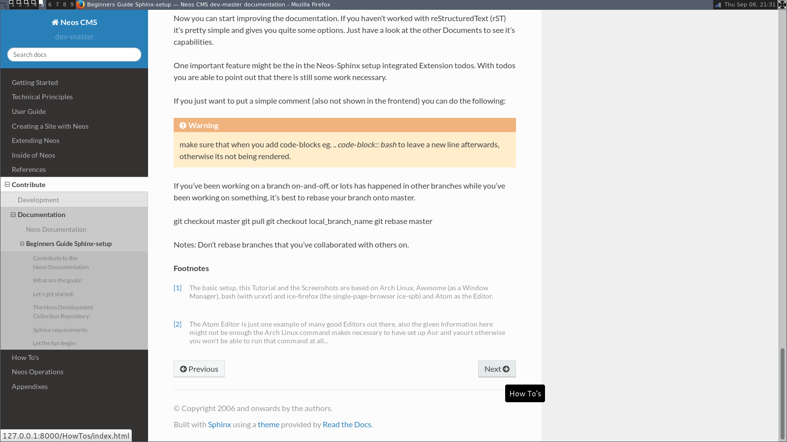

.. meta::
   :description: The reStructuredText plaintext markup language
   :keywords: plaintext, markup language

============================
Beginners Guide Sphinx-Setup
============================

Contribute to the Neos-Documentation
====================================

This Documentation aims to get you started quite from the ground up.
Imagine you would like to contribute to the Documentation but you haven't worked much with github yet,
you don't know how a proper workflow looks like and you are not sure how to start contributing.

The problem is, that even while explaining some of the basic steps, there might always be the
need for some kind of basic setup you will have to take care of yourself. If you still have troubles
don't hesitate to ask eg `here`_ why the steps aren't working for you.
You need for eg. a Linux Console to get started. [#f1]_

.. _here: https://discuss.neos.io/

What are the goals?
===================

Once everything is set up nicely and hopefully without to much trouble, you:

* will be able to easily access the Documentation offline in your browser
* know howto work with git and hub effectively when editing the Documentation
* see the life updated changes in your browser
* send pull request for your changes back to the Neos-Team
* see howto do some basic formating with reStructuredText (rST)
* know howto use the todo functionallity.

Let's get started:
==================

.. code-block:: bash

  sudo apt-get install git-all hub #(Debian Based)
  sudo pacman -Sy git hub #(Arch Linux)

Quote:

  "Whether you are beginner or an experienced contributor to open-source,
  hub makes it easier to fetch repositories, navigate project pages,
  fork repos and even submit pull requests, all from the command-line."
  -- `hub.github.com`_

.. _hub.github.com: https://hub.github.com/

The Atom Editor including the extension packages *Git Diff* and *language-restructuredtext*
would be nice options for editing the files, but any Editor is fine of cause:

.. code-block:: bash

  yaourt atom-editor #(Arch Linux)

(See https://github.com/atom/atom for other Distributions) [#f2]_

Here you can see how the Atom Editor looks like. On the left side you can see,
that the new (green) and changed (yellow) folders and files are highlighted,
also in the document itself you can see which lines you changed or added:

.. figure:: Images/TheAtomEditor.png
  :alt: The Atom Editor
  :class: screenshot-fullsize

  The Atom Editor

To be able to work with github nicely from the console, you could use hub instead
of git, for that you can edit and add: **alias git=hub** to the .bashrc and refresh it:

.. code-block:: bash

  vim ~/.bashrc #(add: alias git=hub)
  source ~/.bashrc #(to reload the .bashrc-file)

The Neos Development Collection Repository:
===========================================

Now lets clone the Neos Development Collection Repository into the
folder you are currently in.

.. code-block:: bash

  git clone https://github.com/neos/neos-development-collection.git

Sphinx requirements:
====================

Sphinx is based on Python to make Sphinx available in your System
you probably need to install some packages through pip.

.. code-block:: bash

  sudo pacman -S python-pip

There are different ways of dealing with Python-packages.
The following way is to install it in the user-directory and a
dding the bin-path to the $PATH – Environment.

.. code-block:: bash

  pip install --user Sphinx
  pip install --user sphinx-autobuild
  pip install --user sphinx_rtd_theme

Then add the following line to your .bashrc:
**export PATH=$HOME/.local/bin:$PATH**

.. code-block:: bash

  vim ~/.bashrc #(add the above export-statement)
  source ~/.bashrc #(to reload the .bashrc-file)

Let the fun begin:
==================

Now you should already be able to make the documentation available in the browser.
Go into the following folder from where you cloned the Neos-Collection:

*cd /neos-development-collection/TYPO3.Neos/Documentation/*

And then run the following command:

.. code-block:: bash

  make livehtml

If everything works as planed, you should now see a line like this in the console:

*[I 160908 18:55:04 server:281] Serving on http://127.0.0.1:8000*

.. figure:: Images/Sphinx_make_livehtml.png
  :alt: Sphinx make livehtml
  :class: screenshot-fullsize

  Sphinx make livehtml

The Url served here is, as long as you keep the process running, live reloaded when the files are changed.
Just open the Url in your Browser, you should see the whole Documentation served by your local machine.
Now try to open a file in the Neos-Collection eg. the file you are reading right now is located here:
*/neos-development-collection/TYPO3.Neos/Documentation/Contribute/Documentation/BeginnersGuide.rst*

  Sphinx browser view

Now change a line, save it and have a look in the console and the browser. Afterwards undo the change,
to make sure git doesn't take the change seriously yet...
The console should have recognised by now, that you are connected with a browser to the url,
and now should also tell you which file was changed. If you check the browser again, it should,
without manually refreshing the page, show you the edited line in its new version.

reStructuredText (rST):
=======================

Now you can start improving the documentation. If you haven't worked with reStructuredText (rST)
it's pretty simple and gives you quite some options. Just have a look at the Documentation files
available, they give you a good understanding of what is possible. It has a lot of capabilities.
Checkout their documentation for more infomations `Sphinx docs`_.

.. _Sphinx docs: http://www.sphinx-doc.org/en/stable/rest.html

One nice feature is the, in the Neos-Sphinx setup integrated, extension *todo*.
With *todo* you are able to point out that there is still some work necessary.
Add a todo, if you feel like there is something missing here, or someone else needs to check
if what you have written is correct like this. Just use it a lot to make sure it's obvious
what still needs to be done...

.. note::
  Every following line which is indented by two spaces now, is part of the note.
  If you would replace it with todo instead of (*.. note::* -> *.. todo::*), it wouldn't be
  visible in the frontend/browser anymore, but just just visible for you and others, when editing these files.

  There is also the possiblity to see all the todos with its possitions by putting *.. todolist::* into the document.
  Both features (the todo itself and their collection) can be made visible in the Brower
  while working on the Documentation for eg. by starting Sphinx like this:

.. code-block:: bash

  make livehtml SPHINXOPTS="-D todo_include_todos=1"

.. figure:: Images/Sphinx_todolist.png
  :alt: Sphinx todolist
  :class: screenshot-fullsize

  Sphinx todolist

If you just want to put a simple comment (also not shown in the frontend) you can do the following:

.. This is a comment.
  over multiple lines..

  Still in the comment since it is still indented.

.. note::

  Comments are also invisible in the browser, you can create them by just using two dots (..)
  at the beginning of a line. The following indented lines are part of the comment.

.. warning::

  Make sure that when you add code-blocks eg. *.. code-block:: bash* to leave a new line afterwards,
  otherwise its not being rendered.

Github checkout-process:
========================

Now we should have a look at the git-workflow. The first step you should checkout a branch from
master to be able to work on that locally for now. Somewhere below the Folder *neos-development-collection/*,
you should run the following command to create and enter a new branch:

.. code-block:: bash

  git checkout -b [local_branch_name]

Now you can start editing the files as you like in your own local feature-branch.

If you've been working on a branch here and there, you should probably make sure first,
that your master-branch is up to date. The there are two strategies for that. Here we will
rebase your only local branch onto master.
The following would be an example where you stash your changes for now, so you don't have to commit
them there and then, switch to your local master, pull the changes to be up to date and then
apply your changes back to your reactivated feature-branch.

.. note::

  There is a lot to know howto use git in a good way... always make sure to use **git status**
  to see if git is on the same page as you.

.. code-block:: bash

  git stash
  git checkout master
  git pull
  git checkout [local_branch_name]
  git rebase master
  git stash apply

.. warning::
  Make sure not to rebase branches that you've collaborated with others on. Never
  rebase anything you have pushed somewhere already.

To get more information about howto work with git go to this page there are many good sources online.
Two good examples are for eg.: `Basic Branching and Merging`_ or also `Rebasing`_.

.. _Basic Branching and Merging: https://git-scm.com/book/en/v2/Git-Branching-Basic-Branching-and-Merging
.. _Rebasing: https://git-scm.com/book/ch3-6.html

.. code-block:: bash

  git add [new files]
  git status
  git commit -m "done with the feature: [local_branch_name] to make this and that more efficient"
  git fork #(forking repo on GitHub...)
  #→ git remote add YOUR_USER git://github.com/YOUR_USER/neos-development-collection.git

.. code-block:: bash

  # push the changes to your new remote
  git push YOUR_USER feature
  # open a pull request for the topic branch you've just pushed
  git pull-request
  #→ (opens a text editor for your pull request message)

.. rubric:: Footnotes

.. [#f1] The basic setup, this Tutorial and the Screenshots are based on Arch Linux,
  Awesome (as a Window Manager), bash (with urxvt) and ice-firefox (the single-page-browser ice-spb) and Atom as the Editor.

.. [#f2] The Atom Editor is just one example of many good Editors out there, also the given Information here
  might not be enough the Arch Linux command makes necessary to have set up Aur and yaourt otherwise you won't be able to run
  that command at all...

.. todolist::
