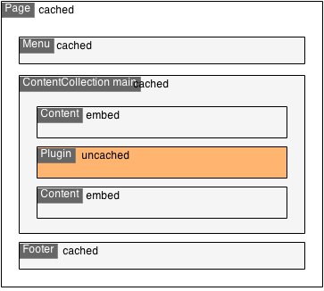

.. _content-cache:

=============
Content Cache
=============

Introduction
============

The frontend rendering of a document node in Neos can involve many queries and operations. Doing this for every request
would be too slow to achieve a feasible response time. The content cache is a feature of TypoScript and supports a
configurable and nested cache that can answer many requests directly from the cache without expensive operations. It is
based on the Flow caching framework that supports many different cache backends, expiration and tagging.

Each TypoScript path (of type object) can have its own cache configuration. These cache configurations can be nested to
re-use parts of the content and have multiple cache entries with different properties on the same page. This could be a
menu or section that is the same for many pages. The nesting support is also allows to have uncached content like
plugins inside cached content.

The content cache is active even when you are in editing mode. Cache entries will be *flushed* automatically whenever
data has changed through a tag based strategy or when relevant files changed during development (code, templates or
configuration).

.. note::
	In Neos, you don't a have a button to clear the cache. Cache invalidation is handled by the core and can be
	configured to be application specific. It's really important to configure the cache correctly to avoid problems
	with cache invalidation.

	An example cache hierarchy with different modes

Let's see how the content cache can help you to deliver a faster user experience.

The basics
==========

The main TypoScript path is ``root``, you can find it in the file ``TypoScript/DefaultTypoScript.ts2`` in the
``TYPO3.Neos`` package. Here is a small part of this file that shows the outermost cache configuration of the ``root``
path::

	root = TYPO3.TypoScript:Case {
		default {
			@position = 'end 9999'
			condition = TRUE
			renderPath = '/page'
		}

		@cache {
			mode = 'cached'

			maximumLifetime = '86400'

			entryIdentifier {
				node = ${node}
				editPreviewMode = ${node.context.currentRenderingMode.name}
			}

			entryTags {
				# Whenever the node changes the matched condition could change
				1 = ${'Node_' + documentNode.identifier}
				# Whenever one of the parent nodes changes the layout could change
				2 = ${'DescendantOf_' + documentNode.identifier}
			}
		}
	}

The given configuration will cache the entire page content with a unique identifier defined by the current node
(the document node), the preview mode and *globally configured* entry identifiers.

.. note::
  All ``entryIdentifier`` values will be evaluated and combined to a single string value (the keys will be part of the
  identifier and sorted alphabetically).

In the ``@cache`` meta property the following subproperties are allowed:

``mode``
  Sets the caching mode of the current path. Possible values are ``'embed'`` (default), ``'cached'``,
  ``'dynamic'`` or ``'uncached'``.
  Only simple string values are supported for this property.

  It defaults to mode ``embed`` which will not create a new cache entry but store the con`tent into the next outer ``cached``
  entry. With mode ``cached`` a separate cache entry will be created for the path. Mode ``uncached`` can be used to
  always evaluate a path even if is contained inside a cached path. The ``dynamic`` mode evalutes a so called
  "discriminator" on every request and caches results differently depending on it's value. Dynamic cache mode is therefore
  much faster than ``uncached`` but slightly slower compared to ``cached`` mode. It is useful in situations where
  arguments (eg. from the request) lead to different rendering results. The ``context`` property should be set to configure
  the TypoScript context variables that will be available when evaluating the uncached path.

``maximumLifetime``
  Set the maximum lifetime for the nearest cached path. Possible values are ``null`` (default), ``0`` (unlimited lifetime)
  or the amount of seconds as an integer.

  If this property is declared on a path with caching mode ``cached`` or ``dynamic`` it will set the lifetime of the
  cache entry to the minimum of all nested ``maximumLifetime`` configurations (in paths with mode ``embed``) and
  the ``maximumLifetime`` of the current configuration.

``entryIdentifier``
  Configure the cache entry identifier for mode ``cached`` or ``dynamic`` based on an array of values.

  The prototype ``TYPO3.TypoScript:GlobalCacheIdentifiers`` will be used as the base object, so global values that
  influence *all* cache entries can be added to that prototype, see :ref:`Global cache entry identifiers` for more
  details.

  If this property is not set, the identifier is built from all TypoScript context values that are simple values or
  implement ``CacheAwareInterface``.

  The identifier string value will be a hash built over all array values including and sorted by their key.

.. note::
  It is very important to add all values that influence the output of the current path to the ``entryIdentifier`` array
  since cache entries will be re-used across rendered documents if the same identifier is requested. In the cache
  hierarchy the outermost cache entry determines all the nested entries, so it's important to add values that
  influence the rendering for every cached path along the hierarchy.

``entryTags``
  Configure a set of tags that will be assigned to the cache entry for mode ``cached`` or ``dynamic`` as an array.

  The correct entry tags are important to achieve an automatic flushing of affected cache entries if a node or other
  data in Neos was changed during editing, publishing or other actions. A number of tags with a specific pattern
  are flushed by default in Neos whenever a node is changed, published or discarded. See :ref:`Cache Entry Tags` for a full
  list.

``context``
  Configure a list of variable names that will be stored from the TypoScript context for later rendering of a path with
  mode ``uncached`` or ``dynamic``. Only values that are configured here will be available in TypoScript when the path is evaluated
  in subsequent request.

  Example from ``Plugin.ts2``::

	prototype(TYPO3.Neos:Plugin) {
		@cache {
			mode = 'uncached'
			context {
				1 = 'node'
				2 = 'documentNode'
			}
		}
	}

``entryDiscriminator``
  Configure an expression that uniquely discriminates different entries of a ``dynamic`` cached area. The expression or TypoScript
  object must evaluate to a string to be used as discriminator and should be different for every cache entry you want to create for
  this ``dynamic`` cached area.

  Example for a ``dynamic`` configuration with ``entryDiscriminator``::

	prototype(TYPO3.Neos:Plugin) {
		@cache {
			mode = 'dynamic'
			entryIdentifier {
			  node = ${node}
			}
			entryDiscriminator = ${request.arguments.pagination}
			context {
				1 = 'node'
				2 = 'documentNode'
			}
			entryTags {
				1 = ${'Node_' + node.identifier}
			}
		}
	}

.. _Cache Entry Tags:

Cache Entry Tags
----------------

Neos will automatically flush a set of tags whenever nodes are created, changed, published or discarded.
The exact set of tags depends on the node hierarchy and node type of the changed node. You should assign tags that
mathches one of these patterns in your configuration. You can use an Eel expression to build the pattern depending on
any context variable including the node identifier or type.

The following patterns of tags will be flushed by Neos:

``Everything``
  Flushes cache entries for every changed node.

``NodeType_[My.Package:NodeTypeName]``
  Flushes cache entries if any node with the given node type changes. ``[My.Package:NodeTypeName]`` needs to be
  replaced by any node type name. Inheritance will be taken into account, so for a changed node of type
  ``TYPO3.Neos.NodeTypes:Page`` the tags ``NodeType_TYPO3.Neos.NodeTypes:Page`` and ``NodeType_TYPO3.Neos:Document``
  (and some more) will be flushed.

``Node_[Identifier]``
  Flushes cache entries if a node with the given identifier changes. ``Identifier`` needs to be replaced by a valid node
  identifier.

``DescendantOf_[Identifier]``
  Flushes cache entries if a child node of the node with the given identifier changes. ``Identifier`` need to be
  replaced by a valid node identifier.

Example::

	prototype(TYPO3.Neos:ContentCollection) {
		#...

		@cache {
			#...

			entryTags {
				1 = ${'Node_' + node.identifier}
				2 = ${'DescendantOf_' + contentCollectionNode.identifier}
			}
		}
	}

The ``ContentCollection`` cache configuration declares a tag that will flush the cache entry for the collection if
any of it's descendants (direct or indirect child) changes. So editing a node inside the collection will flush the
whole collection cache entry and cause it to re-render.

.. note::
  When using ``cached`` as the cache mode, your ``entryTags`` should always contain the node identifier. Otherwise, the
  cache will not be flushed when you make changes to the node itself, which will lead to unexpected behavior in the Neos
  backend::

  	@cache {
  		mode = 'cached'
  		entryTags {
  			1 = ${'Node_' + node.identifier}
  			2 = ... additional entry tags ...
  		}
  	}

Default cache configuration
===========================

The following list of TypoScript prototypes is cached by default:

* TYPO3.Neos:Breadcrumb
* TYPO3.Neos:Menu
* TYPO3.Neos:Page
* TYPO3.Neos:ContentCollection (see note)

The following list of TypoScript prototypes is uncached by default:

* TYPO3.Neos.NodeTypes:Form
* TYPO3.Neos:Plugin

.. note::

	The ``TYPO3.Neos:ContentCollection`` prototype is cached by default and has a cache configuration with proper
	identifier, tags and maximumLifetime defined. For all ``ContentCollection`` objects inside a ``Content`` object the
	mode is set to ``embed``. This means that node types that have a ``ContentCollection`` do not generate a separate
	cache entry but are embedded in the outer *static* ``ContentCollection``.

Overriding default cache configuration
--------------------------------------

You can override default cache configuration in your TypoScript::

	prototype(TYPO3.Neos:PrimaryContent).@cache.mode = 'uncached'

You can also override cache configuration for a specific TypoScript Path::

    page.content.main {
    	prototype(TYPO3.Neos:Plugin).@cache.mode = 'cached'
    }

.. _Global cache entry identifiers:

Global cache entry identifiers
==============================

Information like the request format or base URI that was used to render a site might have impact on all generated URIs.
Depending on the site or application other data might influence the uniqueness of cache entries. If an ``entryIdentifier``
for a cached path is declared without an object type, it will default to ``TYPO3.TypoScript:GlobalCacheIdentifiers``::

	prototype(My.Package:ExampleNode) {
		@cache {
			mode = 'cached'

			# This is the default if no object type is specified
			# entryIdentifier = TYPO3.TypoScript:GlobalCacheIdentifiers
			entryIdentifier {
				someValue = ${q(node).property('someValue')}
			}
		}
	}

This prototype can be extended to add or remove custom global values that influence *all* cache entries without a specific
object type::

	prototype(TYPO3.TypoScript:GlobalCacheIdentifiers) {
		myRequestArgument = ${request.arguments.myArgument}
	}

You can use a ``TYPO3.TypoScript:RawArray`` to explicitly specify the values that are used for the entry identifier::

	prototype(My.Package:ExampleNode) {
		@cache {
			mode = 'cached'

			entryIdentifier = TYPO3.TypoScript:RawArray {
				someValue = ${q(node).property('someValue')}
			}
		}
	}

Tuning your cache
=================

Change the cache backend
------------------------

By default, all cache entries are stored on the local filesystem. You can change this in ``Caches.yaml``,
the example below will use the Redis backend for the content cache::

	TYPO3_TypoScript_Content:
	  backend: TYPO3\Flow\Cache\Backend\RedisBackend

.. note::
	The best practice is to change the cache configuration in your distribution.
