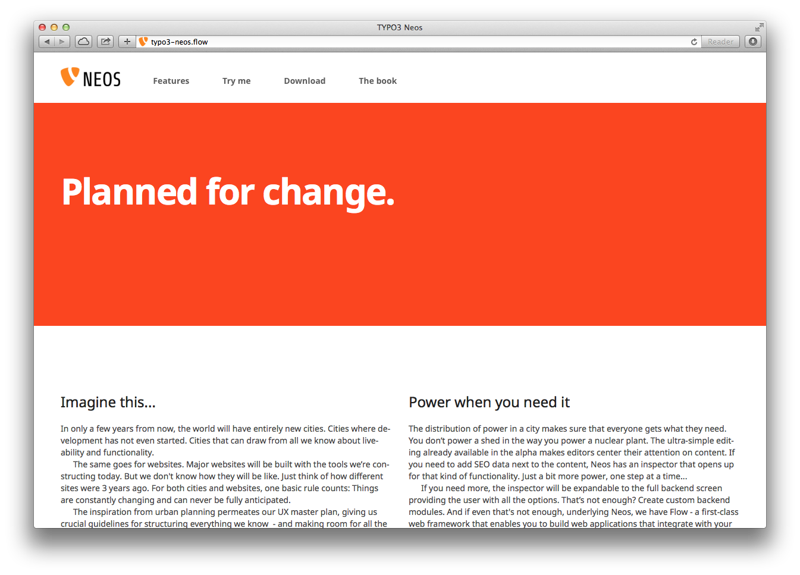

============
Installation
============

.. tip::

	TYPO3 Neos is built on top of the TYPO3 Flow framework. If you run into technical problems,
	keep in mind to check the `TYPO3 Flow documentation`_ for possible hints as well.

Requirements
------------

TYPO3 Neos has at least the same system requirements as TYPO3 Flow. You can find them in the
`TYPO3 Flow Requirements Documentation`_.

Fundamental Installation
------------------------

#. First install composer like this (if you don't have it already):

   .. code-block:: bash

    curl -s https://getcomposer.org/installer | php

#. Go to your htdocs directory and create project based on the Neos base distribution:

   .. code-block:: bash

     cd /your/htdocs/
     php /path/to/composer.phar create-project -s alpha typo3/neos-base-distribution TYPO3-Neos

#. Set up a virtual host inside your Apache configuration, and then restart Apache:

   .. code-block:: apache

     NameVirtualHost *:80 # if needed

     <VirtualHost *:80>
       DocumentRoot "/your/htdocs/TYPO3-Neos/Web/"
       # enable the following line for production context
       #SetEnv FLOW_CONTEXT Production
       ServerName neos.demo
     </VirtualHost>

#. Add an entry to */etc/hosts*:

   .. code-block:: text

     127.0.0.1 neos.demo

#. Set file permissions as needed:

   .. code-block:: bash

       sudo ./flow core:setfilepermissions john www-data www-data

   .. note::
     Setting file permissions is not necessary and not possible on Windows machines.
     For Apache to be able to create symlinks, you need to use Windows Vista (or
     newer) and Apache needs to be started with Administrator privileges.

   For detailed instructions on setting the needed permissions see  `TYPO3 Flow File Permissions`_

#. Now go to http://neos.demo/setup and follow the on-screen instructions.

The TYPO3 Neos Setup Tool
-------------------------

#. A check for the basic requirements of TYPO3 Flow and Neos will be run. If all is well, you will
   see a login screen. If a check failed, hints on solving the issue will be shown and you should
   fix what needs to be fixed. Then just reload the page, until all requirements are met.

#. The login screen will tell you the location of a file with a generated password. Keep that password
   in some secure place, the generated file will be removed upon login!

#. Fill in the database credentials in the first step. The selector box will be updated with
   accessible databases to choose from, or you can create a new one.

   .. tip::
     Configure your MySQL server to use the ``utf8_unicode_ci`` collation by default if possible!

#. In the next step a user with administrator privileges for editing with TYPO3 Neos is created.

#. The following step allows you to import an existing site or kickstart a new site. To import the
   demo site, just select it in the selector box and go to the next step.

   To kickstart a new site, enter a package and site name in the form before going to the next step.

   If you are new to Neos, we recommend to import the existing demo site so you can follow the next
   section giving you a basic tour of the user interface.

#. If all went well you'll get a confirmation the setup is completed, and you can enter the
   frontend or backend of your Neos website.

	The TYPO3 Neos start page

.. _TYPO3 Flow Documentation: http://docs.typo3.org/flow/TYPO3FlowDocumentation/Index.html
.. _TYPO3 Flow Requirements Documentation: http://docs.typo3.org/flow/TYPO3FlowDocumentation/TheDefinitiveGuide/PartII/Requirements.html
.. _TYPO3 Flow File Permissions: http://docs.typo3.org/flow/TYPO3FlowDocumentation/TheDefinitiveGuide/PartII/Installation.html#file-permissions
