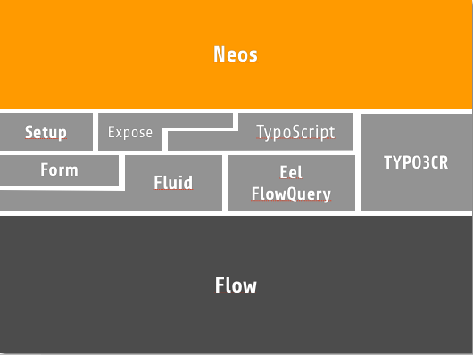
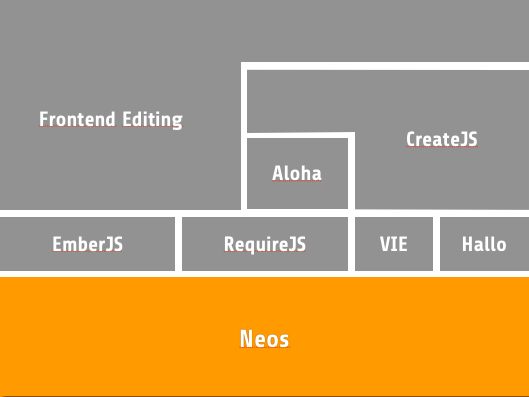

============
Introduction
============

TYPO3 Neos
==========

Back in 2005 it was decided to start with a new TYPO3 version that should eventually
replace the current major version 4. In the long and twisted process that followed we
had to write a new framework first (TYPO3 Flow), struggle with the release schedule of PHP6,
fight tools not supporting PHP namespaces, and come up with good ideas for that
next-generation CMS we were about to build.

Now we actually have first releases of TYPO3 Neos. While the sprint releases were
published under the code name of TYPO3 Neos, the new name is in place since TYPO3 Neos
1.0.0 Alpha 1.

System Overview
===============

TYPO3 Neos is made up of packages and based on the TYPO3 Flow framework. Most of the packages
are part of the TYPO3 Flow base system, TYPO3 Neos consists of a few additional packages, like
Neos and TypoScript, in which the actual CMS functionality is contained. The templates,
graphics and content of the demo site are in another package. Generally, all static website
resources (including templates, TypoScript and Images) can be found in separate packages for
each website.

	The TYPO3 Neos system structure on the Server Side

	The TYPO3 Neos system structure on the Client Side
