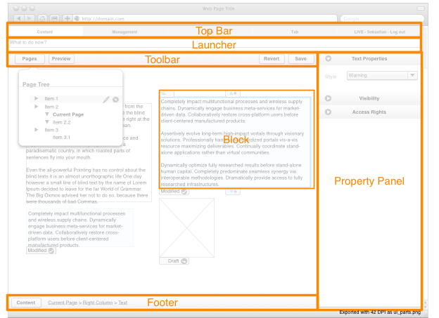
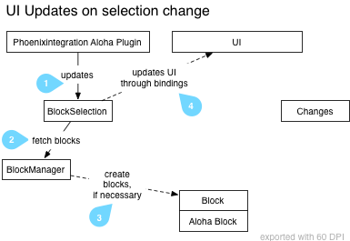
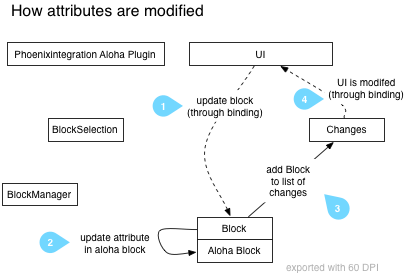

=========================
Content Module Principles
=========================

In the Content Module, we directly render the *frontend* of the website, and then
augment it with the Neos Content Editing User Interface.

Because of this, we do not control all CSS or javaScript which is included on
the page; so we need some special guidelines to deal with that. These are listed
on this page.

Naming of main UI parts
=======================

The following image shows the main UI parts of the content module and the names we use for them.

	UI parts of the content module

Content Module Architecture
===========================

The whole Content Module is built around the *Aloha Blocks*. Blocks are un-editable
elements of a website, which are managed by Aloha. They can appear inside or outside
editables, can be nested, and can appear either as inline element (````) or
as block-level element(``
``).

Only one block is active at any given time. When a block is *active*, then all its
parent blocks are *selected*. The *block selection* contains the active block as
first element and all other selected blocks from innermost to outermost.

Most of the UI changes depending on the current block selection.

User Interface Updates on Selection Change
------------------------------------------

The following diagram shows how the UI is changing when the block selection changes:

	UI Updates on selection change

#. The neosintegration Aloha Plugin (located in ``alohaplugins/neosintegration/lib/neosintegration-plugin.js``) hooks
   into the Aloha event which is triggered whenever the block selection changes. Whenever this event is triggered,
   it calls ``T3.Content.Model.BlockSelection.updateSelection()``.
#. We need to wrap each Aloha Block with a *Ember.js Block* (later only called Block),
   so we can attach event listeners to it. This wrapping is done by the ``BlockManager``
#. The ``BlockManager`` either returns existing Ember.js Blocks (if the given Aloha Block has already been wrapped),
   or creates a new one.
#. Then, the ``BlockSelection`` sets its ``content`` property, which the UI is bound to. Thus,
   all UI elements which depend on the current block selection are refreshed.

User Interface Updates updates on property change
-------------------------------------------------

When an attribute is modified through the property panel, the following happens:

	How attributes are modified

WARNING: TODO: Document what happens when an *editable* is modified

Node Property Naming Conventions
================================

TODO write some intro text

#. *Normal properties*

   Those properties contain normal values like a title, date or other value.
   Serverside setting of the property is done using TYPO3CR Node::setProperty()

#. *Visibility / lifecycle properties*

   These properties are prefixed using an underscore, like '_hidden'.
   Serverside setting of the property is done using TYPO3CR Node::set<UpperCamelCasePropertyname>()

#. *Neos internal properties*

   These properties are prefixed with a double underscore, like __workspacename
   TODO: internal

Saving content
==============

Saving is triggered using ``T3.Content.Model.Changes.save()`` and is very straight-forward. For now,
we use ExtDirect to send things back to the server.

Displaying Modal Dialogs
========================

WARNING: TODO - write this

* REST architectural style
* HTML snippets loaded via fixed URLs from server side
* Return Commands (``<a rel="typo3-...." />``)

REST Server Side API
--------------------

Most backend services which are currently used in the user interface are not RESTful. The goal is to migrate them,
step by step, to a clean REST architecture.

Two services have been – partially – migrated: Nodes and ContentDimensions. We provide an HTML and a JSON based interface,
roughly following HATEOAS concepts. Both formats a not yet part of the public API and we expect them to change as we
gain more experience with the pros and cons of their structure.

URL ``/neos/service/nodes``
URL ``/neos/service/contentdimensions``

Inspect the HTML output and the controller / template code for more information about the currently supported operations
and arguments.
