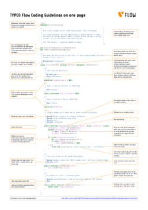

======================================
PHP Coding Guidelines & Best Practices
======================================

Coding Standards are an important factor for achieving a high code quality. A common
visual style, naming conventions and other technical settings allow us to produce a
homogenous code which is easy to read and maintain. However, not all important factors can
be covered by rules and coding standards. Equally important is the style in which certain
problems are solved programmatically - it's the personality and experience of the
individual developer which shines through and ultimately makes the difference between
technically okay code or a well considered, mature solution.

These guidelines try to cover both, the technical standards as well as giving incentives
for a common development style. These guidelines must be followed by everyone who creates
code for the TYPO3 Flow core. Because Neos is based on TYPO3 Flow, it follows the same principles -
therefore, whenever we mention TYPO3 Flow in the following sections, we equally refer to Neos.
We hope that you feel encouraged to follow these guidelines as well when creating your own
packages and TYPO3 Flow based applications.

CGL on One Page
===============

	The Coding Guidelines on One Page

The most important parts of our :download:`Coding Guidelines in a one page document
<Pdf/TYPO3_Flow_Coding_Guidelines_on_one_page.pdf>`
you can print out and hang on your wall for easy reference.
Does it get any easier than that?

Code Formatting and Layout aka "beautiful code"
===============================================

The visual style of programming code is very important. In the TYPO3 project we want many
programmers to contribute, but in the same style. This will help us to:

* Easily read/understand each others code and consequently easily spot security problems
  or optimization opportunities
* It is a signal about consistency and cleanliness, which is a motivating factor for
  programmers striving for excellence

Some people may object to the visual guidelines since everyone has his own habits. You
will have to overcome that in the case of TYPO3 Flow; the visual guidelines must be followed
along with coding guidelines for security. We want all contributions to the project to be
as similar in style and as secure as possible.

General considerations
----------------------

* Almost every PHP file in TYPO3 Flow contains exactly one class and does not output anything
  if it is called directly. Therefore you start your file with a ``<?php`` tag and must not end it
  with the closing ``?>``.
* Every file must contain a header stating namespace and licensing information

  * Declare your namespace.
  * The copyright header itself must not start with ``/**``, as this may confuse
    documentation generators!

*The TYPO3 Flow standard file header*::

 <?php
 namespace YourCompany\Package\Stuff\Here;

 /*                                                                        *
  * This script belongs to the TYPO3 Flow package "Vendor.Package".        *
  *                                                                        *
  * It is free software; you can redistribute it and/or modify it under    *
  * the terms of the GNU Lesser General Public License, either version 3   *
  * of the License, or (at your option) any later version.                 *
  *                                                                        *
  * The TYPO3 project - inspiring people to share!                         *
  *                                                                        */

* Code lines are of arbitrary length, no strict limitations to 80 characters or something
  similar (wake up, graphical displays have been available for decades now...). But feel
  free to break lines for better readability if you think it makes sense!
* Lines end with a newline a.k.a ``chr(10)`` - UNIX style
* Files must be encoded in UTF-8 without byte order mark (BOM)

Make sure you use the correct license and mention the correct package in the header, we
have some `some boilerplate text`_.

.. _`some boilerplate text`: http://wiki.typo3.org/Flow_Licensing_Boilerplate

Indentation and line formatting
_______________________________

Indentation is done with tabs - and not spaces! The beginning of a line is the only place
where tabs are used, in all other places use spaces. Always trim whitespace off the end of
a line.

Here's a code snippet which shows the correct usage of tabs and spaces.

*Correct use of tabs and spaces*::

 /**
  * Returns the name of the currently set context.
  *
  * @return string Name of the current context
  */
 public function getContextName() {
 	return $this->contextName;
 }

There seem to be very passionate opinions about whether TABs or spaces should be used for
indentation of code blocks in the scripts. If you'd like to read more about this religious
discussion, you find some nice arguments in the `Joel on Software`_ forum.

.. _`Joel on Software`: http://discuss.fogcreek.com/joelonsoftware/default.asp?cmd=show&ixPost=3978

Naming
------

Naming is a repeatedly undervalued factor in the art of software development. Although
everybody seems to agree on that nice names are a nice thing to have, most developers
choose cryptic abbreviations in the end (to save some typing). Beware that we TYPO3 core
developers are very passionate about naming (some people call it fanatic, well ...). In
our opinion spending 15 minutes (or more ...) just to find a good name for a method is
well spent time! There are zillions of reasons for using proper names and in the end they
all lead to better readable, manageable, stable and secure code.

As a general note, english words (or abbreviations if necessary) must be used for all
class names, method names, comments, variables names, database table and field names. The
consensus is that english is much better to read for the most of us, compared to other
languages.

When using abbreviations or acronyms remember to make them camel-cased as needed, no
all-uppercase stuff. Admittedly there are a few places where we violate that rule
willingly (TYPO3 – will not change) and historically.

Vendor namespaces
-----------------

The base for namespaces as well as package keys is the vendor namespace. Since Flow is
part of the TYPO3 project, the core team decided to choose "TYPO3" as our vendor
namespace. The Object Manager for example is known under the class name
``TYPO3\Flow\Object\ObjectManager``. In our examples you will find the ``Acme`` vendor
namespace.

Why do we use vendor namespaces? This has two great benefits: first of all we don't need a
central package key registry (like the one we have for TYPO3 CMS extensions) and secondly,
it allows anyone to seamlessly integrate third-party packages, such as Symfony2 components
and Zend Framework components or virtually any other PHP 5.3+ based library.

Think about your own vendor namespace for a few minutes. It will stay with you for a long
time.

Package names
-------------

All package names start with an uppercase character and usually are written in
``UpperCamelCase``. In order to avoid problems with different filesystems,
only the characters a-z, A-Z, 0-9 and the dash sign "-" are allowed for package names –
don't use special characters.

The full package key is then built by combining the vendor namespace and the package,
like ``TYPO3.Fluid`` or ``Acme.Demo``.

Namespace and Class names
-------------------------

* Only the characters a-z, A-Z and 0-9 are allowed for namespace and class names.
* Namespaces are usually written in UpperCamelCase but variations are allowed for well
  established names and abbreviations.
* Class names are always written in ``UpperCamelCase``.
* The unqualified class name must be meant literally even without the namespace.
* The main purpose of namespaces is categorization and ordering
* Class names must be nouns, never adjectives.
* The name of abstract classes must start with the word "Abstract", class names of aspects
  must end with the word "Aspect".

*Incorrect naming of namespaces and classes*

==================================== ================ ===========================================
Fully qualified class name           Unqualified name Remarks
==================================== ================ ===========================================
\\TYPO3\\Flow\\Session\\Php          Php              The class is not a representation of PHP
\\TYPO3\\Flow\\Cache\\Backend\\File  File             The class doesn't represent a file!
\\TYPO3\\Flow\\Session\\Interface    Interface        Not allowed, "Interface" is a reserved keyword
\\TYPO3\\Foo\\Controller\\Default    Default          Not allowed, "Default" is a reserved keyword
\\TYPO3\\Flow\\Object\\Manager       Manager          Just "Manager" is too fuzzy
==================================== ================ ===========================================

*Correct naming of namespaces and classes*

============================================ ================== ==========================
Fully qualified class name                   Unqualified name   Remarks
============================================ ================== ==========================
\\TYPO3\\Flow\\Session\\PhpSession           PhpSession         That's a PHP Session
\\TYPO3\\Flow\\Cache\\Backend\\FileBackend   FileBackend        A File Backend
\\TYPO3\\Flow\\Session\\SessionInterface     SessionInterface   Interface for a session
\\TYPO3\\Foo\\Controller\\StandardController StandardController The standard controller
\\TYPO3\\Flow\\Object\\ObjectManager         ObjectManager      "ObjectManager" is clearer
============================================ ================== ==========================

*Edge cases in naming of namespaces and classes*

===================================================== =================== ==========================
Fully qualified class name                            Unqualified name    Remarks
===================================================== =================== ==========================
\\TYPO3\\Flow\\Mvc\\ControllerInterface               ControllerInterface Consequently the interface belongs to all the controllers in the Controller sub namespace
\\TYPO3\\Flow\\Mvc\\Controller\\ControllerInterface                       Better
\\TYPO3\\Flow\\Cache\\AbstractBackend                 AbstractBackend     Same here: In reality this class belongs to the backends
\\TYPO3\\Flow\\Cache\\Backend\\AbstractBackend                            Better
===================================================== =================== ==========================

.. note::

  When specifying class names to PHP, always reference the global namespace inside
  namespaced code by using a leading backslash. When referencing a class name inside a
  string (e.g. given to the ``get``-Method of the ``ObjectManager``, in pointcut
  expressions or in YAML files), never use a leading backslash. This follows the native
  PHP notion of names in strings always being seen as fully qualified.

Importing Namespaces
--------------------

If you refer to other classes or interfaces you are encouraged to import the namespace with the
``use`` statement if it improves readability.

Following rules apply:

* If importing namespaces creates conflicting class names you might alias class/interface or namespaces
  with the ``as`` keyword.
* One ``use`` statement per line, one ``use`` statement for each imported namespace
* Imported namespaces should be ordered alphabetically (modern IDEs provide support for this)

.. tip::

 ``use`` statements have no side-effects (e.g. they don’t trigger autoloading).
 Nevertheless you should remove unused imports for better readability

Interface names
---------------

Only the characters a-z, A-Z and 0-9 are allowed for interface names – don't use special
characters.

All interface names are written in ``UpperCamelCase``. Interface names must be adjectives
or nouns and have the Interface suffix. A few examples follow:

* ``\TYPO3\Flow\Object\ObjectInterface``
* ``\TYPO3\Flow\Object\ObjectManagerInterface``
* ``\MyCompany\MyPackage\MyObject\MySubObjectInterface``
* ``\MyCompany\MyPackage\MyObject\MyHtmlParserInterface``

Exception names
---------------

Exception naming basically follows the rules for naming classes. There are two possible
types of exceptions: generic exceptions and specific exceptions. Generic exceptions should
be named "Exception" preceded by their namespace. Specific exceptions should reside in
their own sub-namespace end with the word ``Exception``.

* ``\TYPO3\Flow\Object\Exception``
* ``\TYPO3\Flow\Object\Exception\InvalidClassNameException``
* ``\MyCompany\MyPackage\MyObject\Exception``
* ``\MyCompany\MyPackage\MyObject\Exception\OutOfCoffeeException``

On consistent naming of classes, interfaces and friends
-------------------------------------------------------

At times, the question comes up, why we use a naming scheme that is inconsistent with
what we write in the PHP sources. Here is the best explanation we have:

  At first glance this feels oddly inconsistent; We do, after all, put each
  of those at the same position within php code.

  But, I think leaving Abstract as a prefix, and Interface/Trait as suffixes
  makes sense. Consider the opposite of how we do it: "Interface Foo", "Trait
  Foo" both feel slightly odd when I say them out loud, and "Foo Abstract"
  feels very wrong. I think that is because of the odd rules of grammar in
  English (Oh! English. What an ugly inconsistent language! And yet, it is my
  native tongue).

  Consider the phrase "the poor man". 'poor' is an adjective that describes
  'man', a noun. Poor happens to also work as a noun, but the definition
  changes slightly when you use it as a noun instead of an adjective. And, if
  you were to flip the phrase around, it would not make much sense, or could
  have (sometimes funny) alternative meanings: "the man poor" (Would that
  mean someone without a boyfriend?)

  The word "Abstract" works quite well as an adjective, but has the wrong
  meaning as a noun. An "Abstract" (noun) is "an abridgement or summary" or a
  kind of legal document, or any other summary-like document. But we're not
  talking about a document, we're talking about the computing definition
  which is an adjective: "abstract type". (
  http://en.wiktionary.org/wiki/abstract)

  "Abstract" can be a noun, an adjective, or a verb. But, we want the
  adjective form. "Interface" is a noun or a verb. "Trait" is always a noun.
  So, based on current English rules, "Abstract Foo", "Foo Interface" and
  "Foo Trait" feel the most natural. English is a living language where words
  can move from one part of speech to another, so we could get away with
  using the words in different places in the sentence. But that would, at
  least to begin with, feel awkward.

  So, I blame the inconsistent placement of Abstract, Interface, and Trait on
  the English language.

  […]

  -- Jacob Floyd, http://lists.typo3.org/pipermail/flow/2014-November/005625.html

Method names
------------

All method names are written in lowerCamelCase. In order to avoid problems with different
filesystems, only the characters a-z, A-Z and 0-9 are allowed for method names – don't use
special characters.

Make method names descriptive, but keep them concise at the same time. Constructors must
always be called ``__construct()``, never use the class name as a method
name.

* ``myMethod()``
* ``someNiceMethodName()``
* ``betterWriteLongMethodNamesThanNamesNobodyUnderstands()``
* ``singYmcaLoudly()``
* ``__construct()``

Variable names
--------------

Variable names are written in ``lowerCamelCase`` and should be

* self-explanatory
* not shortened beyond recognition, but rather longer if it makes their meaning clearer

The following example shows two variables with the same meaning but different naming.
You'll surely agree the longer versions are better (don't you ...?).

*Correct naming of variables*

* ``$singletonObjectsRegistry``
* ``$argumentsArray``
* ``$aLotOfHtmlCode``

*Incorrect naming of variables*

* ``$sObjRgstry``
* ``$argArr``
* ``$cx``

As a special exception you may use variable names like ``$i``, ``$j`` and ``$k`` for
numeric indexes in ``for`` loops if it's clear what they mean on the first sight. But even
then you should want to avoid them.

Constant names
--------------

All constant names are written in ``UPPERCASE``. This includes ``TRUE``, ``FALSE`` and
``NULL``. Words can be separated by underscores - you can also use the underscore to group
constants thematically:

* ``STUFF_LEVEL``
* ``COOLNESS_FACTOR``
* ``PATTERN_MATCH_EMAILADDRESS``
* ``PATTERN_MATCH_VALIDHTMLTAGS``

It is, by the way, a good idea to use constants for defining regular expression patterns
(as seen above) instead of defining them somewhere in your code.

Filenames
----------

These are the rules for naming files:

* All filenames are ``UpperCamelCase``.
* Class and interface files are named according to the class or interface they represent
* Each file must contain only one class or interface
* Names of files containing code for unit tests must be the same as the class which is
  tested, appended with "Test.php".
* Files are placed in a directory structure representing the namespace structure.

*File naming in TYPO3 Flow*

``TYPO3.TemplateEngine/Classes/TYPO3/TemplateEngine/TemplateEngineInterface.php``
  Contains the interface ``\TYPO3\TemplateEngine\TemplateEngineInterface`` which is part
  of the package *TYPO3.TemplateEngine*

``TYPO3.Flow/Classes/TYPO3/Flow/Error/RuntimeException.php``
  Contains the ``\TYPO3\Flow\Error\RuntimeException`` being a part of the package
  *TYPO3.Flow*

``Acme.DataAccess/Classes/Acme/DataAccess/CustomQuery.php``
  Contains class ``\Acme\DataAccess\CustomQuery`` which is part of the package
  *Acme.DataAccess*

``TYPO3.Flow/Tests/Unit/Package/PackageManagerTest.php``
	Contains the class ``\TYPO3\Flow\\Tests\Unit\Package\PackageManagerTest`` which
	is a PHPUnit testcase for ``Package\PackageManager``.

PHP code formatting
===================

Strings
-------

In general, we use single quotes to enclose literal strings::

 $vision = 'Inspiring people to share';

If you'd like to insert values from variables, concatenate strings::

 $message = 'Hey ' . $name . ', you look ' . $appearance . ' today!';

A space must be inserted before and after the dot for better readability::

 $vision = 'Inspiring people ' . 'to share.';

You may break a string into multiple lines if you use the dot operator. You'll have to
indent each following line to mark them as part of the value assignment::

 $vision = 'Inspiring' .
   'people ' .
   'to ' .
   'share';

You should also consider using a PHP function such as `sprintf()` to concatenate strings to increase readability::

 $message = sprintf('Hey %s, you look %s today!', $name, $appearance);

Arrays
------

Classes
-------

Functions and methods
---------------------

if statements
-------------

* There needs to be one space between the ``if`` keyword and the opening brace "(" of the
  test expression
* After the closing brace ")" of the test expression follows one space before the curly
  brace "{"
* ``else`` and ``elseif`` are on the same line as their corresponding curly braces

*if statements*::

 if ($something || $somethingElse) {
   doThis();
 } else {
   doSomethingElse();
 }

 if (weHaveALotOfCriteria() === TRUE
   && notEverythingFitsIntoOneLine() === TRUE
   || youJustTendToLikeIt() === TRUE) {
      doThis();

 } else {
   ...
 }

switch statements
-----------------

* There needs to be one space between the ``switch`` keyword and the opening brace "(" of the
  test expression
* After the closing brace ")" of the test expression follows one space before the curly
  brace "{"
* ``break`` is indented to the same level as ``case`` keywords

*switch statements*::

 switch ($something) {
   case FOO:
      $this->handleFoo();
   break;
   case BAR:
      $this->handleBar();
   break;
   default:
      $this->handleDefault();
 }

Development Process
===================

Test-Driven Development
-----------------------

In a nutshell: before coding a feature or fixing a bug, write an unit test.

Whatever you do: before committing changes to the repository, run all unit tests to make
sure nothing is broken!

Commit Messages
---------------

To have a clear and focused history of code changes is greatly helped by using a
consistent way of writing commit messages. Because of this and to help with (partly)
automated generation of change logs for each release we have defined a fixed syntax for
commit messages that is to be used.

.. tip::

 Never commit without a commit message explaining the commit!

The syntax is as follows:

* Start with one of the following codes:

  [FEATURE]
    A feature change. Most likely it will be an added feature, but it could also be removed. For additions there should
    be a corresponding ticket in the issue tracker.
  [BUGFIX]
    A fix for a bug. There should be a ticket corresponding to this in the issue tracker as well as a new) unit test for
    the fix.
  [SECURITY]
    A security related change. Those must only be committed by active contributors in agreement with the
    `TYPO3 Security Team`_.
  [TASK]
    Anything not covered by the above categories, e.g. coding style cleanup or documentation changes. Usually only used
    if there's no corresponding ticket.

  Except for [SECURITY] each of the above codes can be prefixed with [WIP] to mark a change **work in progress**. This
  means that it is not yet ready for a final review. The [WIP] Prefix must be removed before a change is merged.

* The code is followed by a short summary in the same line, no full stop at the end.
  If the change affects the public API or is likely to break things on the user side, start the line with **[!!!]**.
  This indicates a breaking change that needs human action when updating. Make sure to explain why a change is breaking
  and in what circumstances.

* Then follows (after a blank line) a custom message explaining what was done. It should
  be written in a style that serves well for a change log read by users.

* If there is more to say about a change add a new paragraph with background information below.
  In case of breaking changes give a hint on what needs to be changed by the user.

* If corresponding tickets exist, mention the ticket number(s) using footer lines after
  another blank line and use the following actions:

  Fixes: #<number>
   If the change fixes a bug.
  Resolves: #<number>
   If the change resolves a feature request or task.
  Related: #<number>
   If the change relates to an issue but does not resolve or fix it.

* Fixes may be targeted at not only the master branch (i.e. the next major/point release),
  but also for a point release in an older branch. Thus a ``Releases`` footer must address
  the target branches.

*A commit messages following the rules...*:

.. code-block:: text

 [TASK] Short (50 chars or less) summary of changes

 More detailed explanatory text, if necessary.  Wrap it to about 72
 characters or so.  In some contexts, the first line is treated as the
 subject of an email and the rest of the text as the body.  The blank
 line separating the summary from the body is critical (unless you omit
 the body entirely); tools like rebase can get confused if you run the
 two together.

 Write your commit message in the present tense: "Fix bug" and not "Fixed
 bug."  This convention matches up with commit messages generated by
 commands like git merge and git revert.

 Code snippets::

  should be written in
  ReStructuredText compatible
  format for better highlighting

 Further paragraphs come after blank lines.

 * Bullet points are okay, too
 * An asterisk is used for the bullet, it can be preceded by a single
   space. This format is rendered correctly by Forge (redmine)
 * Use a hanging indent

 Resolves: #123
 Resolves: #456
 Related: #789
 Releases: master, 1.1, 1.0

Examples of good and bad subject lines::

   Introduce xyz service                             // BAD, missing code prefix
   [BUGFIX] Fixed bug xyz                            // BAD, subject should be written in present tense
   [WIP][!!!][TASK] A breaking change                // BAD, subject has to start with [!!!] for breaking changes
   [BUGFIX] SessionManager removes expired sessions  // GOOD, the line explains what the change does, not what the
                                                        bug is about (this should be explained in the following lines
                                                        and in the related bug tracker ticket)

.. _`TYPO3 Security Team`: http://typo3.org/teams/security/

Source Code Documentation
-------------------------

All code must be documented with inline comments. The syntax is similar to that known from
the Java programming language (JavaDoc). This way code documentation can automatically be
generated using PHP_UML_.

.. _PHP_UML: http://pear.php.net/package/PHP_UML

Documentation Blocks
--------------------

A file contains different documentation blocks, relating to the class in the file and the
members of the class. A documentation block is always used for the entity it precedes.

Class documentation
-------------------

Classes have their own documentation block describing the classes purpose.

*Standard documentation block*::

 /**
  * First sentence is short description. Then you can write more, just as you like
  *
  * Here may follow some detailed description about what the class is for.
  *
  * Paragraphs are separated by an empty line.
  */
 class SomeClass {
  ...
 }

Additional tags or annotations, such as ``@see`` or ``@Flow\Aspect``, can be added as needed.

Documenting variables, constants, includes
------------------------------------------

Properties of a class should be documented as well. We use the short version for
documenting them.

*Standard variable documentation block*::

 /**
  * A short description, very much recommended
  *
  * @var string
  */
 protected $title = 'Untitled';

In general you should try to code in a way that the types can be derived (e.g. by using type hints and annotations).
In some cases this is not possible, for example when iterating through an array of objects. In these cases it’s ok to
add inline @var annotations to increase readability and to activate auto-completion and syntax-highlighting::

 protected function someMethod(array $products) {
 	/** @var $product \Acme\SomePackage\Domain\Model\Product */
 	foreach ($products as $product) {
 		$product->getTitle();
 	}
 }

Method documentation
--------------------

For a method, at least all parameters and the return value must be documented. The
``@access`` tag must not be used as it makes no sense (we're using PHP 5 for a reason,
don't we?)

*Standard method documentation block*::

 /**
  * A description for this method
  *
  * Paragraphs are separated by an empty line.
  *
  * @param \TYPO3\Blog\Domain\Model\Post $post A post
  * @param string $someString This parameter should contain some string
  * @return void
  */
 public function addStringToPost(\TYPO3\Blog\Domain\Model\Post $post, $someString) {
  ...
 }

A special note about the ``@param`` tags: The parameter type and name are separated by one
space, not aligned. Do not put a colon after the parameter name. Always document the
return type, even if it is void - that way it is clearly visible it hasn't just been
forgotten (only constructors never have a ``@return`` annotation!).

Testcase documentation
----------------------

Testcases need to be marked as being a test and can have some more annotations.

*Standard testcase documentation block*::

 /**
  * @test
  */
 public function fooReturnsBarForQuux() {
  ...
 }

Defining the Public API
-----------------------

Not all methods with a public visibility are necessarily part of the intended public API
of a project. For TYPO3 Flow, only the methods explicitly defined as part of the public API
will be kept stable and are intended for use by developers using TYPO3 Flow. Also the API
documentation we produce will only cover the public API.

To mark a method as part of the public API, include an ``@api`` annotation for it in the
docblock.

*Defining the public API*::

 /**
  * This method is part of the public API.
  *
  * @return void
  * @api
  */
 public function fooBar() {
  ...
 }

.. tip::

  When something in a class or an interface is annotated with ``@api`` make sure to also
  annotate the class or interface itself! Otherwise it will be ignored completely when
  official API documentation is rendered!

Overview of Documentation Annotations
-------------------------------------

There are not only documentation annotations that can be used. In TYPO3 Flow annotations are
also used in the MVC component, for defining aspects and advices for the AOP framework as
well as for giving instructions to the Persistence framework. See the individual chapters
for information on their purpose and use.

Here is a list of annotations used within the project. They are grouped by use case and
the order given here should be kept for the sake of consistency.

*Interface Documentation*

* @api
* @since
* @deprecated

*Class Documentation*

* @Flow\Introduce
* @Flow\Entity
* @Flow\ValueObject
* @Flow\Scope
* @Flow\Autowiring
* @Flow\Lazy
* @Flow\Aspect
* @api
* @since
* @deprecated

*Property Documentation*

* @Flow\Introduce
* @Flow\Identity
* @Flow\Transient
* @Flow\Lazy
* @Flow\IgnoreValidation
* @Flow\Inject
* @Flow\InjectConfiguration
* @Flow\Validate
* @var
* @api
* @since
* @deprecated

*Constructor Documentation*

* @param
* @throws
* @api
* @since
* @deprecated

*Method Documentation*

* @Flow\After
* @Flow\AfterReturning
* @Flow\AfterThrowing
* @Flow\Around
* @Flow\Before
* @Flow\Pointcut
* @Flow\Autowiring
* @Flow\CompileStatic
* @Flow\FlushesCaches
* @Flow\Internal
* @Flow\Session
* @Flow\Signal
* @Flow\IgnoreValidation
* @Flow\SkipCsrfProtection
* @Flow\Validate
* @Flow\ValidationGroups
* @param
* @return
* @throws
* @api
* @since
* @deprecated

*Testcase Documentation*

* @test
* @dataProvider
* @expectedException

.. tip::

  Additional annotations (more or less only the ``@todo`` and ``@see`` come to mind here),
  should be placed after all other annotations.

Best Practices
==============

TYPO3 Flow
----------

This section gives you an overview of TYPO3 Flow's coding rules and best practices.

Error Handling and Exceptions
-----------------------------

TYPO3 Flow makes use of a hierarchy for its exception classes. The general rule is to throw
preferably specific exceptions and usually let them bubble up until a place where more
general exceptions are caught. Consider the following example:

Some method tried to retrieve an object from the object manager. However, instead of
providing a string containing the object name, the method passed an object (of course not
on purpose - something went wrong). The object manager now throws an ``InvalidObjectName``
exception. In order to catch this exception you can, of course, catch it specifically - or
only consider a more general ``Object`` exception (or an even more general ``Flow``
exception). This all works because we have the following hierarchy:

.. code-block:: text

 + \TYPO3\Flow\Exception
 + \TYPO3\Flow\Object\Exception
 + \TYPO3\Flow\Object\Exception\InvalidObjectNameException

Throwing an exception
---------------------

When throwing an exception, make sure to provide a clear error message and an *error code
being the unix timestamp of when you write the ``throw`` statement*. That error code must
be unique, so watch out when doing copy and paste!

For every exception there should be a page on the TYPO3 wiki, as exception messages link
to that page, identified by the error code (unix timestamp).

Unit Testing
------------

Some notes for a start:

* Never use the object manager or factory in unit tests! If they are needed, mock them.

* Avoid tests for the scope of an object. Those tests test the object factory, rather then
  the test target. Such a test should be done by checking for the presence of an expected
  @scope annotation – eventually we will find an elegant way for this.

Cross Platform Coding
---------------------

* When concatenating paths, always use
  ``\TYPO3\Flow\Utility\Files::concatenatePaths()`` to avoid trouble.

PHP in General
--------------

* All code should be object oriented. This means there should be no functions outside
  classes if not absolutely necessary. If you need a "container" for some helper methods,
  consider creating a static class.
* All code must make use of PHP5 advanced features for object oriented programming.

  * Use `PHP namespaces`_
  * Always declare the scope (public, protected, private) of methods and member variables
  * Make use of iterators and exceptions, have a look at the SPL_

* Make use of `type-hinting`_ wherever possible
* Always use ``<?php`` as opening tags (never only ``<?``)
* Never use the closing tag ``?>`` at the end of a file, leave it out
* Never use the shut-up operator ``@`` to suppress error messages. It makes debugging
  harder, is dirty style and slow as hell
* Prefer strict comparisons whenever possible, to avoid problems with truthy and falsy
  values that might behave different than what you expect. Here are some examples:

  Examples of good and bad comparisons::

   if ($template)             // BAD
   if (isset($template))      // GOOD
   if ($template !== NULL))   // GOOD
   if ($template !== ''))     // GOOD

   if (strlen($template) > 0) // BAD! strlen("-1") is greater than 0
   if (is_string($template) && strlen($template) > 0) // BETTER

   if ($foo == $bar)          // BAD, avoid truthy comparisons
   if ($foo != $bar)          // BAD, avoid falsy comparisons
   if ($foo === $bar))        // GOOD
   if ($foo !== $bar))        // GOOD

  .. figure:: Images/PHP_TrueFalse.jpg
  	:alt: Truthy and falsy are fuzzy...

  	Truthy and falsy are fuzzy...

* Order of methods in classes. To gain a better overview, it helps if methods in classes
  are always ordered in a certain way. We prefer the following:

  * constructor
  * injection methods
  * initialization methods (including ``initializeObject()``)
  * public methods
  * protected methods
  * private methods
  * shutdown methods
  * destructor

* Avoid double-negation. Instead of ``exportSystemView(..., $noRecurse)`` use
  ``exportSystemView(..., $recurse)``. It is more logical to pass ``TRUE`` if you want
  recursion instead of having to pass ``FALSE``. In general, parameters negating things
  are a bad idea.

.. _`PHP namespaces`:  http://www.php.net/manual/language.namespaces.php
.. _SPL: http://www.php.net/manual/ref.spl.php
.. _`type-hinting`: http://www.php.net/manual/language.oop5.typehinting.php

Comments
--------

In general, comments are a good thing and we strive for creating a well-documented source
code. However, inline comments can often be a sign for a bad code structure or method
naming. [#]_ As an example, consider the example for a coding smell::

  // We only allow valid persons
 if (is_object($p) && strlen($p->lastN) > 0 && $p->hidden === FALSE && $this->environment->moonPhase === MOON_LIB::CRESCENT) {
  $xmM = $thd;
 }

This is a perfect case for the refactoring technique "extract method": In order to avoid
the comment, create a new method which is as explanatory as the comment::

 if ($this->isValidPerson($person) {
   $xmM = $thd;
 }

Bottom line is: You may (and are encouraged to) use inline comments if they support the
readability of your code. But always be aware of possible design flaws you probably try to
hide with them.

------

.. [#] This is also referred to as a bad "smell" in the theory of Refactoring. We highly recommend reading "Refactoring" by Martin Fowler - if you didn't already.
